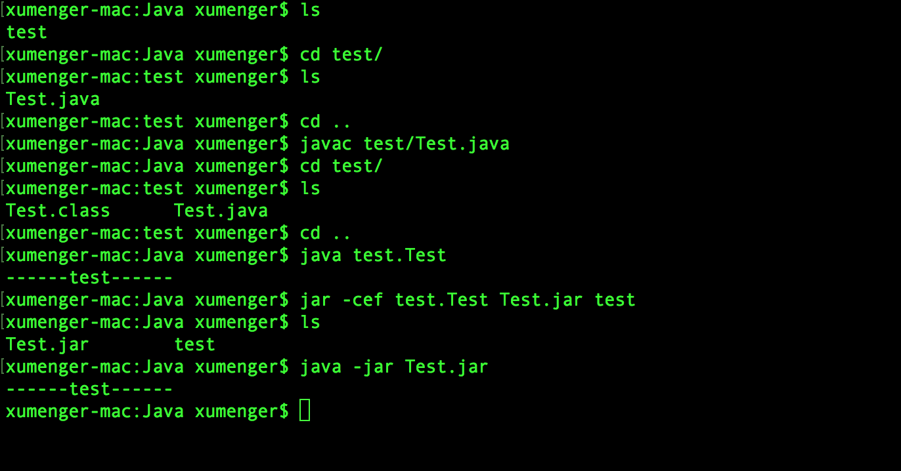
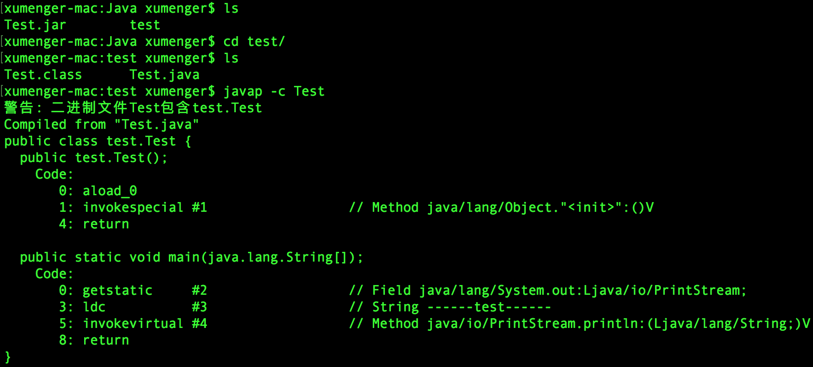
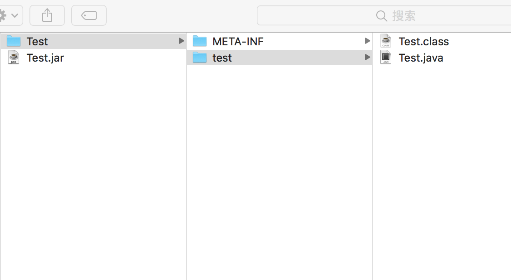
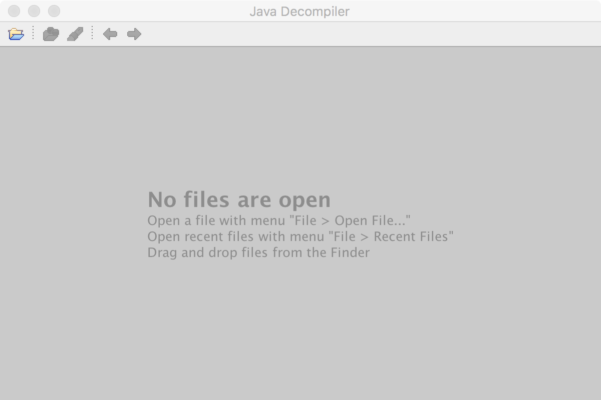
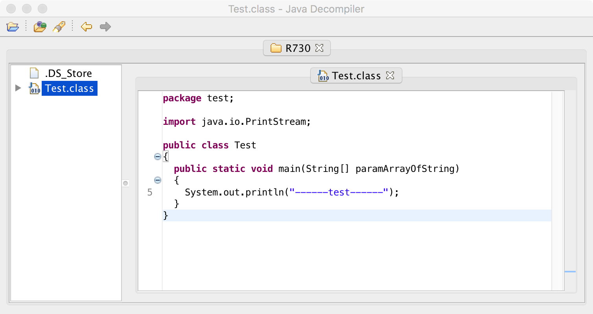
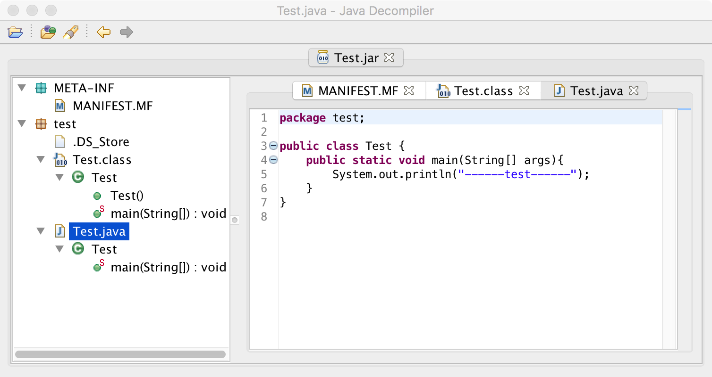

>用Java 这方面，用Java 是不可能用Java 的，这辈子不可能用Java 的。Eclipse 又不会用，就是用C++ 这些语言，才能做开发！使用Visual C++ 就像用笔写字一样，用Visual C++ 的感觉比写字还舒服！C++ 的语法看着就舒服，我超喜欢用Visual C++


## 编译带源码的jar包

编写一个简单的Test.java 程序

```java
package test;

public class Test {
    public static void main(String[] args){
        System.out.println("------test------");
    }
}
```

参照下面的图片编译Java 程序、打包成jar 包



jar 的命令参数介绍

* jar：命令为java 自带的专用打包工具
* c：代表生成新的jar 包
* e：代表可执行的类，即main 函数所在的类
* f：代表生成的jar 包的名称
* test：最后的这个参数表示将test 目录下所有的文件都打包到新的jar 包中

## 反汇编java代码

还是以上面的例子来将，我们先把java 源码编译成class 文件的，但是如果我们只有class 文件能不能反过来得到对应的java 源码呢？

这就用到反汇编工具了：javap（扩展了解：IDA 反汇编得到C/C++ 代码）

比如对上面的Test.class 进行反汇编



经过以上三步骤，你会看到一些字节码指令，其实这才是最终运行在JVM 上的机器指令代码（注意并不是java 代码，所以有必要了解一下[JVM、Java 的字节码](http://blog.xiaohansong.com/2016/04/26/java-bytecode/)）

另外javap 还有更多用法，比如：

* 查看class文件的编译版本
* 查看当前类的包
* 查看变量信息
* 查看堆栈信息

## 查看jar包中的源码

上面讲到，`jar -cef test.Test Test.jar test`命令的最后的这个参数表示将test 目录下所有的文件都打包到新的jar 包中。而test 目录下有java 源码文件，所以jar 包中可能存在项目的源码

那么如果项目引用的jar 包中有源码，怎么把源码提取出来方便看呢？

最简单的方法就是直接使用解压工具，对jar 包进行解压，然后就可以得到打包在其中的所有文件了



另外推荐一个工具！在[这个地址](http://jd.benow.ca/)下载JD-GUI，程序打开后的界面如下



上面讲到用javap 反汇编class 文件得到字节码，使用JD-GUI 打开一个class 文件可以直接反汇编得到java 代码



使用JD-GUI 打开一个jar 文件是这样的效果，在这里可以看到jar 包中的java 源码文件，可以看到class 反汇编得到的java 源码



>[《从jar包还原出java源码(项目文件)》](https://blog.csdn.net/mxmxz/article/details/73043156)中提到一个问题就是jar 包中的class 文件和java 源码的版本不一致！这个需要注意！

## 怎么提取jar包中的源码

上面提到的这些方式比较适用于只有一个jar 包的情况，假如一个框架、一个库有很多jar 包，那么你手工一个个的解压缩简直太笨。那么有什么自动化的工具可以帮助提取出jar 包中的源码，并且按照项目的目录结构组织好呢？
