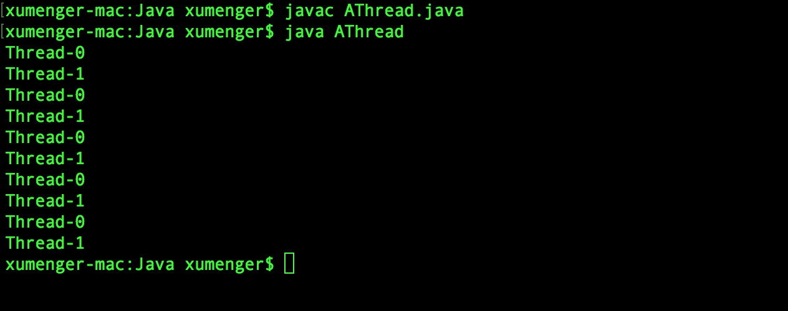

之前使用Delphi、C++ 在Windows 下做开发，总结了很多[多线程](http://www.xumenger.com/tags/#%E5%A4%9A%E7%BA%BF%E7%A8%8B)的文章，运行原理不再多言，因为现在要用到Java 做服务端开发，也要用到多线程的东西，所以还是写一篇流水账文章把相关的API 梳理一遍吧

可以说这个【Java服务端开发】系列的文章就是一系列的流水账文章，更多的是介绍API 怎么用的，虽然可以参考[官方网站](http://www.oracle.com/technetwork/cn/java/index.html)和[官方文档](https://docs.oracle.com/en/java/)。我还是写下来是因为选择其中常用的点，以后倒方便随时翻阅参考！

>接下来系列文章使用到的Java 的版本是：1.8.0_161

继续说Java 下的多线程！Java 中创建线程有两种方法：

## Thread类

继承Thread 类，重写Thread 的run() 方法

```java
class AThread extends Thread{
    public synchronized void run(){
        for(int i=0; i<5; i++){
            System.out.println(Thread.currentThread().getName());
            try{
                Thread.sleep(100);
            }catch(InterruptedException e){
                e.printStackTrace();
            }
        }
    }

    public static void main(String[] args){
        AThread t1 = new AThread();
        AThread t2 = new AThread();
        t1.start();
        t2.start();
    }
}
```

编译运行的效果如下



## Runnable接口

实现Runnable 接口，实例化Thread 类

```java
class Runner implements Runnable{
    @Override
    public synchronized void run(){
        for(int i=0; i<5; i++){
            System.out.println(Thread.currentThread().getName());
            try{
                Thread.sleep(100);
            }catch(InterruptedException e){
                e.printStackTrace();
            }
        }
    }

    public static void main(String[] args){
        Runner r = new Runner();
        Thread t1 = new Thread(r, "线程1");
        Thread t2 = new Thread(r, "线程2");
        t1.start();
        t2.start();
    }
}
```

编译运行的效果如下


虽然是多线程，但为什么没有并发的效果呢：线程1 运行完，线程2 才开始运行？

如果把上面Runner 类的run() 方法的**synchronized** 关键字去掉会怎么样？

```java
class Runner implements Runnable{
    @Override
    public void run(){
        for(int i=0; i<5; i++){
            System.out.println(Thread.currentThread().getName());
            try{
                Thread.sleep(100);
            }catch(InterruptedException e){
                e.printStackTrace();
            }
        }
    }

    public static void main(String[] args){
        Runner r = new Runner();
        Thread t1 = new Thread(r, "线程1");
        Thread t2 = new Thread(r, "线程2");
        t1.start();
        t2.start();
    }
}
```

编译运行的效果如下


## Java并发编程

以上讲到了Java 的Thread、Runnable 多线程并发编程的简单例子，关于并发编程其实还有更多需要探究的点

* Future 并发编程
* Java 多线程
* 多线程并发下的竞态条件
* Java中的atomic模块和CAS理论
* 进程间通信方式
