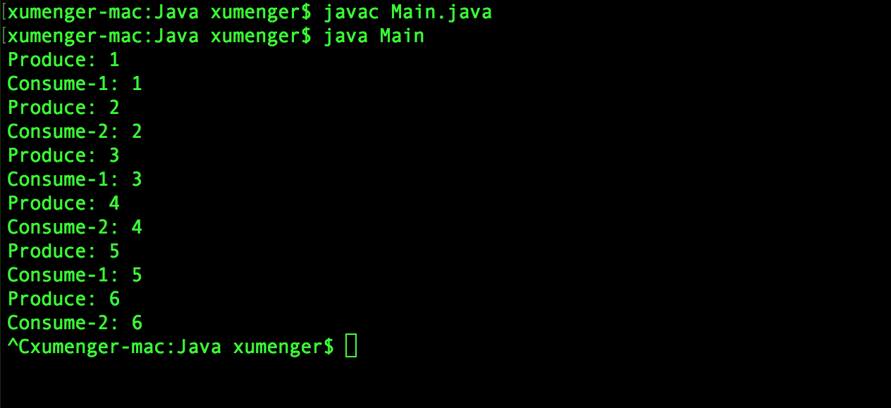

阻塞队列是Java 的util.concurrent 包下重要的数据结构，BlockingQueue 提供了线程安全的队列访问方式：当往阻塞队列中插入数据，且队列已满时，线程将会阻塞等待队列非满；当从阻塞队列取数据，且队列为空时，线程将会阻塞等待队列非空

JDK7 提供了以下7 个阻塞队列

* ArrayBlockingQueue：由数组结构组成的有界阻塞队列
* LinkedBlockingQueue：由链表结构组成的有界阻塞队列
* PriorityBlockingQueue：支持优先级排序的无阻塞队列
* DelayQueue：使用优先级队列实现的无界阻塞队列
* SynchronousQueue：不存储元素的阻塞队列
* LinkedTransferQueue：链表结构组成的无界阻塞队列
* LinkedBlockingDeque：链表结构组成的双向阻塞队列

阻塞队列提供了下列四种处理方法

 操作 | 抛异常      | 特定值    | 阻塞     | 超时 
-----|------------|----------|----------|-----------------------------
插入  | add(o)     | offer(o) | put(o)  | offer(o, timeout, timeunit)
移除  | remove(o)  | poll(o)  | take(o) | poll(timeout, timeunit)
检查  | element(o) | peek(o)  |         |

## 生产者消费者

队列在多线程

```java
import java.util.concurrent.ArrayBlockingQueue;
import java.util.concurrent.BlockingQueue;

class Producer implements Runnable{
    private BlockingQueue<Integer> queue;
    private Integer counter = 0;

    Producer(BlockingQueue<Integer> q){
        queue = q;
    }

    public void run(){
        try{
            while(true){
                // 当队列满时，生产者阻塞
                queue.put(produce());
                Thread.sleep(1000);
            }
        }catch(InterruptedException e){
            e.printStackTrace();
        }
    }

    int produce(){
        counter++;
        System.out.println("Produce: " + counter.toString());
        return counter;
    }
}

class Consumer implements Runnable{
    private BlockingQueue<Integer> queue;
    private Integer index;

    Consumer(BlockingQueue<Integer> q, Integer i){
        queue = q;
        index = i;
    }

    public void run(){
        try{
            while(true){
                // 当队列空时，消费者阻塞等待
                consume(queue.take());
            }
        }catch(InterruptedException e){
            e.printStackTrace();
        }
    }

    void consume(Integer num){
        System.out.println("Consume-" + index.toString() + ": " + num.toString());
    }
}

// main function
class Main{
    public static void main(String[] args){
        BlockingQueue<Integer> queue = new ArrayBlockingQueue<Integer>(2);
        Producer p = new Producer(queue);
        Consumer c1 = new Consumer(queue, 1);
        Consumer c2 = new Consumer(queue, 2);

        new Thread(p).start();
        new Thread(c1).start();
        new Thread(c2).start();
    }
}
```

编译运行效果如下



## 更多的方法

上面的例子中用到了put() 和take() 方法


## 分布式消息队列

上面讲到的BlockingQueue 是

