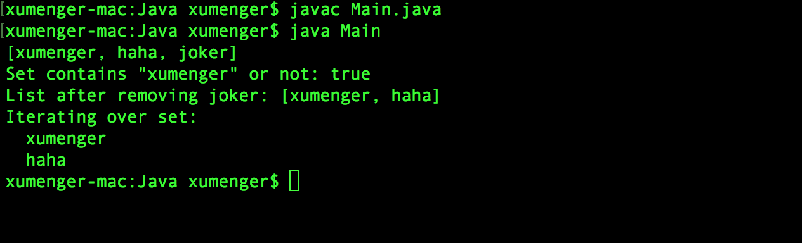
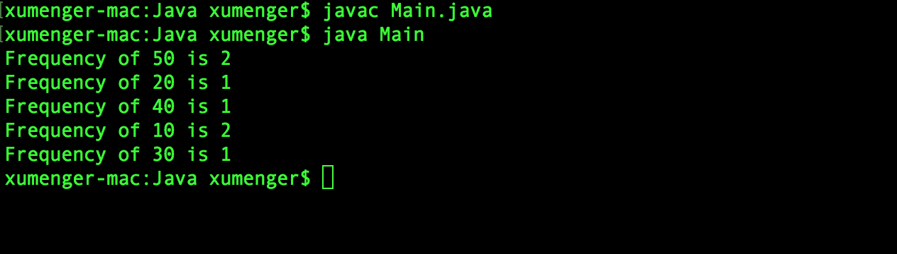
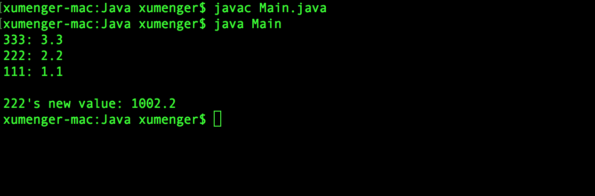

算法与数据结构一直是计算机科学领域的核心所在，如何合理的利用有限的内存资源、如何利用有限的CPU资源提升性能、如何优化磁盘与内存间的数据加载等，其实都可以以算法与数据结构为切入点找到原因，以及找到解决方法

比如[上面讲到的BlockingQueue](http://www.xumenger.com/java-server-02-blockingqueue-20180818/) 其实就是一种容器，用于存储数据，除此之外，还有其他更多的容器

## HashSet

```java
import java.util.*;

class Main{
    public static void main(String[] args){
        HashSet<String> set = new HashSet<String>();

        set.add("xumenger");
        set.add("joker");
        set.add("haha");

        System.out.println(set);
        System.out.println("Set contains \"xumenger\" or not: " + set.contains("xumenger"));

        set.remove("joker");
        System.out.println("List after removing joker: " + set);

        System.out.println("Iterating over set:");
        Iterator<String> it = set.iterator();
        while (it.hasNext()){
            System.out.println("  " + it.next());
        }
    }
}
```

编译运行的效果如下



## HashMap

```java
import java.util.*;

class Main{
    public static void main(String[] args){
        int array[] = {10, 20, 30, 40, 50, 50, 10};

        HashMap<Integer, Integer> map = new HashMap<Integer, Integer>();

        for(int i=0; i<array.length; i++){
            Integer c = map.get(array[i]);

            if(null == map.get(array[i]))
                map.put(array[i], 1);
            else
                map.put(array[i], ++c);
        }

        for(Map.Entry<Integer, Integer> m: map.entrySet()){
            System.out.println("Frequency of " + m.getKey() + " is " + m.getValue());
        }
    }
}
```

编译运行的效果如下



## Hashtable

```java
import java.util.*;

class Main{
    public static void main(String[] args){
        Hashtable ht = new Hashtable();
        Enumeration keys;
        String str;
        double d;

        ht.put("111", new Double(1.1));
        ht.put("222", new Double(2.2));
        ht.put("333", new Double(3.3));

        keys = ht.keys();
        while(keys.hasMoreElements()){
            str = (String)keys.nextElement();
            System.out.println(str + ": " + ht.get(str));
        }
        System.out.println();

        d = ((Double)ht.get("222")).doubleValue();
        ht.put("222", new Double(d + 1000));
        System.out.println("222's new value: " + ht.get("222"));
    }
}
```

编译运行的效果如下



## 对于C++中的STL

