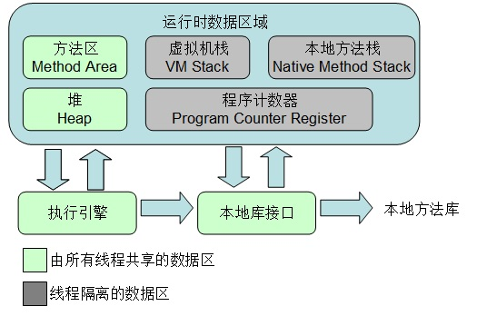
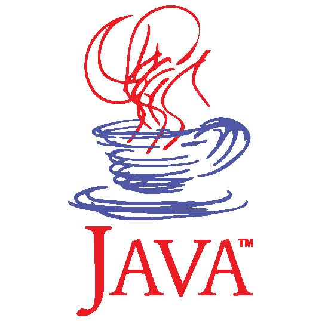

Java杂谈，真的是“杂谈”！

前面的几篇文章讲到了Java中的多线程、阻塞队列、容器类，但关于Java 还有更多的内容是没有讲到的，本来是不自量力的想要写一系列文章把Java 的方方面面一步到位的整理清楚的，结果越写发现东西越多，根本不是朝夕能够搞定的，所以还是得像以前那样，在后续的工作、应用中接触到一些语法点，再逐个针对性做总结和梳理

下面先大概谈谈Java 中那些很重要的，但我目前完全还没有讲到的！

## Java注解

在[《Spring Boot开发Web程序》](http://www.xumenger.com/java-springboot-20180322/)讲到Spring Boot 在做URL 路由的时候使用到了**注解**

```java
package com.example.demo;

import org.springframework.web.bind.annotation.PathVariable;
import org.springframework.web.bind.annotation.RequestMapping;
import org.springframework.web.bind.annotation.RequestMethod;
import org.springframework.web.bind.annotation.RestController;

@RestController
public class TestController {
    @RequestMapping("/")
    public String index() {
    	    return "This is Index Page";
    }
    
    @RequestMapping("/about")
    public String about() {
	    return "This is About Page";
    }
    
    @RequestMapping(value="/user/{name}", method= RequestMethod.GET)
    public String user(@PathVariable("name") String name) {
	    return "Hello " + name;
    }
}
```

在[《使用Flask进行简单Web开发》](http://www.xumenger.com/python2-flask-20170701/)中讲到Flask 在做URL 路由的时候是这样的

```python
# -*- coding: utf-8 -*-
from flask import Flask
app = Flask(__name__)

# 主页
@app.route('/')
def index():
    return '<h1>Hello World</h1>'

# 用户URL
@app.route('/user/<name>')
def user(name):
    return '<h1>Hello, %s</h1>' % name

if __name__ == '__main__':
    app.run(debug = True)
```

是不是很像？！那到底Java 的注解和Python 的装饰器在实现层面上有什么区别，底层的原理分别是什么样的呢？

## Java虚拟机



Java 是一种基于虚拟机的语言，不像C/C++/Delphi，所以在很多方面的特性存在不同，比如

* C/C++ 需要自己管理内存，Java 则是有垃圾回收机制
* C++ 通过引入智能指针来把原来的值语义转换为引用语义，而Java 本来就是引用语义的
* Java 有了垃圾回收机制，那是不是就不存在内存泄露的问题了呢

另外Python、Lua 也和Java 一样都是基于虚拟机的编程语言，同样有很多值得挖掘的点

* PVM、LVM、JVM 在底层上主要的差别是什么
* 它们三种语言的垃圾回收机制有何异同之处

另外还有像

* Java 虚拟机的内存结构是什么样的
* Java 线程是怎么运行的
* Java 的类加载机制
* 等等等等

## Java网络编程

目前在Java 中是支持BIO、NIO、AIO 这三种网络IO 模型的，简单来说，它们分别是这样的

BIO：是当发起I/O 的读或写操作时，均为阻塞方式，直到应用程序读到了流或者将流写入数据

NIO：基于事件驱动思想，常采用Reactor（反应器）模式。当发起I/O 请求时，应用程序是非阻塞的。当Socket 有流可读或写的时候，由操作系统通知应用程序，应用程序再将流读取到缓冲区或者写入系统

AIO：同样基于事件驱动的思想，通常采用Proactor（前摄器模式）实现。在进行I/O 操作时，直接调用API 的read 或write，这两种方法均为异步。对于读操作，操作系统将数据读到缓冲区，并通知应用程序，对于写操作，操作系统将write 方法传递的流写入并主动通知应用程序。它节省了NIO 中遍历事件通知队列的代价


当然这些IO 模型本质无非就是针对操作系统提供的select、poll、epoll、IOCP 等方式的再封装，由此可见，再往底层还可以去研究操作系统系统调用层面的技术点！

在我的博客中，针对Delphi、Python 的网络编程都进行过很多的整理，那么与Java 的网络编程比起来，它们哪些方面是一致的，哪些方面又是有差异的呢？

## Java的更多内容



上面针对几个大的点做了比较重点的归纳，还有更多的内容，下面大概列举一下

* Java 类加载机制
* Java 反射机制
* Java 多进程
* Java 函数式编程
* Java 字节码
* Java 反编译
* Java CAS
* Java 虚拟机和指令集
* Java 范型
* Java JDBC
* SpringBoot
* Maven