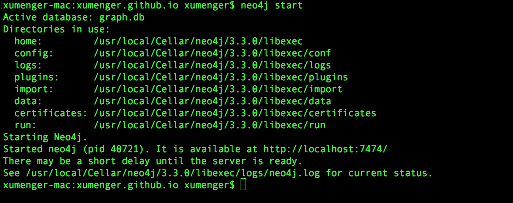

知识图谱是一系列结构化数据的处理方法，它涉及知识的提取、表示、存储、检索等诸多技术。从渊源上讲，它是知识表示与推理、数据库、信息检索、自然语言处理等多种技术发展的融合。但传统的知识处理方法，在实际的工程应用，特别是互联网应用中，面临实施成本高、技术周期长、熟悉该技术的人才缺乏、基础数据不足等诸多现实制约。实战中的知识图谱，需要充分利用成熟的工业技术，不拘泥于特定的工具和方法，特别是不盲目追求标准化、技术的先进性或新颖性，以实际的业务出发，循序渐进推进工程的实施

有一幅图吐槽的很有意思

## 参考资料

* [精益知识图谱方法论](../download/20180820/ccks.pdf)
* 