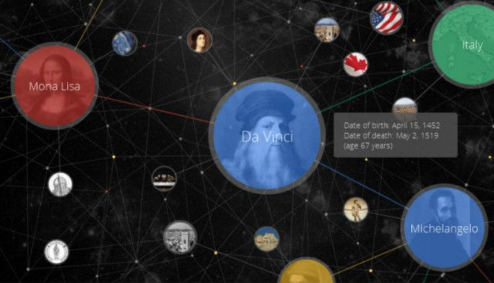
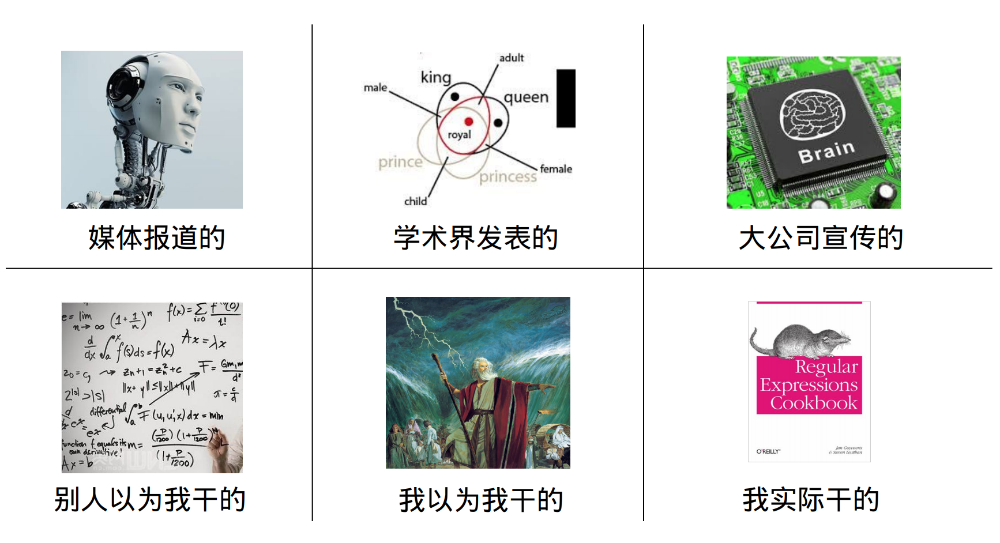

知识图谱的概念是Google 在2012 年提出的，当时主要是为了将传统的keyword-base 搜索模型向基于语义的搜索升级。知识图谱可以用来更好的查询复杂的关联关系，从语义层面理解用户意图，改进搜索质量

知识图谱最大的优势是在于对数据的描述能力非常强大，各种机器学习算法虽然在预测能力上很不错，但是在描述能力上非常弱，知识图谱刚好填补了这部分空缺

知识库可以分为两种类型，一种是Freebase、Yago2 为代表的Curated KB，主要是从维基百科和WordNet 等知识库中抽取大量的实体及实体关系，像是一种结构化的维基百科。另一种是以Stanford OpenIE、Never-Ending Language Learning（NELL）为代表的Extracted KBs，直接从上亿个非结构化网页中抽取实体关系三元组。与Freebase 相比，这样得到的知识更加多样化，但同时精确度要低于Curated KBs，因为实体关系和实体更多的是自然语言的形式，如“奥巴马出生在火奴鲁鲁”，可以表示为（"Obama"，"was also born in"，"Honolulu"）

知识图谱的构建是一个浩大的工程，从大方面来讲，分为**知识获取**、**知识融合**、**知识验证**、**知识计算和应用**几个部分

## 参考资料

* [精益知识图谱方法论](../download/20180820/ccks.pdf)
* [CN-DBpedia: A Never-Ending Chinese Knowledge Extraction System](../download/20180820/CN-DBpedia-System.pdf)
* [搜狗词库转为txt格式（小小输入法）](https://blog.csdn.net/zhangzhenhu/article/details/7014271)
* [scel2txt 搜狗scel格式转txt python3](https://blog.csdn.net/cFarmerReally/article/details/78149648)
* [将搜狗词库.scel格式转化为.txt格式](https://www.cnblogs.com/clover-siyecao/p/5736280.html)
* [搜狗词库](https://pinyin.sogou.com/dict/)
* [Bing词典](https://cn.bing.com/dict?FORM=HDRSC6)
* [为什么需要知识图谱？什么是知识图谱？——KG的前世今生](https://zhuanlan.zhihu.com/p/31726910)
* [笔记：知识图谱的构建方式](https://blog.csdn.net/class_guy/article/details/79152987)
* [知识图谱基础（一）-什么是知识图谱](https://www.jianshu.com/p/cd937f20bf55)
* [知识图谱基础（二）-知识图谱的知识表达系统](https://www.jianshu.com/p/941dc6d7e760)
* [知识图谱基础（三）-schema的构建](https://www.jianshu.com/p/704e935c98a9)
* [知识图谱应用篇（一）-搜索与推荐](https://www.jianshu.com/p/801f0d90b155)
* [知识图谱应用篇（二）-问答系统](https://www.jianshu.com/p/ed36c3576d54)
* [知识图谱应用篇（三）-知识图谱的问答场景应该如何选择？](https://www.jianshu.com/p/2e73f56babca)
* [最全知识图谱综述#1: 概念以及构建技术](http://www.dataguru.cn/article-12218-1.html)
* [知识图谱关键技术及行业应用解读](https://blog.csdn.net/imgxr/article/details/80130110)
* [知识图谱基础之RDF，RDFS与OWL](https://blog.csdn.net/u011801161/article/details/78833958)
* [基于知识图谱推理的关系推演](https://zhuanlan.zhihu.com/p/42340077)
* [干货！我就知道你们喜欢看技术类的东西~](https://zhuanlan.zhihu.com/p/41486134)
* [农业领域的知识图谱构建（Agriculture_KnowledgeGraph）](https://blog.csdn.net/kjcsdnblog/article/details/79747460)
* [揭开知识库问答KB-QA的面纱1·简介篇](https://zhuanlan.zhihu.com/p/25735572)
* [项目实战：如何构建知识图谱](https://zhuanlan.zhihu.com/p/29332977)
* [项目实战--知识图谱初探](http://www.shuang0420.com/2017/09/05/项目实战-知识图谱初探/)
* [知识工厂](http://kw.fudan.edu.cn/)
* [中文开放知识图谱](http://openkg.cn/organization)
* [中文通用百科知识图谱（CN-DBpedia）](http://openkg.cn/dataset/cndbpedia)

最后看一张很有意思的图

