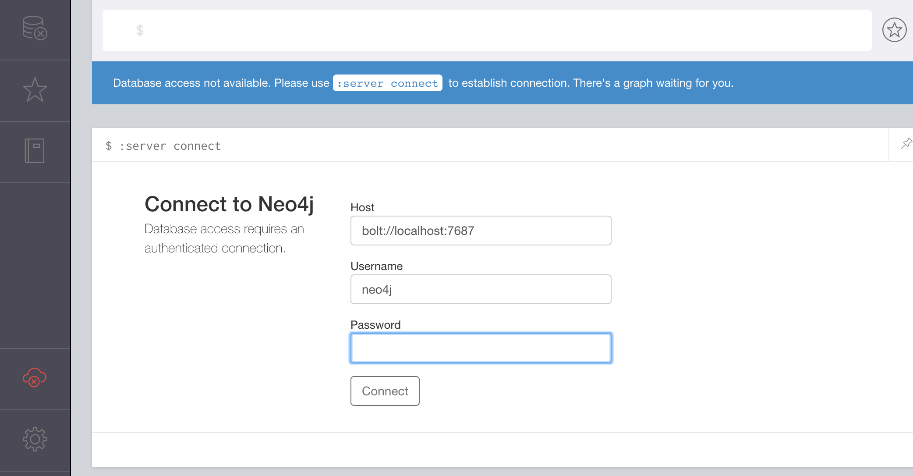
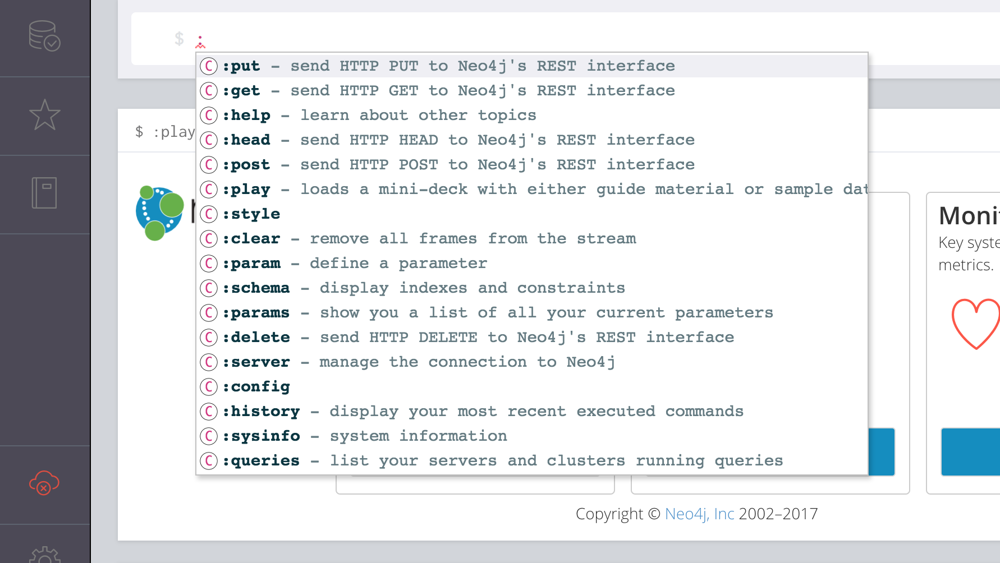
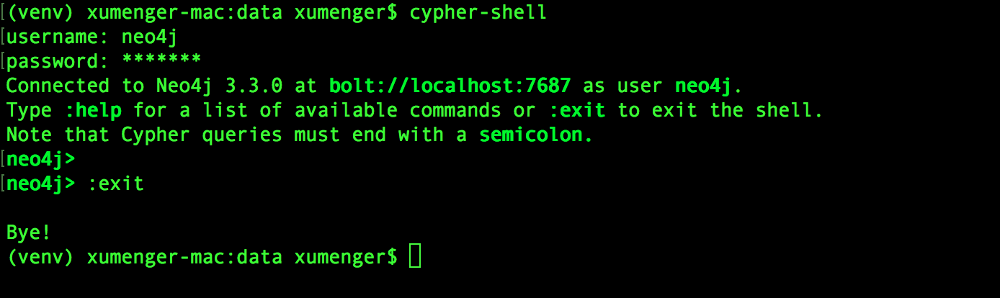
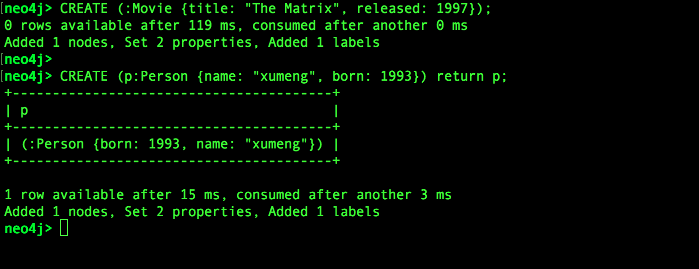
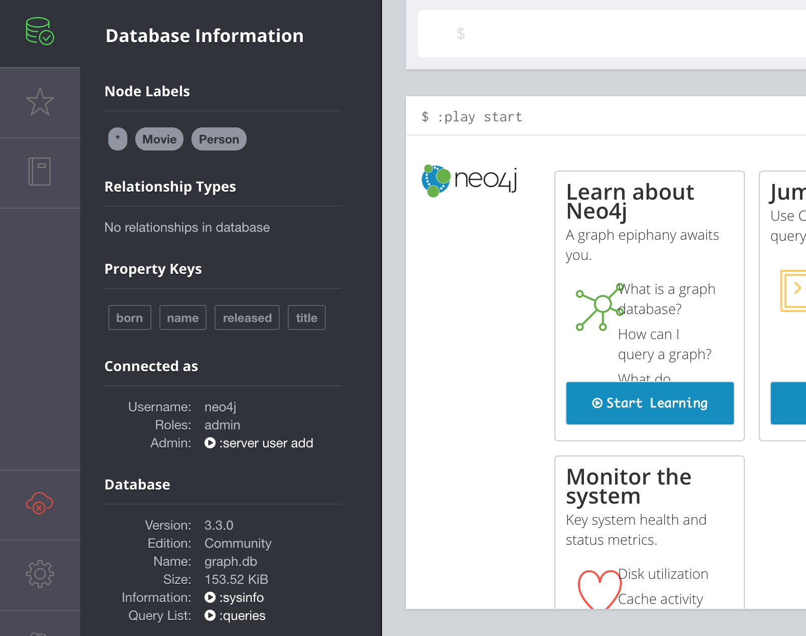
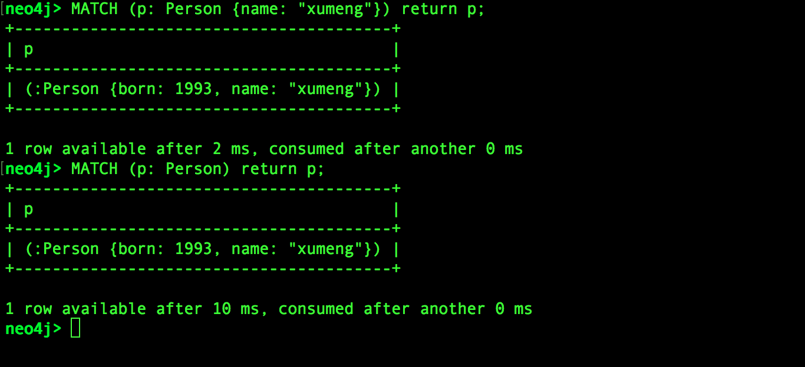

>哎？为什么要去研究知识图谱呢？


本来想着这篇文章对知识图谱的知识体系、实践方法进行一个总结，做着做着发现这个计划就是扯淡，才刚刚接触到一个全新的领域，就妄图用上帝视角来把握它，怎么可能？！所以如果想对知识图谱有所了解，请直接看后面附上的那些参考链接，本文通过一个实际可操作的实践来先介绍知识图谱中的一个工程实践领域：图数据库

下面这些是通过搜索引擎找到的一些关于图数据库的资料，可以先去了解一下

* [图形数据库Neo4J简介](https://www.cnblogs.com/loveis715/p/5277051.html)
* [带你发现新大陆!什么是图数据库以及简单入门!](https://blog.csdn.net/xlgen157387/article/details/79085901)
* [Neo4j图数据库简介和底层原理](https://www.cnblogs.com/bonelee/p/6211290.html)
* [图数据库概述](https://blog.csdn.net/chuchus/article/details/73249440)
* [图数据库——大数据时代的高铁](https://blog.csdn.net/heyc861221/article/details/80128421)
* [Neo4j:图数据库GraphDB(一)入门和基本查询语句](https://www.cnblogs.com/rongyux/p/5537028.html)
* [图数据库奥秘初探](https://www.jianshu.com/p/e236f90edaf7)
* [在选择数据库的路上，我们遇到过哪些坑？（一）](http://www.datayuan.cn/article/6397.htm)
* [在选择数据库的路上，我们遇到过哪些坑？（二）](http://www.datayuan.cn/article/6399.htm)
* [Neo4j+DRBD+Keepalived高可用架构](http://www.ywnds.com/?p=12199)
* [Neo4J 中文社区](http://neo4j.com.cn/)

## 安装[neo4j](https://neo4j.com/)

```bash
brew install neo4j
neo4j start
```


启动之后，可以在浏览器中通过[http://localhost:7474/browser/](http://localhost:7474/browser/)访问



通过初始账户密码neo4j/neo4j 即可登录

在Mac 上安装就是这么方便！

## 使用neo4j数据库

可以在上面[http://localhost:7474/browser/](http://localhost:7474/browser/)的网页上通过命令来操作neo4j 数据库



接下来的展示还是通过shell 来操作，上面只是告诉你还有另外的方法而已

在这里插播对neo4j 的更多介绍！它是Neo Technology 所提供的开源图数据库，拥有下面这些特性：

* 对事务的支持：neo4j 强制要求每个对数据的修改都需要在一个事务内完成，以保证数据的一致性
* 强大的图搜索能力：neo4j 允许用户通过Cypher 语言来操作数据库。该语言是特意为操作图数据库设计的，因此其可以非常高效地操作图数据库
	* 同时neo4j 也提供了面向当前市场一系列流行语言的客户端，以供使用这些语言的开发人鱼啊能够快速地操作neo4j
	* 此外，一些项目，如Spring Data Neo4J，也提供了一系列非常简单明了的数据操作方式，使得用户上手变得更为容易
* 有一定的横向扩展能力。由于图中的一个节点常常具有和其他节点相关联的关系，因此想一系列Sharding 解决方案那样对图进行切割非常不现实
	* 因此neo4j 当前所提供的横向扩展方法主要是通过Read Replica 进行读写分割
	* 反过来，由于单个neo4j 实例可以存储几十亿个节点及关系，因此对一般的企业级应用，这种横向扩展能力已经足够了

安装完neo4j 后，可以看到相关的命令有这些


* neo4j：用于控制服务端的启停等动作
* neo4j-admin：用于对数据进行备份、还原、迁移
	* 备份到文件：`neo4j-admin dump --database=graph.db --to=./2018.dump`
	* 数据导入：`neo4j-admin load --from ./2018.dump --database=graph.db --force`
* neo4j-import：用于将csv 格式的数据导入到数据库
* neo4j-shell：

我们还是使用cypher-shell 操作数据库



### Cypher语法简介

>Cypher 之于图数据库，类似于SQL 之于关系型数据库

**Node语法**

Cypher 使用一对圆括号来表示一个节点：

* () 匿名节点
* (matrix) 为节点添加一个ID
* (:Movie) Movie label 标签，声明的是节点类型。noe4j 的所用使用label，每个索引有标签和属性组成

```cypher
(matrix:Movie)

; 节点属性（如title）代表一个key/value 的list
(matrix:Movie {title: "The Matrix"})

(matrix:Movie {title: "The Matrix", released: 1997})
```

**RelationShip语法**

* ``--`` 表示一个无指向的关系
* ``-->`` 表示一个有指向的关系
* ``[]`` 能够添加ID、属性、类型等信息

```cypher
-[role]->
-[:ACTED_IN]->
-[role:ACTED_ID]->
-[role:ACTED_IN {roles:["Neo"]}]->
```

**Pattern语法**

节点与关系语法的合并就表示模式

```cypher
(keanu:Person:Actor {name:"Keanu Reeves"})
-[role:ACTED_IN {roles:["Noe"]}]->
(matrix: Movie {title:"The Matrix"})
acted_in = (:Person)-[:ACTED_IN]->(:Movie)
```

下面通过实际操作来展示其用法（第一条语句是创建一个节点数据；第二条语句是创建数据，并要求返回）



然后到浏览器的可视化界面上看一下，已经有这些数据了



接下来展示模式匹配的语法，比如我想查找名字为"xumeng" 的人，或者我想查询所有的人



## 知识图谱相关链接

* [精益知识图谱方法论](../download/20180820/ccks.pdf)
* [CN-DBpedia: A Never-Ending Chinese Knowledge Extraction System](../download/20180820/CN-DBpedia-System.pdf)
* [搜狗词库转为txt格式（小小输入法）](https://blog.csdn.net/zhangzhenhu/article/details/7014271)
* [scel2txt 搜狗scel格式转txt python3](https://blog.csdn.net/cFarmerReally/article/details/78149648)
* [将搜狗词库.scel格式转化为.txt格式](https://www.cnblogs.com/clover-siyecao/p/5736280.html)
* [搜狗词库](https://pinyin.sogou.com/dict/)
* [Bing词典](https://cn.bing.com/dict?FORM=HDRSC6)
* [为什么需要知识图谱？什么是知识图谱？——KG的前世今生](https://zhuanlan.zhihu.com/p/31726910)
* [笔记：知识图谱的构建方式](https://blog.csdn.net/class_guy/article/details/79152987)
* [知识图谱基础（一）-什么是知识图谱](https://www.jianshu.com/p/cd937f20bf55)
* [知识图谱基础（二）-知识图谱的知识表达系统](https://www.jianshu.com/p/941dc6d7e760)
* [知识图谱基础（三）-schema的构建](https://www.jianshu.com/p/704e935c98a9)
* [知识图谱应用篇（一）-搜索与推荐](https://www.jianshu.com/p/801f0d90b155)
* [知识图谱应用篇（二）-问答系统](https://www.jianshu.com/p/ed36c3576d54)
* [知识图谱应用篇（三）-知识图谱的问答场景应该如何选择？](https://www.jianshu.com/p/2e73f56babca)
* [最全知识图谱综述#1: 概念以及构建技术](http://www.dataguru.cn/article-12218-1.html)
* [知识图谱关键技术及行业应用解读](https://blog.csdn.net/imgxr/article/details/80130110)
* [知识图谱基础之RDF，RDFS与OWL](https://blog.csdn.net/u011801161/article/details/78833958)
* [基于知识图谱推理的关系推演](https://zhuanlan.zhihu.com/p/42340077)
* [干货！我就知道你们喜欢看技术类的东西~](https://zhuanlan.zhihu.com/p/41486134)
* [农业领域的知识图谱构建（Agriculture_KnowledgeGraph）](https://blog.csdn.net/kjcsdnblog/article/details/79747460)
* [揭开知识库问答KB-QA的面纱1·简介篇](https://zhuanlan.zhihu.com/p/25735572)
* [项目实战：如何构建知识图谱](https://zhuanlan.zhihu.com/p/29332977)
* [项目实战--知识图谱初探](http://www.shuang0420.com/2017/09/05/项目实战-知识图谱初探/)
* [知识工厂](http://kw.fudan.edu.cn/)
* [中文开放知识图谱](http://openkg.cn/organization)
* [中文通用百科知识图谱（CN-DBpedia）](http://openkg.cn/dataset/cndbpedia)

最后看一张很有意思的图


