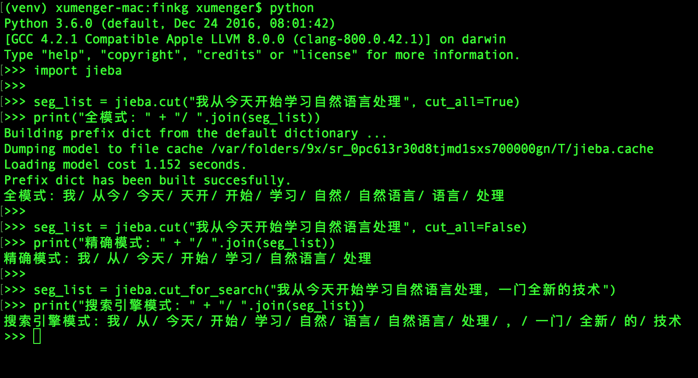
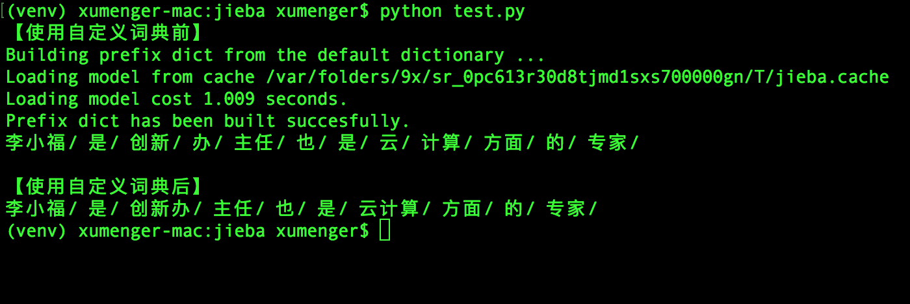
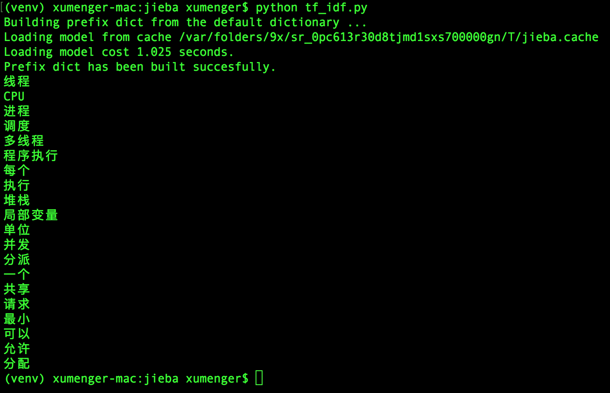
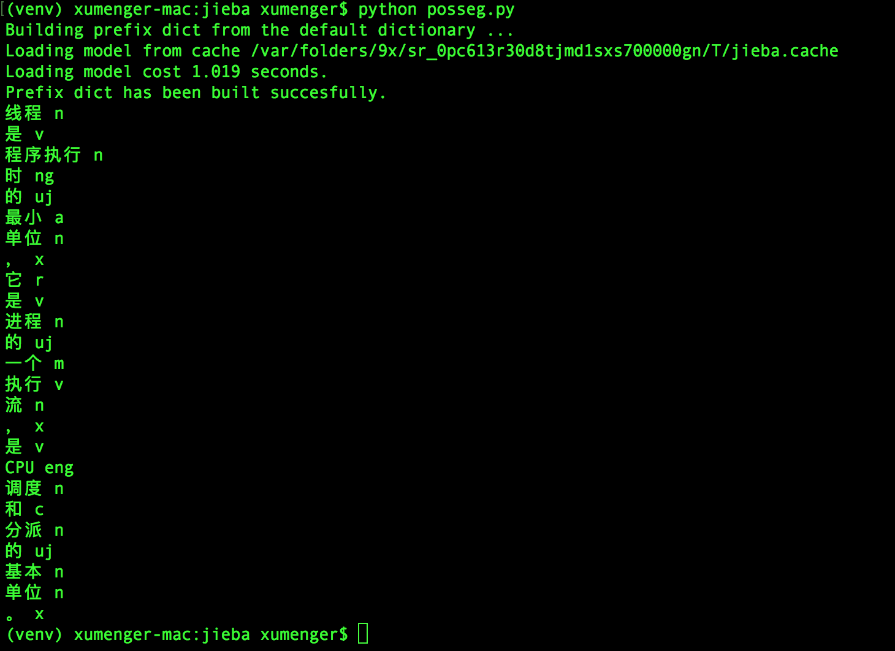

>紧接着[知识图谱入坑记](http://www.xumenger.com/knowledge-graph-20180820/)

[jieba](https://github.com/fxsjy/jieba) 可以说是现在做的最好的开源版本的中文分词组件！本文展示jieba 的一些典型用法，真的是很简单，几行代码就可以实现强大的功能，真的是利器！

按照官方的说法，jieba 具有这样的一些特点

* 支持三种分词模式
	* 精确模式：试图将句子最精确地切开，适合文本分析
	* 全模式：把句子中所有可以成词的词语都扫描出来，速度快但不能解决歧义
	* 搜索引擎模式：在精确模式基础上，对长词再切分，提高召回率，适合于搜索引擎分词
* 支持繁体分词
* 支持自定义词典
* MIT授权协议

jieba 基于前缀词典实现高效的词图扫描，生成句子中汉字所有可能成词情况所构成的有向无环图（DAG）；采用了动态规划查找最大概率路径，找出基于词频的最大切分组合；对于未登录词，采用了基于汉字成词能力的HMM 模型，使用了Viterbi 算法

## 分词模式展示

先直接上效果图！



对应的代码是这样的

```python
import jieba

seg_list = jieba.cut("我从今天开始学习自然语言处理", cut_all=True)
print("全模式: " + "/ ".join(seg_list))

seg_list = jieba.cut("我从今天开始学习自然语言处理", cut_all=False)
print("精确模式: " + "/ ".join(seg_list))

seg_list = jieba.cut_for_search("我从今天开始学习自然语言处理，一门全新的技术")
print("搜索引擎模式: " + "/ ".join(seg_list))
```

## 自定义词典

虽然jieba 有新词识别能力，但jieba 还是支持开发者指定自定义的词典，这样可以保证有更高的正确率

词典的格式很简单，每个词占一行；每行分三个部分：词语、词频（可省略）、词性（可省略），用空格隔开，顺序不可颠倒，比如这样一个文本：

```txt
云计算 5
李小福 2 nr
创新办 3 i
easy_install 3 eng
好用 300
韩玉赏鉴 3 nz
八一双鹿 3 nz
台中
凱特琳 nz
Edu Trust认证 2000
```

然后编写一个测试代码，展示使用自定义词典前和使用自定义词典后的分词效果

```python
import jieba

test_str = "李小福是创新办主任也是云计算方面的专家 "

print("【使用自定义词典前】")
seg_list = jieba.cut(test_str, cut_all=False)
print("/ ".join(seg_list))

print("\n【使用自定义词典后】")
jieba.load_userdict("./dict.txt")
seg_list = jieba.cut(test_str, cut_all=False)
print("/ ".join(seg_list))
```



在使用jieba 分词时经常会发现一些未登录词，因此增加领域词典十分重要，下面提供增加几种途径：

* 领域权威词汇词典
* 搜狗输入法领域词库、百度输入法领域词库
* [jieba 分词提供的其他词典](https://github.com/fxsjy/jieba/tree/master/extra_dict)

补充jieba 分词词性标记含义

缩写   | 词性    | 解释
------|---------|---------------------------------------------
Ag    | 形语素  | 形容词性语素。形容词代码为 a，语素代码ｇ前面置以A
a     | 形容词  | 取英语形容词 adjective的第1个字母
ad    | 副形词  | 直接作状语的形容词。形容词代码 a和副词代码d并在一起
an    | 名形词  | 具有名词功能的形容词。形容词代码 a和名词代码n并在一起
b     | 区别词  | 取汉字“别”的声母
c     | 连词    | 取英语连词 conjunction的第1个字母
dg    | 副语素  | 副词性语素。副词代码为 d，语素代码ｇ前面置以D
d     | 副词    | 取 adverb的第2个字母，因其第1个字母已用于形容词
e     | 叹词    | 取英语叹词 exclamation的第1个字母
f     | 方位词  | 取汉字“方”
g     | 语素    | 绝大多数语素都能作为合成词的“词根”，取汉字“根”的声母
h     | 前接成分 | 取英语 head的第1个字母
i     | 成语    | 取英语成语 idiom的第1个字母
j     | 简称略语 | 取汉字“简”的声母
k     | 后接成分 | 
l     | 习用语  | 习用语尚未成为成语，有点“临时性”，取“临”的声母
m     | 数词    | 取英语 numeral的第3个字母，n，u已有他用
Ng    | 名语素  | 名词性语素。名词代码为 n，语素代码ｇ前面置以N
n     | 名词    | 取英语名词 noun的第1个字母
nr    | 人名    | 名词代码 n和“人(ren)”的声母并在一起
ns    | 地名    | 名词代码 n和处所词代码s并在一起
nt    | 机构团体 | “团”的声母为 t，名词代码n和t并在一起
nz    | 其他专名 |“专”的声母的第 1个字母为z，名词代码n和z并在一起
o     | 拟声词  | 取英语拟声词 onomatopoeia的第1个字母
p     | 介词    | 取英语介词 prepositional的第1个字母
q     | 量词    | 取英语 quantity的第1个字母
r     | 代词    | 取英语代词 pronoun的第2个字母,因p已用于介词
s     | 处所词  | 取英语 space的第1个字母
tg    | 时语素  | 时间词性语素。时间词代码为 t,在语素的代码g前面置以T
t     | 时间词  | 取英语 time的第1个字母
u     | 助词    | 取英语助词 auxiliary
vg    | 动语素  | 动词性语素。动词代码为 v。在语素的代码g前面置以V
v     | 动词    | 取英语动词 verb的第一个字母
vd    | 副动词  | 直接作状语的动词。动词和副词的代码并在一起
vn    | 名动词  | 指具有名词功能的动词。动词和名词的代码并在一起
w     | 标点符号 |
x     | 非语素字 | 非语素字只是一个符号，字母 x通常用于代表未知数、符号
y     | 语气词  | 取汉字“语”的声母
z     | 状态词  | 取汉字“状”的声母的前一个字母
un    | 未知词  | 不可识别词及用户自定义词组。取英文Unkonwn首两个字母。(非北大标准，CSW分词中定义)

## 关键词抽取

jieba 支持使用TF-IDF 算法提取关键字

```python
from jieba import analyse

# 引入TF-IDF 关键词抽取接口
tfidf = analyse.extract_tags

# 原始文本
text = "线程是程序执行时的最小单位，它是进程的一个执行流，\
        是CPU调度和分派的基本单位，一个进程可以由很多个线程组成，\
        线程间共享进程的所有资源，每个线程有自己的堆栈和局部变量。\
        线程由CPU独立调度执行，在多CPU环境下就允许多个线程同时运行。\
        同样多线程也可以实现并发操作，每个请求分配一个线程来处理。"

# 基于TF-IDF 算法进行关键词抽取
keywords = tfidf(text)
# 输出抽取出的关键词
for keyword in keywords:
    print(keyword)
```



>处理上面展示的基于TF-IDF 算法的关键字抽取，jieba 还支持TextRank 算法！可以看[这篇文章](https://www.cnblogs.com/zhbzz2007/p/6177832.html)做深入的了解

## 词性标注

```python
import jieba.posseg as pseg

text = "线程是程序执行时的最小单位，它是进程的一个执行流，是CPU调度和分派的基本单位。"

words = pseg.cut(text)
for w in words:
    print(w.word + " " + w.flag)
```


