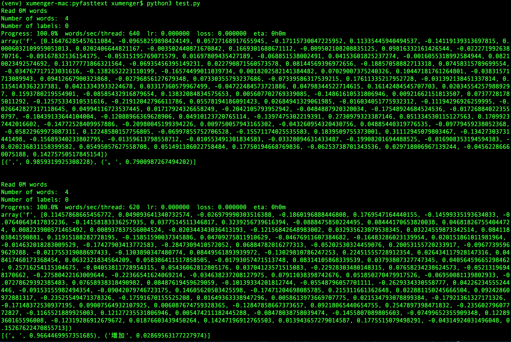
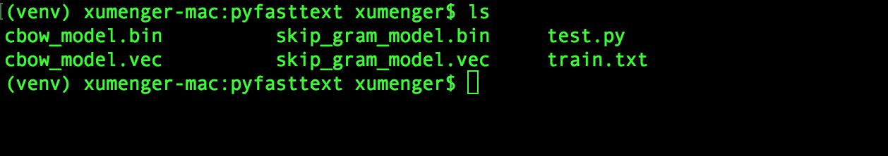

在[自然语言处理入坑记](http://www.xumenger.com/nlp-jieba-20180827/)中讲到了jieba 这个Python 的库，本文计划梳理更多的Python 自然语言处理库

* 中文词法分析工具包 thulac
* 词向量及文本分类工具 pyfasttext
* 汉字转拼音的工具包 pinyin

## 中文词法分析工具包 thulac

thulac(THU Lexical Analyzer for Chinese) 是由清华大学自然语言处理和社会人文计算实验室研制推出的一套中文词法分析工具，具体有中文分词和词性标注功能。thuslac 有以下特点：

* 能力强。利用集成的目前世界上最大规模的人工分词和词性标注中文词料库（约5800万）训练而成，模型标注能力强大
* 准确率高。该工具包在标准数据集Chinese Treebank（CTB5）上分词的F1 值可达97.3%，词性标注的F1 值可达92.9%
* 速度较快。同时进行分词和词性标注速度为300KB/s，每秒可处理约15万字，只进行分词速度可达1.3MB/s

下面简单演示它的用法
 
```python
import thulac

print("1. 默认模式")
t1 = thulac.thulac()
# 进行一句话分词
text = t1.cut("我在学习自然语言处理技术", text = True)
print(text)
print("\n")

print("2. 只进行分词，不进行词性标注")
t2 = thulac.thulac(seg_only = True)
#对input.txt文件内容进行分词，输出到output.txt
t2.cut_f("input.txt", "output.txt")
```

运行的效果如下


input.txt 的内容是

>THULAC（THU Lexical Analyzer for Chinese）由清华大学自然语言处理与社会人文计算实验室研制推出的一套中文词法分析工具包，具有中文分词和词性标注功能

output.txt 的内容是

>THULAC （ THU Lexical Analyzer for Chinese ） 由 清华大学 自然 语言 处理 与 社会 人文 计算 实验室 研制 推出 的 一 套 中文 词法 分析 工具 包 ， 具有 中文 分词 和 词性 标注 功能

## 词向量及文本分类工具 pyfasttext

fasttext 是个好东西，是由FaceBook 在2016 年推出的一个训练词向量的模型。相比于之前Google 的word2vec，fasttext 可以解决out of vocabulary 的问题。fasttext 还能够用于有监督的文本分类。更赞的是，FaceBook 提供了200 多种语言的预训练模型和词向量

在Python 上我们可以用[pyfasttext](https://pypi.org/project/pyfasttext/) 这个库，需要说明，因为其需要依赖Cython，所以需要先``pip install cython``

>预训练好的词向量模型[wiki.zh.bin下载](http://s3-us-west-1.amazonaws.com/fasttext-vectors/wiki.zh.zip)

```python
# 加载pyfasttext模块
from pyfasttext import FastText 

# 加载一个已经存在的模型
# model = FastText()
# model.load_model('./path/to/model.bin')

# 使用skip-gram模型训练
skip_gram_model = FastText()
skip_gram_model.skipgram(input='./data.txt', output='skip_gram_model', epoch=100, lr=0.7)
print(skip_gram_model['dog'])
print(skip_gram_model.get_numpy_vector('dog'))
print(skip_gram_model.get_numpy_vector('dog', normalized=True))

king = skip_gram_model.get_numpy_vector('king')
man = skip_gram_model.get_numpy_vector('man')
woman = skip_gram_model.get_numpy_vector('woman')
skip_gram_model.words_for_vector(king + woman - man, k=1)

# for word in skip_gram_model.words:
#    print(word, skip_gram_model[word])

print(skip_gram_model.nearest_neighbors('dog', k=2))

# test data is stored inside a file, use this:
skip_gram_model.predict_proba_file('./test.txt', k=2)

print("\n\n")

##################
# 使用cbow模型训练 #
##################
cbow_model = FastText()
cbow_model.cbow(input='./data.txt', output='cbow_model', epoch=100, lr=0.7)
print(cbow_model['dog'])
print(cbow_model.get_numpy_vector('dog'))
print(cbow_model.get_numpy_vector('dog', normalized=True))

king = cbow_model.get_numpy_vector('king')
man = cbow_model.get_numpy_vector('man')
woman = cbow_model.get_numpy_vector('woman')
cbow_model.words_for_vector(king + woman - man, k=1)

# for word in cbow_model.words:
#    print(word, cbow_model[word])

print(cbow_model.nearest_neighbors('dog', k=2))

# test data is stored inside a file, use this:
cbow_model.predict_proba_file('./test.txt', k=2)
```

data.txt的内容大概是这样的。标签是以字符串label作为前缀的单词，后面的数字对应类别。我们可以将训练数据处理成这种形式，训练自己的文本分类模型（这里分别有别人整理好的[训练数据](http://pan.baidu.com/s/1jH7wyOY)和[测试数据](http://pan.baidu.com/s/1slGlPgx)）

```

```

运行的效果是这样的



相关文章

* [文本分类（六）：使用fastText对文本进行分类--小插曲](https://blog.csdn.net/lxg0807/article/details/52960072)
* [NLP︱高级词向量表达（一）——GloVe（理论、相关测评结果、R&python实现、相关应用）](https://blog.csdn.net/sinat_26917383/article/details/54847240)
* [自己动手写word2vec (四):CBOW和skip-gram模型](https://blog.csdn.net/u014595019/article/details/51943428)
* [轻松理解skip-gram模型](https://blog.csdn.net/u010665216/article/details/78721354?locationNum=7&fps=1)
* [Word2vec之CBOW模型和Skip-gram模型形象解释](https://blog.csdn.net/u011734144/article/details/78668518)

## 汉字转拼音的工具包 pinyin

直接上一个简单的例子演示[pinyin](https://pypi.org/project/pinyin/) 的用法

```python
import pinyin
import pinyin.cedict

print("1. 汉语转拼音")
print(pinyin.get('你 好'))
print(pinyin.get('你好', format="strip", delimiter=" "))
print(pinyin.get('你好', format="numerical"))
print(pinyin.get_initial('你好'))


print("\n2.中文翻译为英文")
print(pinyin.cedict.translate_word('你'))
print(pinyin.cedict.translate_word('你好'))
print(list(pinyin.cedict.all_phrase_translations('你好')))
```

运行的效果如下



>除了可以将汉语转换为拼音，还可以翻译为英文，这个功能确实很强大

## 另一个pinyin

上面用到的这个pinyin 库可以直接通过``pip3 install pinyin``进行安装，另外还有这样一个汉字转拼音的实现，[github地址点这里](https://github.com/cleverdeng/pinyin.py)

它的实现很简单，代码只有这么多！

```python
#!/usr/bin/env python
# -*- coding:utf-8 -*-

"""
    Author:cleverdeng
    E-mail:clverdeng@gmail.com
"""

__version__ = '0.9'
__all__ = ["PinYin"]

import os.path


class PinYin(object):
    def __init__(self, dict_file='word.data'):
        self.word_dict = {}
        self.dict_file = dict_file


    def load_word(self):
        if not os.path.exists(self.dict_file):
            raise IOError("NotFoundFile")

        with file(self.dict_file) as f_obj:
            for f_line in f_obj.readlines():
                try:
                    line = f_line.split('    ')
                    self.word_dict[line[0]] = line[1]
                except:
                    line = f_line.split('   ')
                    self.word_dict[line[0]] = line[1]


    def hanzi2pinyin(self, string=""):
        result = []
        if not isinstance(string, unicode):
            string = string.decode("utf-8")
        
        for char in string:
            key = '%X' % ord(char)
            result.append(self.word_dict.get(key, char).split()[0][:-1].lower())

        return result


    def hanzi2pinyin_split(self, string="", split=""):
        result = self.hanzi2pinyin(string=string)
        if split == "":
            return result
        else:
            return split.join(result)


if __name__ == "__main__":
    test = PinYin()
    test.load_word()
    string = "钓鱼岛是中国的"
    print "in: %s" % string
    print "out: %s" % str(test.hanzi2pinyin(string=string))
    print "out: %s" % test.hanzi2pinyin_split(string=string, split="-")
```

所以这个项目的核心在word.data 这个文本文件中，随机选取其中的一段内容是这样的

```
7180    HUANG3
7181    XIE2
7182    XI4
7183    WU4
7184    XI2 XI1
7185    YUN4 YUN2 YUN1
7186    HE2
7187    HE4
7188    XI1
7189    YUN2
718A    XIONG2
718B    NAI2
718C    SHAN4
718E    YAO4
718F    XUN1 XUN4
7190    MI4
7191    LIAN2
7192    YING2 XING2 JIONG3
7193    WU3 WEN4
7194    RONG2
7197    QIANG4
7198    LIU1 LIU4
7199    XI1 YI2
719A    BI4
719B    BIAO1
```

pinyin 把汉字转拼音的原理是从一个外部文件，找到相关汉字的拼音表示然后替换原文。这个外部文件在PinYin 初始化时由变量的dict\_file 指定

还有[xpiyin](https://github.com/lxneng/xpinyin) 这个库也是类似的功能

## 参考资料

* [THULAC：一个高效的中文词法分析工具包](http://thulac.thunlp.org/)
* [THULAC在线演示](http://thulac.thunlp.org/demo)
* [不懂word2vec，还敢说自己是做NLP？](http://www.dataguru.cn/article-13488-1.html)
* [中文分词原理及工具](https://cuiqingcai.com/5844.html)
* [1、NLP︱高级词向量表达（一）——GloVe（理论、相关测评结果、R&python实现、相关应用）](http://blog.csdn.net/sinat_26917383/article/details/54847240)
* [2、NLP︱高级词向量表达（二）——FastText（简述、学习笔记）](http://blog.csdn.net/sinat_26917383/article/details/54850933)
* [3、NLP︱高级词向量表达（三）——WordRank（简述）](http://blog.csdn.net/sinat_26917383/article/details/54852214)
* 其他NLP词表示方法paper: [从符号到分布式表示NLP中词各种表示方法综述](https://arxiv.org/pdf/1702.00764v1.pdf)
* [Word2Vec和fasttext](https://blog.csdn.net/cdyx369/article/details/80579700)
* [解决fasttext内存不足无法读取模型的问题](https://blog.csdn.net/qq547276542/article/details/78817118)
* [使用fasttext实现文本处理及文本预测](https://blog.csdn.net/meyh0x5vDTk48P2/article/details/79055553)