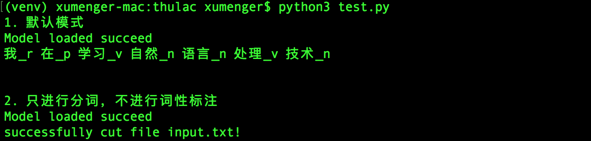

在[自然语言处理入坑记](http://www.xumenger.com/nlp-jieba-20180827/)中讲到了jieba 这个Python 的库，本文计划梳理更多的Python 自然语言处理库

* 中文词法分析工具包 thulac
* 词向量及文本分类工具 pyfasttext
* 汉字转拼音的工具包 pinyin

## 中文词法分析工具包 thulac

thulac(THU Lexical Analyzer for Chinese) 是由清华大学自然语言处理和社会人文计算实验室研制推出的一套中文词法分析工具，具体有中文分词和词性标注功能。thuslac 有以下特点：

* 能力强。利用集成的目前世界上最大规模的人工分词和词性标注中文词料库（约5800万）训练而成，模型标注能力强大
* 准确率高。该工具包在标准数据集Chinese Treebank（CTB5）上分词的F1 值可达97.3%，词性标注的F1 值可达92.9%
* 速度较快。同时进行分词和词性标注速度为300KB/s，每秒可处理约15万字，只进行分词速度可达1.3MB/s

下面简单演示它的用法
 
```python
import thulac

print("1. 默认模式")
t1 = thulac.thulac()
# 进行一句话分词
text = t1.cut("我在学习自然语言处理技术", text = True)
print(text)
print("\n")

print("2. 只进行分词，不进行词性标注")
t2 = thulac.thulac(seg_only = True)
#对input.txt文件内容进行分词，输出到output.txt
t2.cut_f("input.txt", "output.txt")
```



input.txt 的内容是

>THULAC（THU Lexical Analyzer for Chinese）由清华大学自然语言处理与社会人文计算实验室研制推出的一套中文词法分析工具包，具有中文分词和词性标注功能

output.txt 的内容是

>THULAC （ THU Lexical Analyzer for Chinese ） 由 清华大学 自然 语言 处理 与 社会 人文 计算 实验室 研制 推出 的 一 套 中文 词法 分析 工具 包 ， 具有 中文 分词 和 词性 标注 功能

## 词向量及文本分类工具 pyfasttext

```python

```


## 汉字转拼音的工具包 pinyin

```python

```


## 参考资料

* [THULAC：一个高效的中文词法分析工具包](http://thulac.thunlp.org/)
* [THULAC在线演示](http://thulac.thunlp.org/demo)
* [不懂word2vec，还敢说自己是做NLP？](http://www.dataguru.cn/article-13488-1.html)
* [中文分词原理及工具](https://cuiqingcai.com/5844.html)
