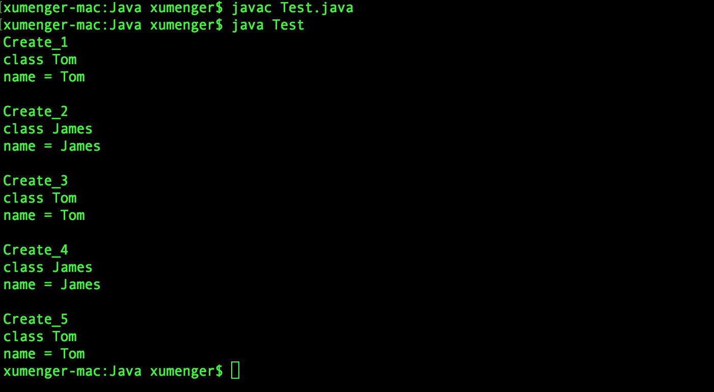
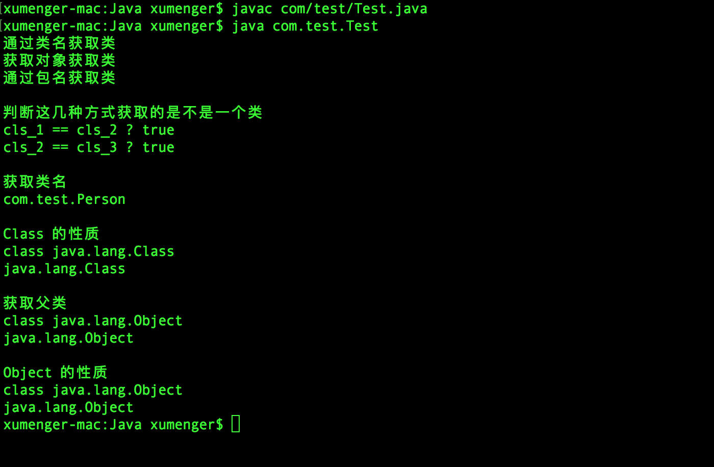
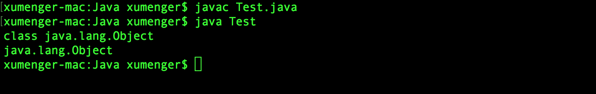
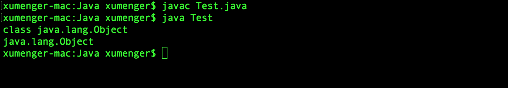

下面一个例子展示Java 中Class 和Object 这两个类的使用方法（一些解释说明在代码的注释中）

>特别要提醒一下！注意区分Class 类和class 关键字！

```java
public class Test {
    public static void main(String[] args) throws InstantiationException, IllegalAccessException {
    	// Tom.class 表示传入Tom 类
        Tom tom = Create_1(Tom.class);
        System.out.println(tom.name);

        Person p = Create_2(James.class);
        // 类型转换
        James james = (James)p;
        System.out.println(james.name);

        Object o = Create_3(Tom.class);
        Tom tom2 = (Tom)o;
        System.out.println(tom2.name);

        Object o2 = Create_4(James.class);
        James james2 = (James)o2;
        System.out.println(james2.name);

        Object o3 = Create_5(new Tom());
        Tom tom3 = (Tom)o3;
        System.out.println(tom3.name);
    }

    //Class<T>类型，可以传入任何类
    public static<T> T Create_1(Class<T> cls) throws InstantiationException, IllegalAccessException {
        // System.out.println("");
        System.out.println("Create_1");
        System.out.println(cls);
        return cls.newInstance();
    }

    // Class<? extends Person>类型，表示只能传入Person 类的子类
    public static Person Create_2(Class<? extends Person> cls) throws InstantiationException, IllegalAccessException {
        System.out.println("");
        System.out.println("Create_2");
        System.out.println(cls);
        return cls.newInstance();
    }

    // Class类型，可以传入任何类
    public static Object Create_3(Class cls) throws InstantiationException, IllegalAccessException {
        System.out.println("");
        System.out.println("Create_3");
        System.out.println(cls);
        return cls.newInstance();
    }

    public static Object Create_4(Class<?> cls) throws InstantiationException, IllegalAccessException {
        System.out.println("");
        System.out.println("Create_4");
        System.out.println(cls);
        return cls.newInstance();
    }

    public static Object Create_5(Object object) throws InstantiationException, IllegalAccessException {
        System.out.println("");
        System.out.println("Create_5");
        // 获取object 的类
        Class cls = object.getClass();
        System.out.println(cls);
        // 用cls 类创建对象
        return cls.newInstance();
    }
}

abstract class Person {
    public String name = "";
    public int age = 0;
}

class Tom extends Person {
    public String name = "name = Tom";
    public int age = 20;
}

class James extends Person {
    public String name = "name = James";
    public int age = 25;
}
```

编译运行效果是这样的



## 详解Class和Object

Class 一般是在反射的时候用到的，并且Class 是Object 的子类，Class 是一个特殊的类，不可以直接实例化

下面展示Class 的一些常用API

```java
package com.test;

public class Test {
    public static void main(String[] args) throws Exception {
        System.out.println("通过类名获取类");
        Class cls_1 = Person.class;
        System.out.println("获取对象获取类");
        Class cls_2 = new Person().getClass();
        System.out.println("通过包名获取类");
        Class cls_3 = Class.forName("com.test.Person");

        System.out.println("");
        System.out.println("判断这几种方式获取的是不是一个类");
        System.out.print("cls_1 == cls_2 ? ");
        System.out.println(cls_1 == cls_2);
        System.out.print("cls_2 == cls_3 ? ");
        System.out.println(cls_2 == cls_3);

        System.out.println("");
        System.out.println("获取类名");
        System.out.println(cls_1.getName());

        System.out.println("");
        System.out.println("Class 的性质");
        Class cls_cls = cls_1.getClass();
        System.out.println(cls_cls);
        System.out.println(cls_cls.getName());

        System.out.println("");
        System.out.println("获取父类");
        Class super_cls = cls_1.getSuperclass();
        System.out.println(super_cls);
        System.out.println(super_cls.getName());

        System.out.println("");
        System.out.println("Object 的性质");
        Class obj_cls = Object.class;
        System.out.println(obj_cls);
        System.out.println(obj_cls.getName());
    }
}

class Person{}
```

编译运行效果是这样的



## Object是Class的实例

>所有的类都是Class 的实例，Object 是类，所以Object 也是Class 类的一个实例

这句话看上去没啥问题，我们写个程序来验证一下！

```java
public class Test {
    public static void main(String[] args) throws Exception {
        Class cls = Object.class;
        System.out.println(cls);
        System.out.println(cls.getName());
    }   
}
```

运行的效果是这样的



Class 是一个特殊的类，一般应用于反射，可以通过Class 类型获取其他类型的元数据（metadata），比如字段、属性、构造器、方法等等，可以获取并调用！！

## Class继承自Object

>所有的类都最终继承自Object，Class 是类，所以Class 也继承自Object

这句话看上去没啥问题，我们写个程序来验证一下！

```java
public class Test {
    public static void main(String[] args) throws Exception {
        Class cls_cls = Class.class;
        Class super_cls = cls_cls.getSuperclass();
        System.out.println(super_cls);
        System.out.println(super_cls.getName());
    }   
}
```

运行的效果是这样的


