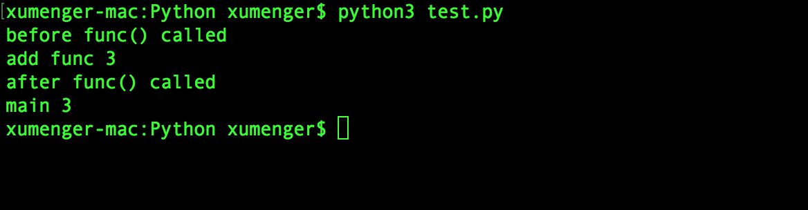

之前讲过Flask 中URL 路由的编码方式是这样的

```python
# -*- coding: utf-8 -*-
from flask import Flask
app = Flask(__name__)

# 主页
@app.route('/')
def index():
    return '<h1>Hello World</h1>'

# 用户URL
@app.route('/user/<name>')
def user(name):
    return '<h1>Hello, %s</h1>' % name

if __name__ == '__main__':
    app.run(debug = True)
```

正是使用的装饰器来实现的，其实可以进一步去看一下Flask 中route 的实现

```python
class Flask(object):

    ...

    def route(self, rule, **options):
        def decorator(f):
            self.add_url_rule(rule, f.__name__, **options)
            self.view_function[f.__name__] = f
            return f
        return decorator

    ...
```

>注意，在Flask 的route() 装饰器方法中，其是把f 函数作为一个对象进行处理的，并没有调用它！

好了，接下来就简单讲一下Python 中的这个装饰器

## 一个简单的装饰器例子

```python
# 装饰器
def log(func):
    def wrapper():
        print("log {}".format(func.__name__))
        return func()
    return wrapper

def debug(func):
    def wrapper():
        print("debug {}".format(func.__name__))
        return func()
    return wrapper


# 在函数前面加上装饰器
@debug
@log
@debug
@debug
def test_func():
    print("I am a test function")

if('__main__' == __name__):
    test_func()
```

运行效果是这样的


特别注意！像上面的一个装饰器可以多次装饰一个函数，装饰器调用的顺序和在函数上装饰的顺序是一致的

有个问题？为什么前三个装饰器不能正确获取函数的名字，只有最后一个可以按预期获取到？

## Python装饰器

Python 装饰器仅提供定义劫持，对类及其方法的定义并没有提供任何附加元数据的功能

装饰器的本质上是一个Python 函数或类，它可以让其他函数或类在不需要做任何代码修改的前提下增加额外功能，装饰器的返回值也是一个函数、类对象

它经常用于有切面需求的场景，比如：插入日志、性能测试、事务处理、缓存、权限校验等场景

```python
@decorator
def function():
    pass
```

这个语法糖相当于实现的是

```python
def function():
    pass

function = decorator(function)
```

## 无参数装饰器

```python
def decorator(func):
    def wrapper():
        print("before func() called")
        func()
        print("after func() called")
    return wrapper

@decorator
def add():
    print("add() called")

add()
```


## 定参函数装饰器

函数带参数，我们只要把装饰器最内层函数跟调用函数的参数列表保持一致即可

```python
def decorator(func):
    # 定参
    def wrapper(a, b):
        print("before func() called")
        ret = func(a, b)
        print("after func() called")
        return ret
    return wrapper

@decorator
def add(a, b):
    print("add func %d" % (a + b))
    return a + b

ret = add(1, 2)
print("main %d" % ret)
```


## 多参函数装饰器

```python
def decorator(func):
    # 变参
    def wrapper(*args, **kwargs):
        print("before func() called")
        ret = func(*args, **kwargs)
        print("after func() called")
        return ret
    return wrapper

@decorator
def add(a, b):
    print("add func %d" % (a + b))
    return a + b

ret = add(1, 2)
print("main %d" % ret)
```



## 带参装饰器

装饰器带参数，则在最外层把装饰器的参数传进去

```python
def decorator(arg):
    def wrapper(func):
        print(arg)
        print("before func() called")
        func()
        print("after func() called")
        print(arg)
    return wrapper

@decorator("decorator")
def add():
    print("add func")

add()
```


为什么执行add() 的时候报错呢？试着把add() 注释掉呢？

```python
def decorator(arg):
    def wrapper(func):
        print(arg)
        print("before func() called")
        func()
        print("after func() called")
        print(arg)
    return wrapper

@decorator("decorator")
def add():
    print("add func")

# add()
```


为什么没有执行add() 函数，但实际上其自动执行了呢？

装饰器带参数，则装饰器函数则变成了三层，需要在最外层把装饰器的参数传递进去

```python
def decorator(arg):
    def _decorator(func):
        def __decorator(*args, **kwargs):
            print(arg)
            print("before func() called")
            ret = func(*args, **kwargs)
            print("after func() called")
            print(arg)
            return ret
        return __decorator
    return _decorator

@decorator("decorator")
def add(a, b):
    print("add func %d" % (a + b))
    return a + b

ret = add(1, 2)
print("main %d" % ret)
```
