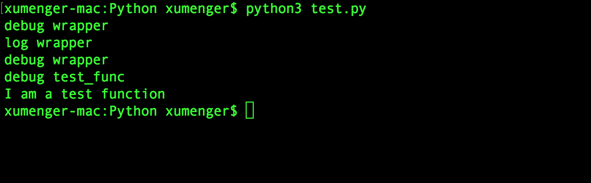

之前讲过Flask 中URL 路由的编码方式是这样的

```python
# -*- coding: utf-8 -*-
from flask import Flask
app = Flask(__name__)

# 主页
@app.route('/')
def index():
    return '<h1>Hello World</h1>'

# 用户URL
@app.route('/user/<name>')
def user(name):
    return '<h1>Hello, %s</h1>' % name

if __name__ == '__main__':
    app.run(debug = True)
```

正是使用的装饰器来实现的，其实可以进一步去看一下Flask 中route 的实现

```python
class Flask(object):

    ...

    def route(self, rule, **options):
        def decorator(f):
            self.add_url_rule(rule, f.__name__, **options)
            self.view_function[f.__name__] = f
            return f
        return decorator

    ...
```

好了，接下来就简单讲一下Python 中的这个装饰器

## 一个简单的装饰器例子

```python
# 装饰器
def log(func):
    def wrapper():
        print("log {}".format(func.__name__))
        return func()
    return wrapper

def debug(func):
    def wrapper():
        print("debug {}".format(func.__name__))
        return func()
    return wrapper


# 在函数前面加上装饰器
@debug
@log
@debug
def test_func():
    print("I am a test function")

if('__main__' == __name__):
    test_func()
```

运行效果是这样的



## Python装饰器

Python 装饰器仅提供定义劫持，对类及其方法的定义并没有提供任何附加元数据的功能

装饰器的本质上是一个Python 函数或类，它可以让其他函数或类在不需要做任何代码修改的前提下增加额外功能，装饰器的返回值也是一个函数、类对象

它经常用于有切面需求的场景，比如：插入日志、性能测试、事务处理、缓存、权限校验等场景

```python
@decorator
def function():
    pass
```

这个语法糖相当于实现的是

```python
def function():
    pass

function = decorator(function)
```

