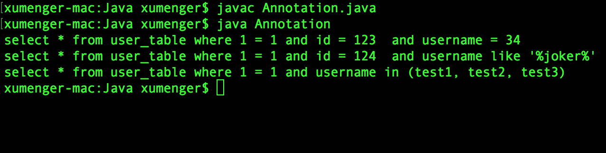

>[之前](http://www.xumenger.com/talk-java-20180819/)我就讲过Java 中的注解和Python 中的装饰器在最直观的语法层面看起来很像，所以首先推荐一篇[《面向对象编程：Java注解与Python装饰器》](https://alexknight.github.io/java/2018/07/19/annotation-and-decorate.html)

回顾一下在Spring Boot 中编写URL 路由的方式是这样的

```java
package com.example.demo;

import org.springframework.web.bind.annotation.PathVariable;
import org.springframework.web.bind.annotation.RequestMapping;
import org.springframework.web.bind.annotation.RequestMethod;
import org.springframework.web.bind.annotation.RestController;

@RestController
public class TestController {
    @RequestMapping("/")
    public String index() {
        return "This is Index Page";
    }
    
    @RequestMapping("/about")
    public String about() {
        return "This is About Page";
    }
    
    @RequestMapping(value="/user/{name}", method= RequestMethod.GET)
    public String user(@PathVariable("name") String name) {
       return "Hello " + name;
    }
}
```

## Java注解

注解是Java5 开始引入的新特征，它提供了一种安全的类似注视的机制，用来将任何的信息或元数据（MetaData）与程序元素（类、方法、成员变量等）进行关联。为程序的元素（类、方法、成员变量等）加上更加直观明了的说明，这些说明信息是与程序的业务逻辑无关，并且供执行的工具或框架使用。注解像一种修饰符一样，应用于包、类型、构造方法、方法、成员变量、参数及本地变量的声明语句中

Java 注解是附加在代码中的一些元信息，用于一些工具在编译、运行时进行解析和使用，起到说明、配置的功能。注解不会也不能影响代码的实际逻辑，仅仅起到辅助性的作用。包含在java.lang.annotation 包中

注解至少有以下作用：

* 生成代码。这是最常见的，也是Java 最早提供的注解。常见的有@param、@return 等
* 跟踪代码依赖性，实现替代配置文件功能。比如Dagger2 依赖注入，未来Java 开发，将大量注解配置
* 在编译时进行格式检查。如@override 放在方法前，如若该方法并未覆盖了超类方法，则编译时就能检查出

注解本质时一个继承了Annotation 的特殊接口，其具体实现类是Java 运行时生成的动态代理类

通过反射获取注解时，返回的是Java 运行时生成的动态代理对象$Proxy1，通过代理对象调用自定义注解（接口）的方法，会最终调用AnnotationInvocationHandler 的invoke 方法。该方法会从memberValues 这个Map 中索引出对应的值。而memberValues 的来源是Java 常量池！

## 一个简单的注解例子

>该例子来自[注解：java 自定义注解应用实例](https://www.cnblogs.com/keyi/p/6797044.html)

```java
import java.lang.annotation.Documented;  
import java.lang.annotation.ElementType;  
import java.lang.annotation.Inherited;  
import java.lang.annotation.Retention;  
import java.lang.annotation.RetentionPolicy;  
import java.lang.annotation.Target;

import java.lang.reflect.Field;
import java.lang.reflect.Method;

@Inherited
@Target({ElementType.TYPE})
@Retention(RetentionPolicy.RUNTIME)
@Documented
@interface Table {
    String value() default "";
}


@Inherited
@Target({ElementType.FIELD})
@Retention(RetentionPolicy.RUNTIME)
@Documented
@interface Column {
    String value() default "";
    String type() default "integer";
}


@Table("user_table")
class UserDto {
    
    @Deprecated
    private String tt;

    @Column(value = "_id", type = "integer")
    private String id;

    @Column(value = "_username", type = "string")
    private String name;

    public UserDto(String id, String name) {
        super();
        this.id = id;
        this.name = name;
    }

    public String getId() {
        return id;
    }

    public void setId(String id) {
        this.id = id;
    }

    public String getName() {
        return name;
    }

    public void setName(String name) {
        this.name = name;
    }
}


public class Annotation {

    public static void main(String[] args) {
        UserDto userDto_1 = new UserDto("123", "34");
        UserDto userDto_2 = new UserDto("124", "joker");
        UserDto userDto_3 = new UserDto("", "test1, test2, test3");

        String sql_1 = assembleSqlFromObj(userDto_1);
        String sql_2 = assembleSqlFromObj(userDto_2);
        String sql_3 = assembleSqlFromObj(userDto_3);

        System.out.println(sql_1);
        System.out.println(sql_2);
        System.out.println(sql_3);
    }

    /*
     * 通过注解来组装查询条件，组成查询语句
     */
    public static String assembleSqlFromObj(Object obj) {
        // 获取obj 对象的Table 注解信息
        Table table = obj.getClass().getAnnotation(Table.class);
        StringBuffer sbSql = new StringBuffer();
        String tableName = table.value();
        sbSql.append("select * from " + tableName + " where 1 = 1");
        
        // 获取obj 对象的所有成员变量
        Field[] fields = obj.getClass().getDeclaredFields();
        for (Field f : fields) {
            String fieldName = f.getName();
            String methodName = "get" + fieldName.substring(0, 1).toUpperCase() + fieldName.substring(1);
            try {
                // 获取obj 对象列中的Column 注解信息
                Column column = f.getAnnotation(Column.class);
                if (null != column) {
                    // 根据方法名，获取obj 对象的方法
                    Method method = obj.getClass().getMethod(methodName);
                    // 调用对应的方法获取相关信息
                    String value = (String)method.invoke(obj);
                    if (null != value && !value.equals("")) {
                        if (!isNum(column.value()) && !isNum(value)) {  
                            // 判断参数是不是 in 类型参数 1,2,3  
                            if (value.contains(",")) {  
                                sbSql.append(" and " + column.value() + " in (" + value + ") ");  
                            } else {  
                                sbSql.append(" and " + column.value() + " like '%" + value + "%' ");  
                            }  
                        } else {  
                            sbSql.append(" and " + column.value() + " = " + value + " ");  
                        }
                    }
                }
            } catch(Exception e) {
                e.printStackTrace();
            }
        }
        return sbSql.toString();
    }

    /*
     * 检查给定的值是不是 id 类型 1.检查字段名称 2.检查字段值 
     */
    public static boolean isNum(String target) {  
        boolean isNum = false;
        if (target.toLowerCase().contains("id")) {  
            isNum = true;
        }
        if (target.matches("\\d+")) {  
            isNum = true;
        }  
        return isNum;
    }
}
```

编译运行的效果是这样的



本例中的assembleSqlFromObj() 方法利用了Java 的注解、反射机制获取类、对象的元数据信息，扩展阅读[《Java中的Class和Object》](http://www.xumenger.com/java-class-object-20181009/)

>Java注解的更详细的内容可以参考[《Java基础加强总结(一)——注解(Annotation)》](https://www.cnblogs.com/xdp-gacl/p/3622275.html)
