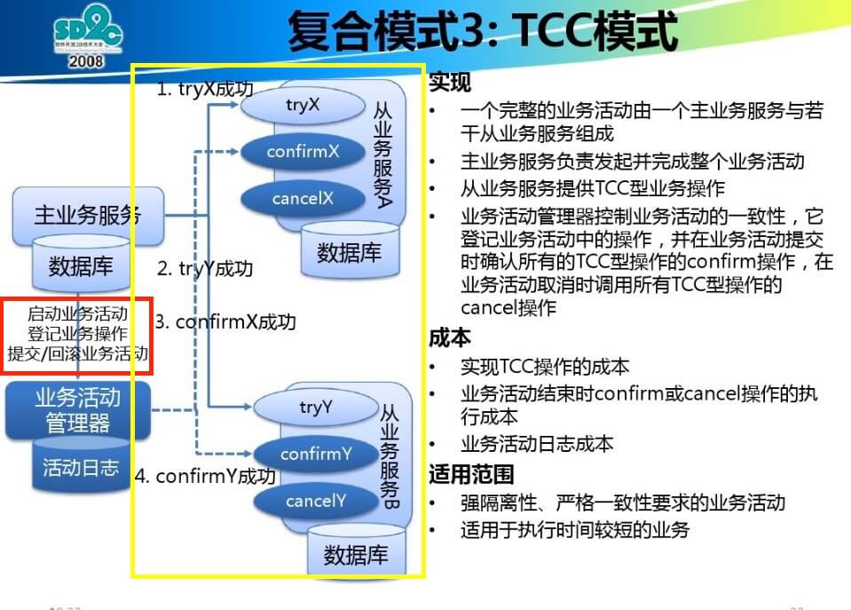

在一个软件系统中，最重要的是什么？当然是数据，数据必须是可信的，为了保证数据的一致性，在一个简单的单体应用中，我们假如用到了多线程并发机制，那么必须在多线程竞争的数据上使用竞态条件来保证线程安全，最根本的其实就是为了保证数据的一致性！

那如果是一个单体应用需要外部存储的时候，现代数据库管理系统为我们提供了很好的选择，数据库提供的事务机制（ACID）可以有效的保证数据的一致性！

考虑这样一个场景，假如在数据库提交事务的时候突然断电，那么它是怎么恢复的呢？

以SQL Server 为例！

SQL Server 数据库是由两个文件组成的，一个数据库文件和一个日志文件，通常情况下，日志文件要比数据库文件大得多。数据库进行任何写操作的时候都要先写日志文件，再写数据文件

同样的道理，在执行事务的时候，数据库首先记录下这个事务的redo 操作日志，然后才开始真正操作数据库，在操作之前首先会把日志文件写入磁盘，那么突然断电的时候，即使操作没有完成，在重启数据库的时候，数据库会根据当前数据的情况进行undo 回滚或者redo 重做，这样就可以保证数据的强一致性

OK，在单体应用中可以通过数据库的ACID 事务机制来保证数据强一致性

但如果是在一个分布式系统中做开发，尤其是在一个微服务架构的系统中，一个业务操作可能分布在多台机器、多个应用中，当中任何一步的失败都会导致整个业务操作的失败，这个时候如何保证数据的一致性呢？！

## 分布式理论

下面分别介绍CAP 理论和BASE 理论

**CAP 理论**

在[分布式计算的八大谬论](http://www.xumenger.com/the-eight-fallacies-of-distributed-computing-20180817/)中有提到过分布式系统的难点，即分布式的网络环境很复杂

在分布式系统中可能的异常有：某个机器宕机、网络异常、消息丢失、消息乱序、数据错误、不可靠的TCP、存储数据丢失等等异常

这里先插播一个概念：CAP 定理！CAP 定理是由加州大学伯克利分校Eric Brewer 教授提出来的，他指出Web 服务无法同时满足以下三个属性

* 一致性(Consistency)：客户端知道一系列的操作会同时发生
* 可用性(Availability)：每个操作都必须以可预期的响应结束
* 分区容错性(Partition tolerance)：即使出现单个组件无法可用,操作依然可以完成

具体而言，在分布式系统中，在任何数据库设计中，一个Web 应用至多只能同时支持上面的两个属性

**BASE 理论**

在分布式系统中，我们往往追求的是高可用性，它的重要性程度比一致性要高，那么如何实现高可用性呢？这里就涉及到另外一个理论：BASE 理论，它是对CAP 定理进行进一步扩充的

* Basically Available（基本可用）
* Soft state（软状态）
* Eventually consistent（最终一致性）

BASE 理论是对CAP 中的一致性和可用性进行权衡后的结果，理论的核心在于：我们无法做到强一致性，但每个应用都可以根据自身业务的特点，采用适当的方法来使系统达到最终一致性

## TCC补偿事务机制

TCC（Try/Confirm/Cancel）其实就是采用的补偿机制，其核心思想是：针对每个操作，都要注册一个与之对应的确认和补偿操作



* Try 阶段：尝试执行业务。完成所有业务检查（一致性）、预留必须业务资源（准隔离性）
* Confirm 阶段：确认执行业务。不做任何业务检查，Confirm 操作需要满足幂等性
* Cancel 阶段：取消执行业务。释放Try 阶段预留的业务资源，Cancel 操作需要满足幂等性

具体举个例子，在电子商务系统中（分为交易系统、账户系统、红包系统），每笔交易发起时，调用交易系统的服务，交易系统再去账户系统扣钱、去红包系统扣红包，假如Tom 发起了交易

* Try 阶段，调用到交易系统，交易系统调用账户系统和红包系统的远程接口，将账户系统中相应的钱、红包系统中响应的红包进行冻结
* Confirm 阶段，远程调用，将用户的钱进行转账操作
* 如果Confirm 成功，那么交易成功，如果失败，那么进入Cancel 阶段对钱和红包进行解冻

TCC 的实现和流程相对简单。但是其缺点也是很明显的，比如Confirm、Cancel 阶段都有可能失败，正常的思路是定时尝试，如果尝试多次还是失败，那么就需要人工干预；另外TCC 属于应用层的一种补偿方式，所以需要程序员在实现的时候写很多补偿的代码，在一些业务场景中，一些业务流程可能用TCC 不太好定义及处理！

**TCC-Transaction框架**

目前在开源世界中，有这么一个项目[TCC-Transaction](https://github.com/changmingxie/tcc-transaction)，它是一个开源的TCC 分布式事务框架。推荐先去阅读[《tcc-transaction 官方文档 —— 使用指南1.2.x》](https://github.com/changmingxie/tcc-transaction/wiki/%E4%BD%BF%E7%94%A8%E6%8C%87%E5%8D%971.2.x)

在TCC 中，一个事务可以包含多个操作。TCC-Transaction 将每个业务操作抽象成事务参与者，每个事务可以包含多个参与者

参与者需要声明try/confirm/cancel 三个类型的方法，和TCC 的操作一一对应。在程序中，通过@Compensable 注解标记在try 方法上，并填写对应的confirm/cancel 方法

```java
public class CapitalTradeOrderServiceImpl implements CapitalTradeOrderService {

    // try
    @Comparable(confirmMethod = "confirmRecord", cancelMethod = "cancelRecord", transactionContextEditor = MethodTransactionContextEditor.class)
    public String record(TransactionContext transactionContext, CapitalTradeOrderDto tradeOrderDto) 
    {

    }

    // confirm
    public void confirmRecord(TransactionContext transactionContext, CapitalTradeOrderDto tradeOrderDto) 
    {

    }

    // cancel
    public void cancelRecord(TransactionContext transactionContext, CapitalTradeOrderDto tradeOrderDto) 
    {

    }

}
```

## 更多分布式事务机制


## 参考资料

* [聊聊分布式事务，再说说解决方案](https://www.cnblogs.com/savorboard/p/distributed-system-transaction-consistency.html)
* [分布式计算的八大谬论](http://www.xumenger.com/the-eight-fallacies-of-distributed-computing-20180817/)
* [tcc-transaction 官方文档 —— 使用指南1.2.x](https://github.com/changmingxie/tcc-transaction/wiki/%E4%BD%BF%E7%94%A8%E6%8C%87%E5%8D%971.2.x)
