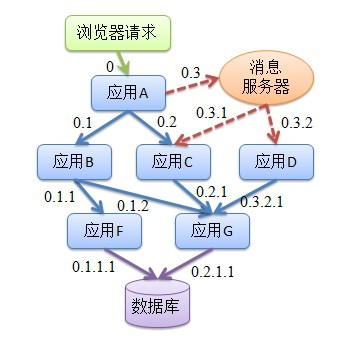
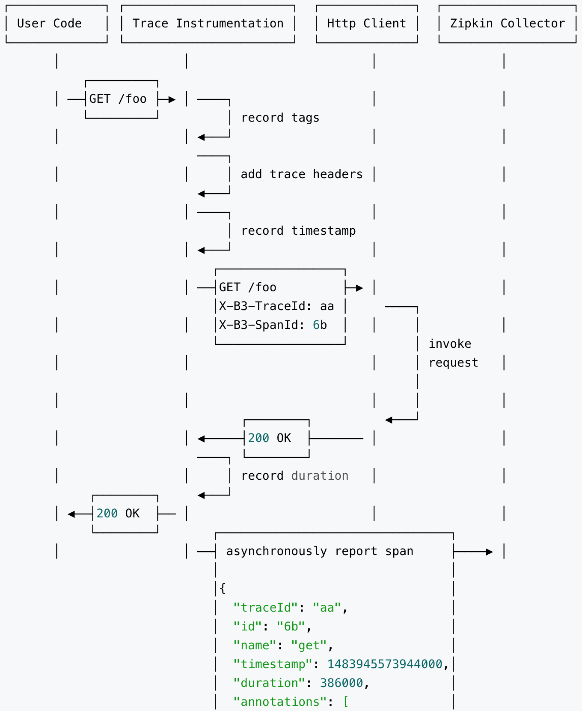
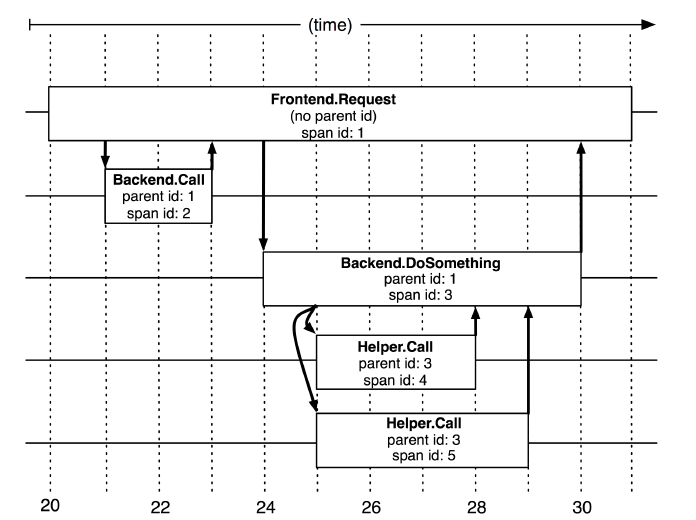
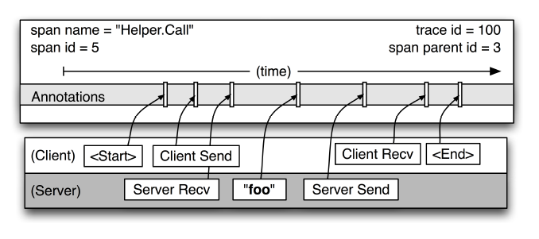

设计和开发一个微服务分布式架构的系统远远没有一个单体应用那么简单，正如[《分布式计算的八大谬论》](http://xumenger.github.io/the-eight-fallacies-of-distributed-computing-20180817/)中讲到的那样，复杂的、难以预料的网络环境使得分布式系统的开发中需要考虑太多的点

[之前一篇](http://xumenger.github.io/distributed-transaction-20181021/)专门对于分布式系统中的数据一致性问题进行了讲解。本文讲解了微服务分布式架构中的另一个领域：分布式调用链监控

## 分布式调用链路

在一个微服务分布式架构的系统中，可能存在复杂的、深层的层层服务调用关系，大致如下图

>微服务架构中各个服务调用关系，是不是很像程序中各个函数的层层调用关系

上面这幅图很好理解，当用户浏览器发起请求的时候，先到应用A，应用A 会去调用B、C，B 会去调用F ……如此层层调用到最后一层，最终完成对于客户请求的一次应答（可能是读请求，也可能是写请求）

试想一下，这个过程中会出现哪些可能的问题

1. 上图中的一个请求要经历多层调用，只要中间任何一步出现错误，那么整个请求就失败
2. 应用B 在调用应用F 的时候，因为应用F 崩溃出现了超时的情况，导致整个请求卡住
3. 应用A 先去调用应用B，结果在B 这里卡了好久，导致接下来想调用C 服务只能等前面B 完成才行

对于第二种情况，可能因为应用F 出现异常拖垮整个服务链路，甚至出现雪崩现象，严重影响系统的可用性。本文先不讨论如何应对这种场景，只是先提一下，这种问题在分布式系统中采用熔断机制和降级机制保证系统在出现此类异常时还有高可用性！

我们先来看看其他的情况，在复杂的调用链路中假设存在一条调用链路响应缓慢，如何定位其中延迟高的服务呢？大多数开发的第一反应可能是**看日志**，依次分析调用链路上各个系统的日志文件，然后定位具体出问题的那个服务，但是只要有过类似排查经历的同学都会知道，真他妈痛苦，海量的日志中定位问题，真的是痛苦得很！

## 分布式跟踪系统

在2010年，Google 发表了其内部使用的分布式跟踪系统[Dapper 的论文](http://bigbully.github.io/Dapper-translation/)，讲述了Dapper 在Google 内部两年的演变和设计、运维经验

Twitter 根据该论文开发了一款分布式跟踪系统[Zipkin](https://github.com/openzipkin/zipkin)，其主要功能是聚集来自各个异构系统的实时监控数据

如上图所示，各个业务系统在彼此调用时，将特定的跟踪消息传递至Zipkin（特别说明一下上图中的Non-Instrumented Server，指的是未使用Trace工具的Server，显然它不会上报Trace信息），Zipkin 在收集到跟踪信息后将其聚合处理、存储、展示，用户可通过Web UI 方便获得网络延迟、调用链路、系统依赖等等信息

那么Zipkin 是怎么收集到这些跟踪信息的呢？这些跟踪信息具体包括了哪些内容，使得Zipkin 收集到之后可以知道系统中调用链路的情况？这里就要介绍一下Trace 和Span 的概念了！下图展示了应用代码发起一次HTTP GET 请求时，怎么收集Trace 信息的

>来自[https://blog.csdn.net/apei830/article/details/78722168](https://blog.csdn.net/apei830/article/details/78722168)

1. 记录tags 信息
2. 将当前调用链的Trace 信息记录到Http Headers 中
3. 记录当前调用的时间戳（timestamp）
4. 发送HTTP 请求，并携带Trace 相关的Header，如X-B3-TraceId:aa，X-B3-SpandId:6b
5. 调用结束后，记录当次调用所花的时间（duration）
6. 将步骤1-5，汇总成一个Span（最小的Trace单元），异步上报该Span信息给Zipkin Collector

在一个多层调用链路中，Trace 信息是这样的：

>5个Span 在分布式跟踪系统的跟踪树中短暂的关联关系（其实每个Span 中还要包含一个TraceID 信息，用于将整个链路串联起来，上图中丢失了TraceID 的信息）

1. 请求到来生成一个全局TraceID（可能要通过分布式主键技术生成），通过TraceID 可以串联起整个调用链，一个TraceID 代表一次请求
2. 除了TraceID，还需要SpanID 用于记录调用父子关系。每个服务会记录下ParentID 和SpanID，通过它们可以组织一次完整调用链的父子关系
3. 一个没有ParentID 的Span 成为Root Span，可以看成调用链的入口
4. 整个调用过程中每个请求都要传TraceID 和SpanID
5. 每个服务将该次请求附带的TraceID 和附带的SpanID 作为ParentID 记录下，并将自己生成的SpanID 也记录下
6. 要查看某次请求的调用则只需要根据TraceID 查出所有调用记录，然后通过ParentID 和SpanID 组织起整个调用链即可！

上面说明了Span 在一个大的跟踪过程是什么样的。分布式跟踪系统记录了Span 名词，以及每个Span 的SpanID 和ParentID，以重建在一次跟踪过程中不同Span 的父子关系。如果一个Span 没有ParentID 被称为Root Span。所有Span 都挂在一个特定的跟踪上，也共用一个TraceID（在图中未示出）。在一个典型的跟踪中，我们希望为每一个RPC 对应到一个单一的Span 上，而且每一个额外的组件层都对应一个跟踪树型结构的层级

下图展示了一个单独的Span 的细节图

## Zipkin和Brave

Twitter 根据该论文开发了一款分布式跟踪系统[Zipkin](https://github.com/openzipkin/zipkin)，其主要功能是聚集来自各个异构系统的实时监控数据

如上图所示，各个业务系统在彼此调用时，将特定的跟踪消息传递至Zipkin（特别说明一下上图中的Non-Instrumented Server，指的是未使用Trace工具的Server，显然它不会上报Trace信息），Zipkin 在收集到跟踪信息后将其聚合处理、存储、展示，用户可通过Web UI 方便获得网络延迟、调用链路、系统依赖等等信息

Zipkin 项目包含以下模块

* zipkin，对应的是zipkin v1 
* zipkin2，对应的是zipkin v2 
* zipkin-server，是Zipkin 的Web 工程
* zipkin-ui，是Zipkin 的前端展示部分工程代码
* zipkin-autoconfigure，为SpringBoot 提供的自动配置相关的类
* zipkin-collector，用于收集Trace 信息，支持从Kafka 和RabbitMQ 中收集，该模块可选，因为Zipkin 默认使用HTTP 协议提供给客户端来收集 
* zipkin-storage，用于存储收集的Trace 信息，默认用内置的InMemoryStorage，即存储在内存中，重启就会丢失。也可以更换存储方式为MySQL、Cassandra等

然后再介绍一下[Brave](https://github.com/openzipkin/brave) 这个项目，Brave 是Java 版的Zipkin 客户端，它将收集的跟踪信息，以Span 的形式上报给Zipkin 系统

Brave目前版本为4.9.1，兼容zipkin1 和2 的协议
