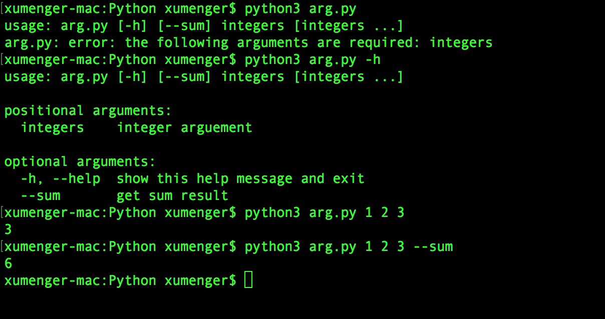
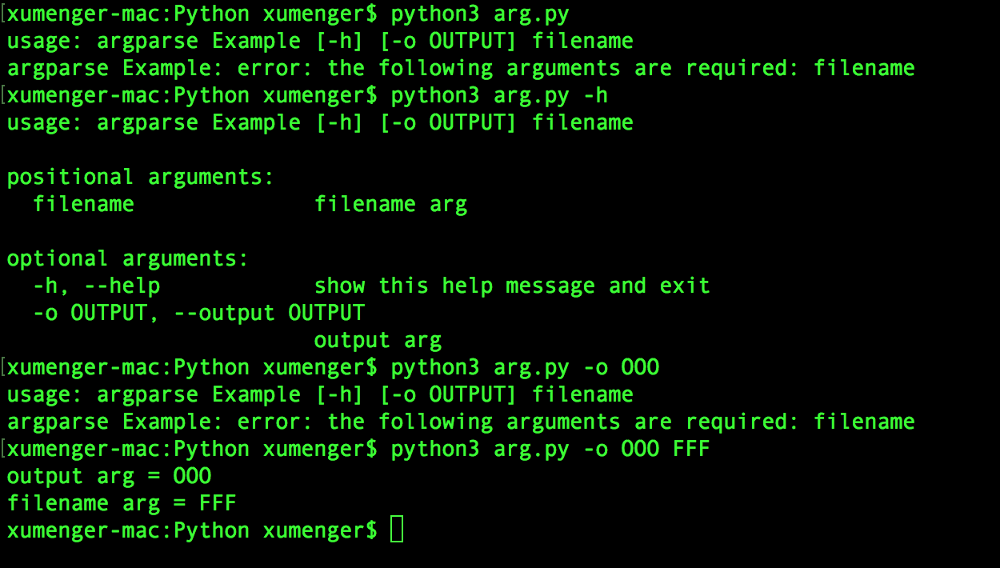

这是一篇没啥技术含量的文章，纯粹是因为最近有一些地方用到argparse 模块，所以**本文仅用于整理argparse 的用法，方便自己参考**

直接来一个例子

```python
import argparse

parser = argparse.ArgumentParser()
parser.add_argument('integers', type = int, nargs = '+', 
                    help = 'integer arguement')
parser.add_argument('--sum', dest = 'accumulate', 
                    action = 'store_const', const = sum, 
                    default = max, help = 'get sum result')
args = parser.parse_args()

print(args.accumulate(args.integers))
```

运行效果是这样的



再来一个例子

```python
import argparse

parser = argparse.ArgumentParser("argparse Example")
parser.add_argument("-o", "--output", help = "output arg")
parser.add_argument("filename", help = "filename arg")

args = parser.parse_args()

print("output arg = " + args.output)
print("filename arg = " + args.filename)
```

运行效果是这样的


