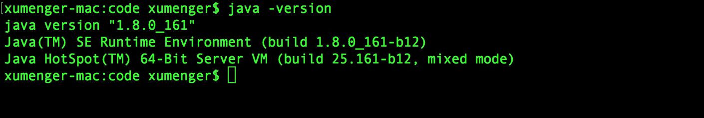

## 搭建Scala开发环境

确保你本地以及安装了JDK-1.5 以上版本，并且设置了JAVA\_HOME 环境变量及 JDK的bin 目录



去[https://www.scala-lang.org/download/](https://www.scala-lang.org/download/)下载scala-2.12.7.tgz 二进制包

解压缩文件包，可将其移动至/usr/local/share 下，然后修改/etc/profile 配置文件，在文件末尾添加`export PATH="$PATH:/usr/local/share/scala/bin"`

当然也可能因为网络问题导致下载太慢，那么在Mac上可以使用`brew install scala` 的方式下载安装！

下面可以测试一下Scala 的运行情况，编写程序如下

```scala
object HelloWorld {

    def main(args: Array[String]) {
        var x = 10;
        if (x < 20) {
            println("Hello, world!");
        }

        var a = 0;
        var b = 0;
        for (a <- 1 to 3; b <- 1 to 3) {
            println("Value of a: " + a + "; Value of b: " + b);
        }

        val list = List(1,2,3,4,5,6);
        for (v <- list) {
            println("Value of v: " + v);
        }

        println("1 + 2 = " + add(1, 2));
    }

    private def add(a: Int, b: Int): Int = {
      var sum: Int = 0
      sum = a + b

      return sum
   }

}
```


另外可以看到直接`scalac HelloWorld.scala` 得到了class 字节码文件，那试着直接用Java 运行呢？直接报错！


## Java调用Scala

编写Scala 程序如下

>下面的Scala 程序指定的包是com.scala，但是其直接在当前目录下编译源文件即可，生成的

```scala
package com.scala

class Calculate {
    def add(a: Int, b: Int): Int = {
        return a + b;
    }

    def sub(a: Int, b: Int): Int = {
        return a - b;
    }

    def mul(a: Int, b: Int): Int = {
        return a * b;
    }

    def div(a: Int, b: Int): Int = {
        return a / b;
    }
}
```

然后编写Java 程序如下

```java
import com.scala.Calculate;

public class TestJava {
    public static void main(String[] args){
        Calculate cal = new Calculate();

        System.out.println(cal.add(1, 2));
    }
}
```

先编译Scala 文件，再编译Java 文件，然后运行Java 程序


## Scala调用Java

编写Java 程序如下

>下面Java 程序中指定的包是com.java，所以其源码文件要放到 com/java/ 下

```java
package com.java;

public class Calculate {
    public int add(int a, int b) {
        return a + b;
    }

    public int sub(int a, int b) {
        return a - b;
    }

    public int mul(int a, int b) {
        return a * b;
    }

    public int div(int a, int b) {
        return a / b;
    }
}
```

然后编写Scala 程序如下

```scala
import com.java.Calculate

object TestScala {
    def main(args: Array[String]) {
        val cal = new Calculate()

        println(cal.mul(10, 2))
    }
}
```


>上面内容把Scala 做了很好的梳理，不过关于Scala 语法的更多内容还请自己去查阅资料补充，比如[http://www.runoob.com/scala/scala-tutorial.html](http://www.runoob.com/scala/scala-tutorial.html)，强烈建议通过开发实践来推动学习！

