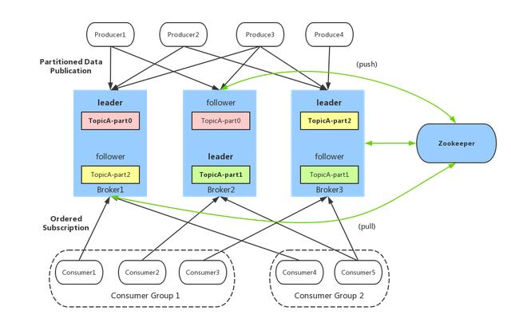

在[TCC分布式事务](http://www.xumenger.com/distributed-transaction-20181021/)、[分布式调用链监控](http://www.xumenger.com/distributed-trace-20181101/)中分别对分布式事务、调用链监控这两个分布式系统架构中的重要技术点进行了梳理，今天来看另外一个分布式系统架构中的重要组件——消息队列

这里我选择Kafka 来进行讲解！其实根据[分布式任务调度系统Celery](http://www.xumenger.com/celery-20180625/)和[一篇学会Redis！](http://www.xumenger.com/redis-20180319/)的内容，Redis 也可以被选择来作为消息队列使用！这里暂且不表

消息队列中间件（简称消息中间件）是指利用高效可靠的消息传递机制进行与平台无关的数据交流，并基于数据通信来进行分布式系统的集成。通过提供消息传递和消息排队模型，它可以在分布式环境下提供应用解耦、弹性伸缩、冗余存储、流量削峰、异步通信、数据同步等等功能，其作为分布式系统架构中的一个重要组件，有着举足轻重的地位

## Kafka架构

broker：Kafka 服务器，负责消息存储和转发

topic：消息类别，Kafka 按照topic 来分类消息

partition：topic 的分区，一个topic 可以包含多个partition，topic 消息保存在各个partition 上

offset：消息在日志中的位置，可以理解为消息在partition 上的偏移量，也代表该消息的唯一序号

producer：消息生产者

consumer：消息消费者

consumer group：消费者分组，每个consumer 必须属于一个group

zookeeper：保存着该集群broker、topic、partition 等meta 数据；另外还负责broker 故障发现、partition leader 选举、负载均衡等功能

## 搭建Kafka的调试环境

首先需要安装gradle ，直接使用Mac 的brew 进行安装

