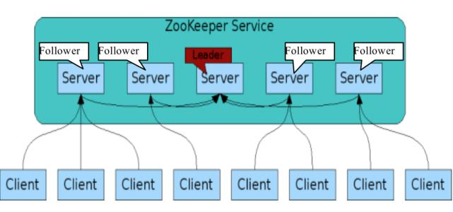
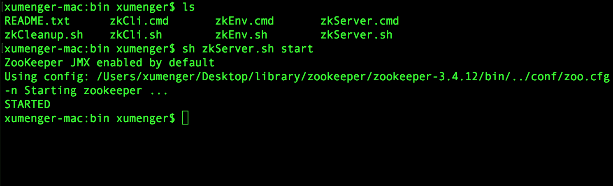
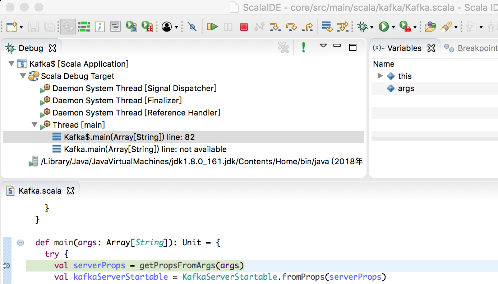
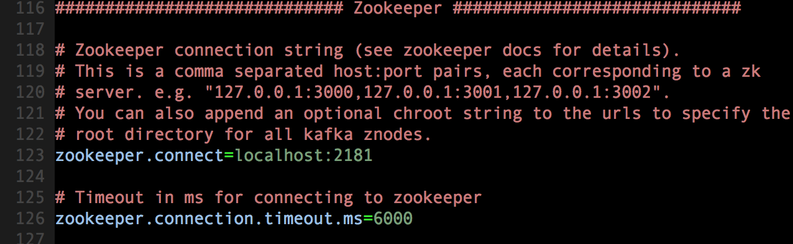
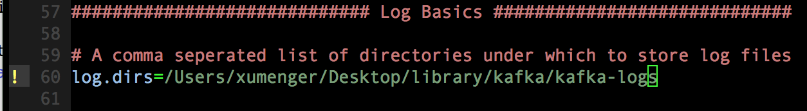
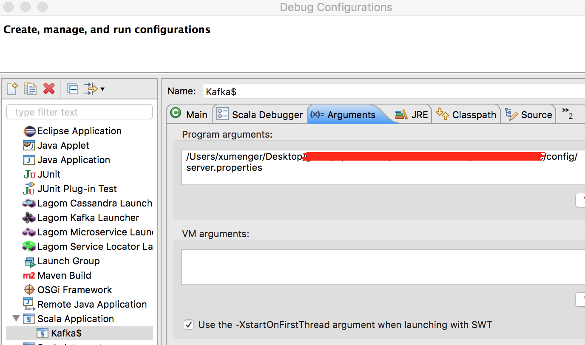
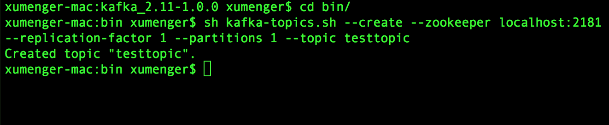
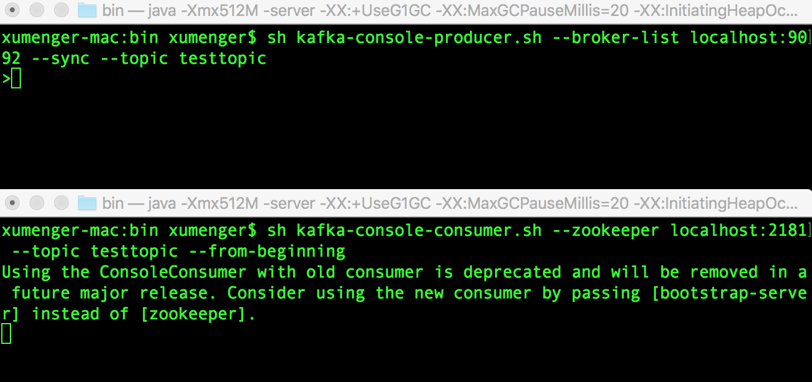
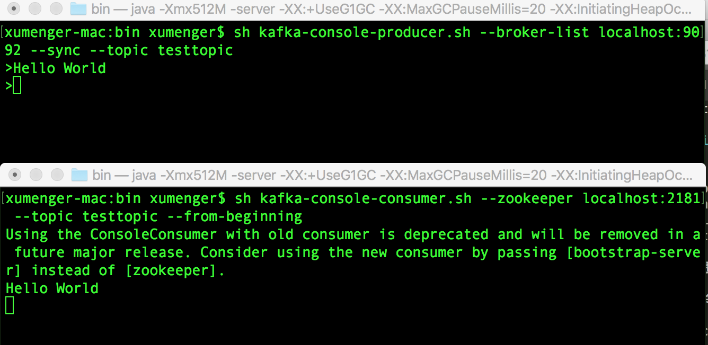

## 安装ZooKeeper

ZooKeeper 是一个分布式应用程序协调程序，是Google 的Chubby 的开源实现，它是集群的管理者，监视者集群中各个节点的状态，根据节点提交的反馈进行下一步合理操作。最终将简单易用的接口和性能高效、功能稳定的系统提供给用户

分布式应用程序可以基于ZooKeeper 实现诸如数据发布/订阅、负载均衡、命名服务、分布式协调/通知、集群管理、Master 选举、配置维护、名字服务、分布式同步、分布式锁和分布式队列等功能



去[https://mirrors.tuna.tsinghua.edu.cn/apache/zookeeper/stable/](https://mirrors.tuna.tsinghua.edu.cn/apache/zookeeper/stable/) 镜像地址下载zookeeper-3.4.12.tar.gz

然后【tar -zxvf zookeeper-3.4.12.tar.gz】解压压缩包文件

去conf/ 目录下，【cp zoo_sample.cfg zoo.cfg】，修改zoo.cfg 中的配置内容中【dataDir=../zookeeperData】

去bin/ 目录下【sh zkServer.sh start】启动服务



ZooKeeper启动后 ，默认端口为2181

## 启动Kafka服务

在[《分布式消息队列Kafka》](http://www.xumenger.com/eclipse-kafka-20181113/)中已经把Kafka 的调试环境搭建起来了，本文继续基于上篇文章的内容来将Kafka 成功运行起来

但是正如上文提到的，Eclipse 安装了Scala 插件后，依然是不能够调试，费劲，还是直接去下载已经集成了Scala 的Eclipse 吧，[http://scala-ide.org/download/sdk.html](http://scala-ide.org/download/sdk.html) 可以直接下载（注意选择和自己环境对应的Scala 版本），然后按照同样的步骤导入项目

OK，现在可以加断点、进行单步调试了



由于Kafka Broker 会将一些元数据信息保存在ZooKeeper 中，因此在启动Kafka Broker 之前必须要先有一个启动着的ZooKeeper 实例或集群，然后我们还需要在server.properties 文件（在config 目录下）更新ZooKeeper 连接信息



同时也去修改server.properties 中关于日志路径的配置



在调试配置中指定server.properties 的绝对路径



然后就可以正常启动Kafka Server 了

## 更多Kafka操作

* [kafka安装和启动-kafka系列（一）](https://blog.csdn.net/a525390802/article/details/80006460)
* [mac(Linux)安装配置kafka环境](https://blog.csdn.net/napoay/article/details/79054816)

更多的Kafka 操作包括：创建topic、启动生产者、启动消费者……

直接用Kafka 的源码比较难搞，这部分我还是直接通过下载二进制程序来搞定，Kafka 1.0.0 的下载地址是[http://archive.apache.org/dist/kafka/1.0.0/](http://archive.apache.org/dist/kafka/1.0.0/)，下载kafka_2.12-1.0.0.tgz，镜像地址[http://mirror.bit.edu.cn/apache/kafka/1.0.0/](http://mirror.bit.edu.cn/apache/kafka/1.0.0/)速度会更快

在对应的目录执行【tar -zxvf kafka_2.12-1.0.0.tgz】进行解压！

>以下操作需要要求Kafka Server 先启动起来

**创建topic**

进入到bin/ 目录

```
sh kafka-topics.sh --create --zookeeper localhost:2181 --replication-factor 1 --partitions 1 --topic testtopic
```



* \-\-create 表示创建
* \-\-zookeeper localhost:2181 指定ZooKeeper 的IP 和端口
* \-\-replication-factor 1 表示topic 的副本是1
* \-\-partitions 1 表示分区为1
* \-\-topic testtopic 表示创建一个名为testtopic 的topic

**生产者和消费者**

执行下面的命令启动生产者

```
sh kafka-console-producer.sh --broker-list localhost:9092 --sync --topic testtopic
```

开启一个新的Terminal 执行下面的命令启动消费者

```
sh kafka-console-consumer.sh --zookeeper localhost:2181 --topic testtopic --from-beginning
```



然后在生产者端输入Hello World 字符串，回车，可以看到在消费者端收到对应的消息


