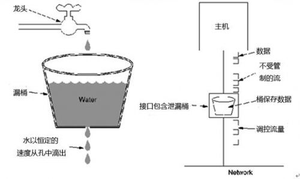
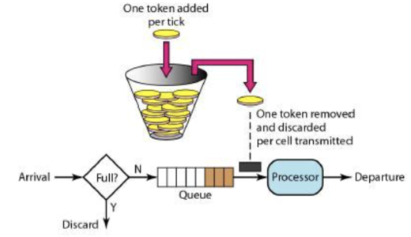
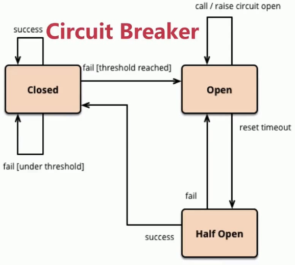

## 雪崩现象

在[《分布式调用链监控》](http://www.xumenger.com/distributed-trace-20181101/)中讲到了在微服务分布式系统中，可能存在很长的调用链，正常的情况下是这样的


那么很显然，如果其中的某个环节因为网络问题或者程序开发的质量不高导致不可用（比如调用超时、一直处理错误……），那么在这个链路之前的环节都会受到影响


因为服务提供者的不可用导致服务调用者的不可用，并将不可用逐渐放大，最终可能导致雪崩现象！

形成雪崩效应的过程大概是下面这样的

* 服务提供者不可用
	* 硬件故障，比如服务提供者的主机宕机、网络硬件故障导致服务提供者不可访问
	* 服务提供者程序逻辑的Bug
	* 缓存击穿：一般发生在缓存应用重启，所有缓存被清空时，以及短时间内大量缓存失效时，大量的缓存不命中，使请求直击后段，造成服务提供者超负荷运行，引起服务不可用
	* 大量用户请求：在秒杀和大促开始前，如果准备不充分，用户发起大量请求也会造成服务提供者的不可用
* 重试加大流量
	* 用户重试：服务提供者不可用后，用户由于忍受不了界面上长时间的等待，而不断刷新页面甚至提交表单
	* 代码逻辑重试：服务调用端会存在大量服务提供者异常后的重试逻辑
* 服务调用者不可用
	* 同步等待造成的资源耗尽，比如会产生大量的等待线程占用系统资源，一旦线程资源被耗尽，服务调用者提供的服务也将处于不可用状态

服务提供者不可用，导致服务调用者不可用，再导致前面的服务调用者不可用，层层影响前面的服务……最终导致程序的雪崩现象！

## 如何解决雪崩问题

为了保证分布式系统的高可用性，一般会采用服务降级、服务熔断、服务限流的策略

### 服务降级

当服务器压力剧增的情况下，根据当前业务情况及流量对一些服务和页面有策略的降级，以释放服务器资源以保证核心任务的正常运行

* 服务接口拒绝服务：页面能访问，但增删改请求时提示服务器繁忙。页面内容也可在Varnish 或CDN 获取
* 页面拒绝服务：页面提供由于服务繁忙次服务暂停。挑战到Varnish 或Nginx 的一个静态页面
* 延迟持久化：页面访问照常，但涉及记录变更，会提示稍晚能看到结果，将数据记录到异步队列或log，服务恢复后执行
* 随机拒绝服务：服务接口随机拒绝服务，让用户重试，目前较少人采用，因为用户体验不佳

### 服务熔断

如果某个目标服务调用慢或者大量超时，此时，熔断该服务的调用，对于后续调用请求，不在继续调用目标服务，直接返回，快速释放资源。如果目标服务情况好转则恢复调用

熔断机制的设计需要考虑三个点：熔断请求判断机制算法、熔断恢复机制、熔断报警，比如

* 熔断请求判断机制算法：使用无锁循环队列计数，每个熔断器默认维护10 个bucket，每秒一个bucket，每个bucket 记录请求的成功、失败、超时、拒绝的状态，默认错误超过50% 且10 秒内超过20 个请求进行中断拦截
* 熔断恢复：对于被熔断的请求，每5 秒允许部分通过，若请求都是健康的（RT < 250ms）则对请求健康恢复
* 熔断报警：对于熔断的请求打日志，异常请求超过某些设定则报警

### 服务限流

限流模式主要是提前对各类型请求设置最高的QPS 阈值，若高于设置的阈值则对该请求直接返回，不再调用后续资源！

常见的限流算法有漏桶、令牌桶算法

漏桶算法很简单，水（请求）先进入漏桶中，漏桶以一定的速度出水（接口有响应速率），当水流入速度过大会直接溢出（访问频率超过接口响应速率），然后就直接拒绝请求，可以看出漏桶算法能强行限制数据的传输速率



令牌桶算法和漏桶算法效果一样，但方向相反。随着时间流逝，系统会按恒定1/QPS 时间间隔（如果QPS=100，则间隔是10ms）往桶里加入Token，如果桶满了就不再加了，当新请求来临时，会从桶中拿出一个Token，如果没有Token 可拿了就阻塞或拒绝服务！



## HyStrix断路器

服务熔断类似现实生活中的“保险丝”，当某个异常条件被触发，直接熔断保险丝来起到保护电路的作用，熔断的触发条件可以依据不同的场景有所不同，比如统计一个时间窗口内失败的调用次数

下面是断路器状态机



* Closed：熔断器关闭状态（所有请求返回成功）
* Open：熔断器打开状态（调用次数累计到达阈值或比例，熔断器打开，服务直接返回错误）
* Half Open：熔断器半开状态（默认时间过后，进入半熔断状态，允许定量服务请求）
	* 如果调用都成功，则认为恢复了，则关闭断路器
	* 反之则打开断路器

断路器的原理是不让客户端直接调用服务端的RPC 接口，而是在客户端包装一层，在这个包装层里实现熔断逻辑

```java
public class CommandHelloWorld extends HystrixCommand<String> {
    private final String name;

    public CommandHelloWorld(String name) {
        super(HyStrixCommandGroupKey.Factory.asKey("ExampleGroup"));
        this.name = name;
    }

    @Override
    protected String run() {
        // 关键点：把一个RPC 调用，封装在一个HyStrixCommand 里面
        return "Hello " + name + " !";
    }
}

// 客户端调用，以前是直接调用远程RPC 接口
// 现在是把RPC 接口封装到HyStrixCommand 里面，它内部完成熔断逻辑
String s = new CommandHelloWorld("World").execute();
```

默认情况下，上面的HystrixCommand 是被扔到一个线程中执行的，也就是说，默认是线程隔离策略；还有一种策略就是不搞线程池，直接在调用者线程中执行，也就是信号量的隔离策略

熔断参数配置

```
circuitBreaker.requestVolumeThreshold //滑动窗口的大小，默认为20
circuitBreaker.sleepWindowInMilliseconds //过多长时间，熔断器再次检测是否开启，默认为5000，即5s钟
circuitBreaker.errorThresholdPercentage //错误率，默认50%
```

也就是说，每当20 个请求中，有50% 失败时，此时再调用此服务，将直接返回失败，直到5s 后，重新检测该触发条件，判断是否把熔断器关闭，或继续打开

下面是一个具体的例子

```java
@RestController
@DefaultProperties(defaultFallback = "defaultFallback")
public class FeignClientTestController {
     
     @HystrixCommand(commandProperties = {
         @HystrixProperty(name = "circuitBreaker.enabled", value = "true"),
         @HystrixProperty(name = "circuitBreaker.requestVolumeThreshold", value = "10"),
         @HystrixProperty(name = "circuitBreaker.sleepWindowInMilliseconds", value = "10000"),
         @HystrixProperty(name = "circuitBreaker.errorThresholdPercentage", value = "60")
     })
     public String serverMethod() {
         return null;
     }

     public String defaultFallback() {
         return "服务器在开小差！";
     }
}
```

## 搭建HyStrix环境

