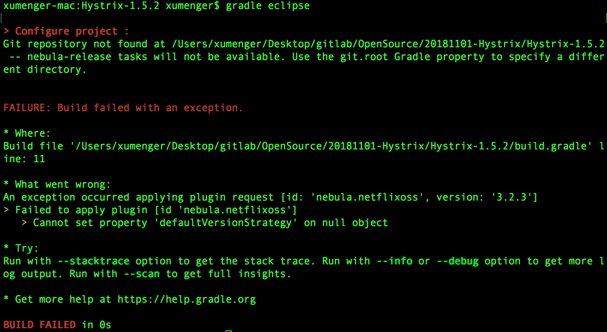
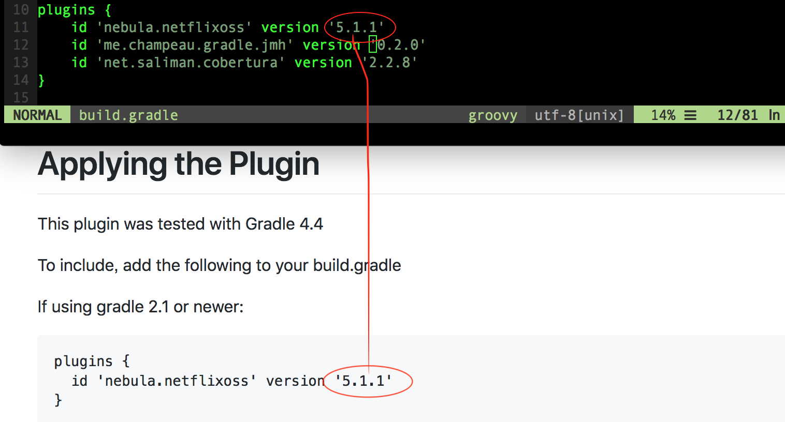
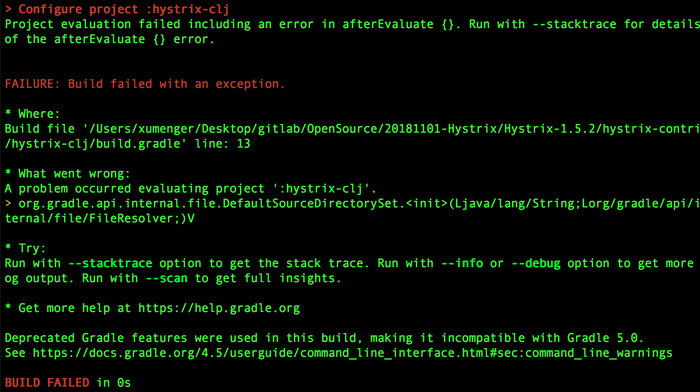
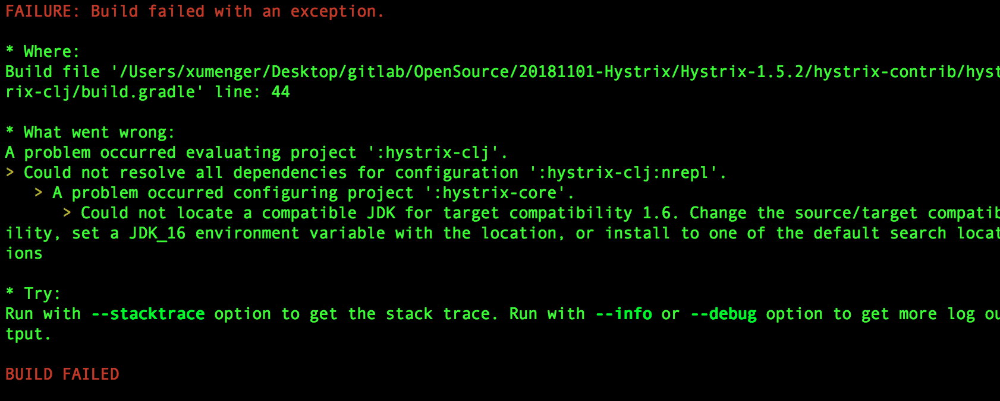
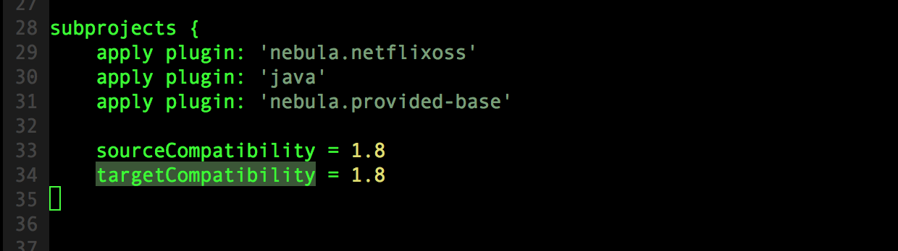
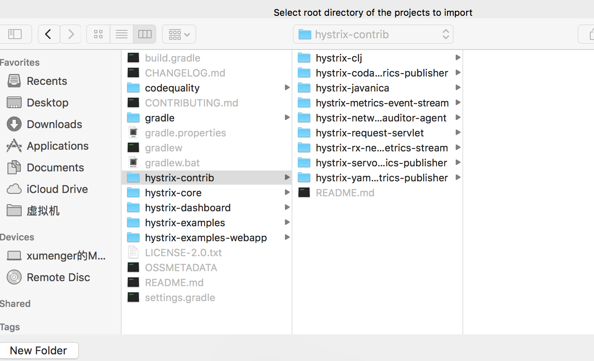
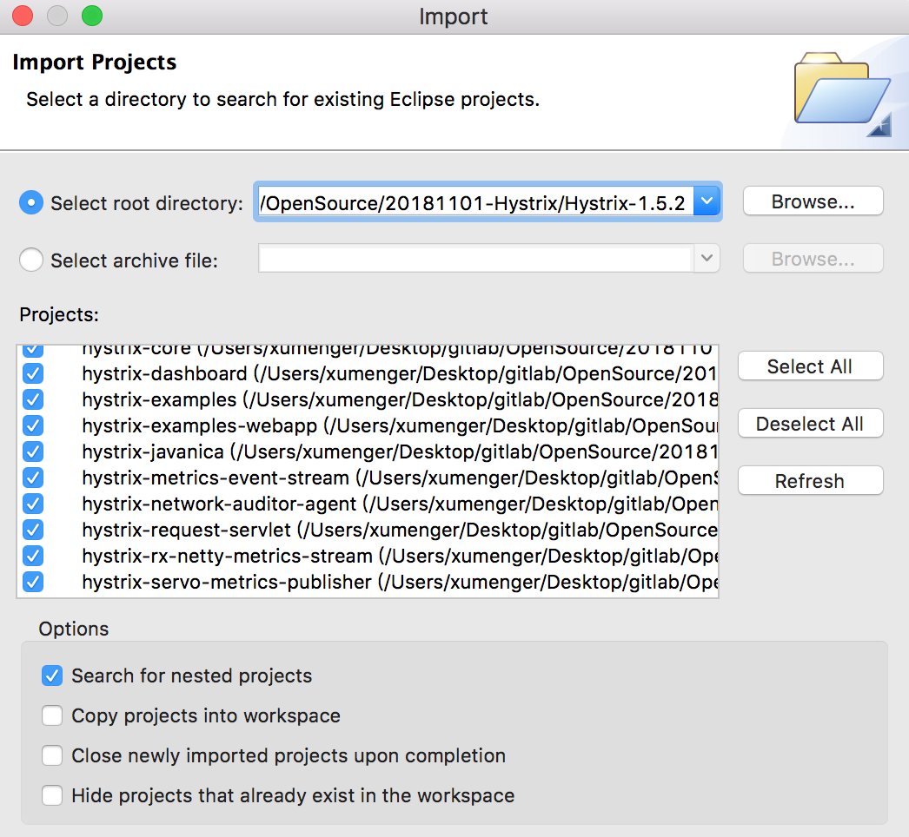

在[《雪崩的时候没有一片雪花是无辜的》](http://www.xumenger.com/hystrix-20181121/)中讲到了分布式系统的高可用、服务降级、服务限流、服务熔断，也简单提到了Hystrix，这里我讲一下怎么搭建Hystrix 的开发环境

Hystrix 是一个专用于服务熔断处理的开源项目，当依赖的服务方出现故障不可用时，Hystrix 有一个所谓的断路器，一但打开，就会直接拦截掉对故障服务的调用，从而防止故障进一步扩大（类似中电路中的跳闸，保护家用电器）

## Hystrix如何解决依赖隔离

>参考[Hystrix 使用与分析](http://hot66hot.iteye.com/blog/2155036)

1. Hystrix 使用命令模式HystrixCommand 包装依赖调用逻辑，每个命令在单独线程中/信号授权下执行
2. 可配置依赖调用超时时间，超时时间一般设置为比99.5% 平均时间略高即可。当调用超时时，直接返回或执行fallback 逻辑
3. 为每个依赖提供一个小的线程池（或信号），如果线程池已满调用将立即拒绝，默认不采用排队，加速失败判定时间
4. 依赖调用结果分成功、失败（抛出异常）、超时、线程拒绝、短路。请求失败（异常、拒绝、超时、短路）时执行fallback（降级）逻辑
5. 提供熔断器组件，可以自动运行或手动调用，停止当前依赖一段时间（10s），熔断器默认错误率阈值为50%，超过将自动运行
6. 提供近实时依赖的统计和监控

Hystrix 依赖的隔离架构，如下图

## 搭建Hystrix环境

下载[Hystrix](https://github.com/Netflix/Hystrix.git)，然后进入到Hystrix 根目录下，执行【gradle eclipse】

执行过程中报错！！

>参考[An exception occurred applying plugin request [id: 'nebula.netflixoss', version: '3.6.3']](https://blog.csdn.net/m0_38017782/article/details/80672771)

解决方法是，访问[https://github.com/nebula-plugins/gradle-netflixoss-project-plugin](https://github.com/nebula-plugins/gradle-netflixoss-project-plugin)，更换最新version 替换

然后重新执行【gradle eclipse】即可，期间可能出现超时的情况，重试！但是可能还是会遇到这个问题

可能是因为我用的gradle 的版本比较高，而Hystrix 支持的gradle 版本比较低，所以要用不一样的方法来构建项目【./gradlew eclipse】

但是还是报错

根据报错，看出来是JDK 的兼容性问题，将根目录下的build.gradle 中的sourceCompatibility 和targetCompatibility 从1.6 改为自己当前机器上的JDK 版本

>搞个gradle 都要浪费这么长时间，各种报错，各种试，也真的是够了！！！！！！！！

然后导入Hystrix 下的所有项目，包括hystrix-core、hystrix-dashboard、hystrix-examples、hystrix-examples-webapp，以及hystrix-contrib 下的各个项目

选择Hystrix 的根目录，然后选中【Search for nested projects】，即可一次性将所有项目导入到Eclipse 中

至此，终于将Hystrix 项目导入到Eclipse 中了

## 参考资料

* [Hystrix应用场景](https://www.jianshu.com/p/e5ed3c66e34b)
* [1.使用Spring Cloud搭建服务注册中心](https://mp.weixin.qq.com/s/K-WDRVLh-AFda_g7ga4iwA)
* [2.使用Spring Cloud搭建高可用服务注册中心](https://mp.weixin.qq.com/s/ie042Q_h8ppsroEjQ0bdgg)
* [3.Spring Cloud中服务的发现与消费](https://mp.weixin.qq.com/s/GoIZdwt5gJje-ZWMBUoBPw)
* [4.Eureka中的核心概念](https://mp.weixin.qq.com/s/kAqOTKUt_qPlxzI4aGS5Pw)
* [5.什么是客户端负载均衡](https://mp.weixin.qq.com/s/k4LtO3W6FcNmZU9zBmpojg)
* [6.Spring RestTemplate中几种常见的请求方](https://mp.weixin.qq.com/s/dN3ftqYspBGYVa4JqIKdiQ)
* [7.RestTemplate的逆袭之路，从发送请求到负载均衡](https://mp.weixin.qq.com/s/uvJDmN2f9y3EEI6A3ss_aQ)
* [8.Spring Cloud中负载均衡器概览](https://mp.weixin.qq.com/s/SsopPRpY_cDarP0UeHKhdw)
* [9.Spring Cloud中的负载均衡策略](https://mp.weixin.qq.com/s/6cDgyK_bs8LuqTjko_GYXg)
* [10.Spring Cloud中的断路器Hystrix](http://mp.weixin.qq.com/s/cs9ufl9j2axq_6a74Ghhbw)
* [11.Spring Cloud自定义Hystrix请求命令](https://mp.weixin.qq.com/s/r05WF7WP3Qd7As_fTBkxaw)
* [12.Spring Cloud中Hystrix的服务降级与异常处](https://mp.weixin.qq.com/s/xifCxrMfbNREyGUOx8m-0w)
* [13.Spring Cloud中Hystrix的请求缓存](http://mp.weixin.qq.com/s/YpWODLrwzFXUQRtIAHLF3Q)
* [14.Spring Cloud中Hystrix的请求合并](http://mp.weixin.qq.com/s/0QSKVLaDjBAscRaeccaXuA)
* [Spring Boot教程](https://www.yiibai.com/spring-boot)
* [Hystrix常用功能介绍](https://segmentfault.com/a/1190000012549823)
* [Hystrix 分布式系统限流、降级、熔断框架](http://blog.51cto.com/developerycj/1950881)
* [Hystrix解析](http://www.iocoder.cn/categories/Hystrix/)