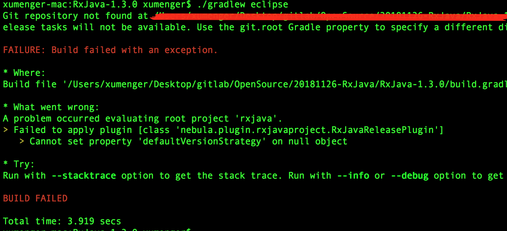
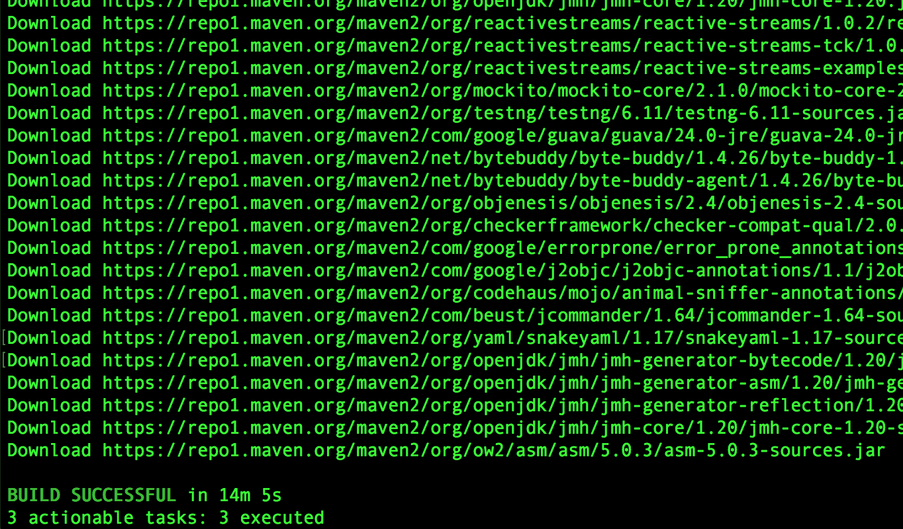
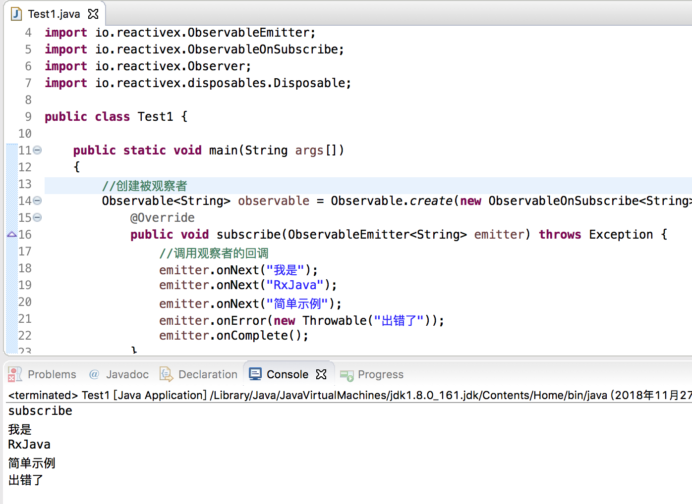

[RxJava](https://github.com/ReactiveX/RxJava)是一个响应式编程框架，采用观察者设计模式

RxJava 最核心的两个东西是Observables（被观察者、事件源）和Subscribers（观察者），Observables 发出一系列事件，Subscribers 处理这些事件。RxJava 中的Observables 是扩展自设计模式中的观察者模式！

直接先来看一个RxJava 编程的例子

```java
package mine;

import io.reactivex.Observable;
import io.reactivex.ObservableEmitter;
import io.reactivex.ObservableOnSubscribe;
import io.reactivex.Observer;
import io.reactivex.disposables.Disposable;

public class Test1 {
    
    public static void main(String args[])
    {
        //创建被观察者
        Observable<String> observable = Observable.create(new ObservableOnSubscribe<String>() {
            @Override
            public void subscribe(ObservableEmitter<String> emitter) throws Exception {
                //调用观察者的回调
                emitter.onNext("我是");
                emitter.onNext("RxJava");
                emitter.onNext("简单示例");
                emitter.onError(new Throwable("出错了"));
                emitter.onComplete();
            }
        });

        //创建观察者
        Observer<String> observer = new Observer<String>() {

            @Override
            public void onError(Throwable e) {
                System.out.println(e.getMessage());
            }

            @Override
            public void onComplete() {
                System.out.println("onCompleted");
            }

            //onSubscribe()方法是最先调用的
            @Override
            public void onSubscribe(Disposable d) {
                System.out.println("subscribe");
            }

            @Override
            public void onNext(String s) {
                System.out.println(s);
            }
        };

        //注册，将观察者和被观察者关联，将会触发OnSubscribe.call方法
        observable.subscribe(observer);
    }
}

```

>RxJava 和我们平时写的程序有什么不同。我们平时写的程序统称为**命令式程序**，是以流程为核心的，每一行代码实际上都是机器实际上要执行的指令

>而RxJava 这样的编程风格，成为**函数响应式编程**，函数响应式编程是以数据流为核心，处理数据的输入、处理以及输出的

>这种思路写出来的代码会跟机器实际执行的指令大相径庭。所以对于已经习惯命令式编程的我们来说，刚开始接触Rxjava的时候必然会很不适应，而且也不太符合我们平时的思维习惯。但是久而久之你会发现这个框架的精髓，尤其是你运用到大项目中的时候，简直爱不释手，随着程序逻辑变得越来越复杂，它依然能够保持代码简洁

## 搭建RxJava环境

首先将RxJava 项目导入到Eclipse 中去！进入到RxJava1.3.0 的根目录下，执行【./gradlew eclipse】，结果报错



换RxJava2.2.3 的源码再试试【./gradlew eclipse】，OK



关于RxJava1.X 和RxJava2.X 的区别可以参考[《RxJava2 vs RxJava1》](https://www.jianshu.com/p/850af4f09b61)

然后导入项目到Eclipse 中

试着直接运行上面的例子，运行效果如下



## 参考资料

* [初识RxJava和Retrofit](https://blog.csdn.net/fantz110/article/details/51707396)
* [RxJava 2.x 实战](https://www.jianshu.com/p/9d0db48426ee)
* [RxJava实战技巧大全](https://www.jianshu.com/p/14f55d3368ed)
* [一起来造一个RxJava，揭秘RxJava的实现原理](https://blog.csdn.net/tellh/article/details/71534704)
* [RxJava2 vs RxJava1](https://www.jianshu.com/p/850af4f09b61)
* [这可能是最好的RxJava 2.x 教程（完结版）](https://www.jianshu.com/p/0cd258eecf60)
* [全面剖析Rxjava2.0的前世今生](https://blog.csdn.net/monkey646812329/article/details/76440648)
* [RxJava 从入门到放弃再到不离不弃](https://www.daidingkang.cc/2017/05/19/Rxjava/)
* [RxJava极简学习（四个简单例子）](https://www.jianshu.com/p/387e4af55031)
* [我所理解的RxJava——上手其实很简单（一）](https://www.jianshu.com/p/5e93c9101dc5)