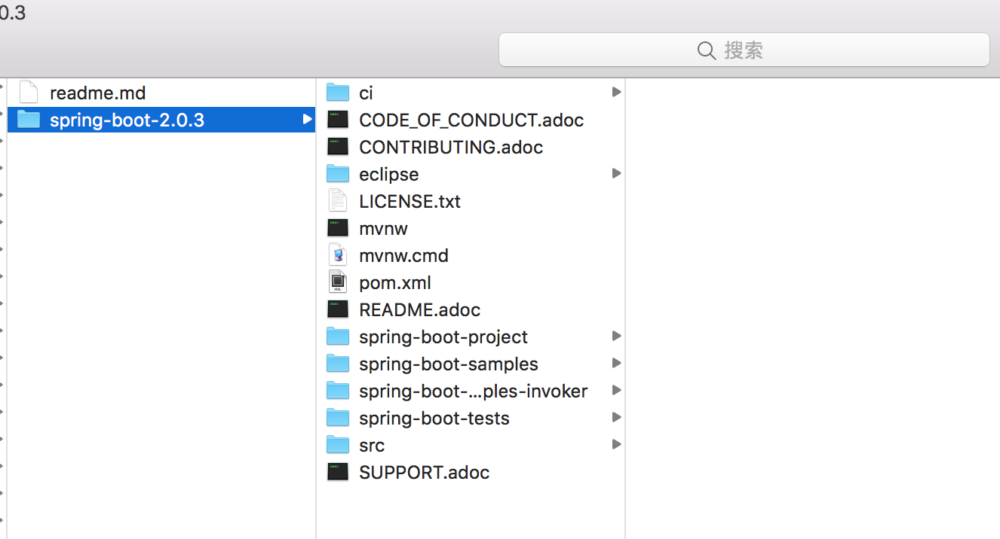
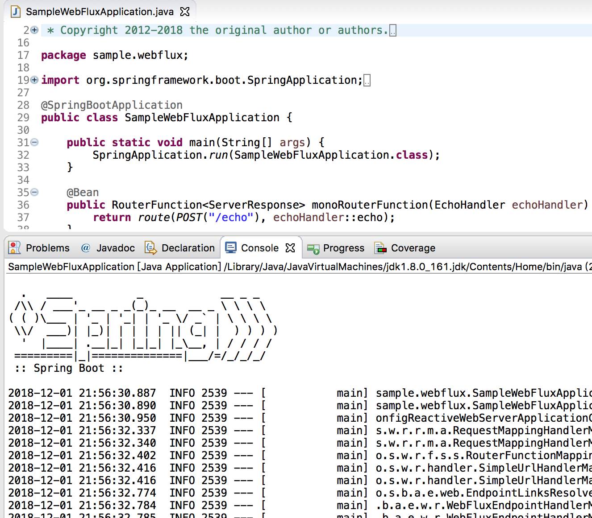

>本文基于Spring Boot-2.0.3

首先使用maven（不是gradle） 构建Spring Boot 项目（为了更快的构建，跳过测试用例）

```shell
$ ./mvnw clean install -DskipTests -Pfast
```

然后等待依赖包下载、等待编译


执行下面的命令

```shell
$ ./mvnw eclipse:eclipse
```


然后将项目导入到Eclipse 中



打开SampleSimpleApplication 运行成功



可以直接在浏览器中访问


