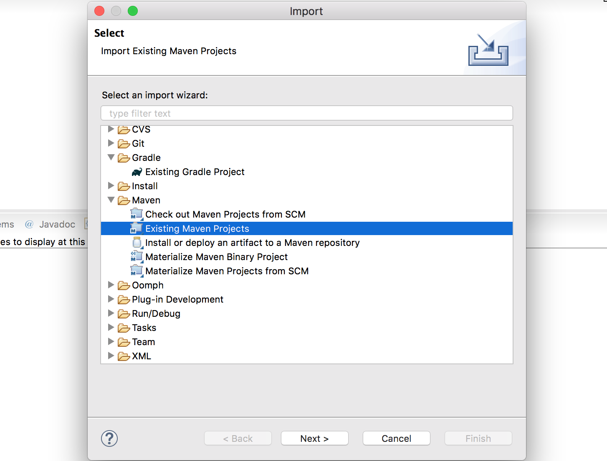

>本文基于[Spring Boot-2.0.3](https://github.com/spring-projects/spring-boot/releases/tag/v2.0.3.RELEASE)

首先使用maven（不是gradle） 构建Spring Boot 项目（为了更快的构建，跳过测试用例）

```shell
$ ./mvnw eclipse:eclipse
```

然后等待依赖包下载、等待编译



然后将构建好的项目导入到Eclipse 中，选择【Import Existing Maven Projects】


选择spring-boot-project、spring-boot-samples、spring-boot-tests 的所有项目（导入时间可能会比较久）


>上面截图中我是一次性导入所有项目，结果堆内存不够用，所以建议一部分一部分的导入！

spring-boot-sample-simple 中打开SampleSimpleApplication.java，Run as Java Application，但是报错


## 参考资料

* [[源码分析]Spring boot 源码环境搭建](https://blog.csdn.net/u010536377/article/details/79517633)
* [Spring Boot开发Web程序](http://www.xumenger.com/java-springboot-20180322/)
* [搭建Flask源码环境](http://www.xumenger.com/pycharm-flask-20181202/)
* [搭建Hystrix开发环境](http://www.xumenger.com/hystrix-dev-20181125/)
