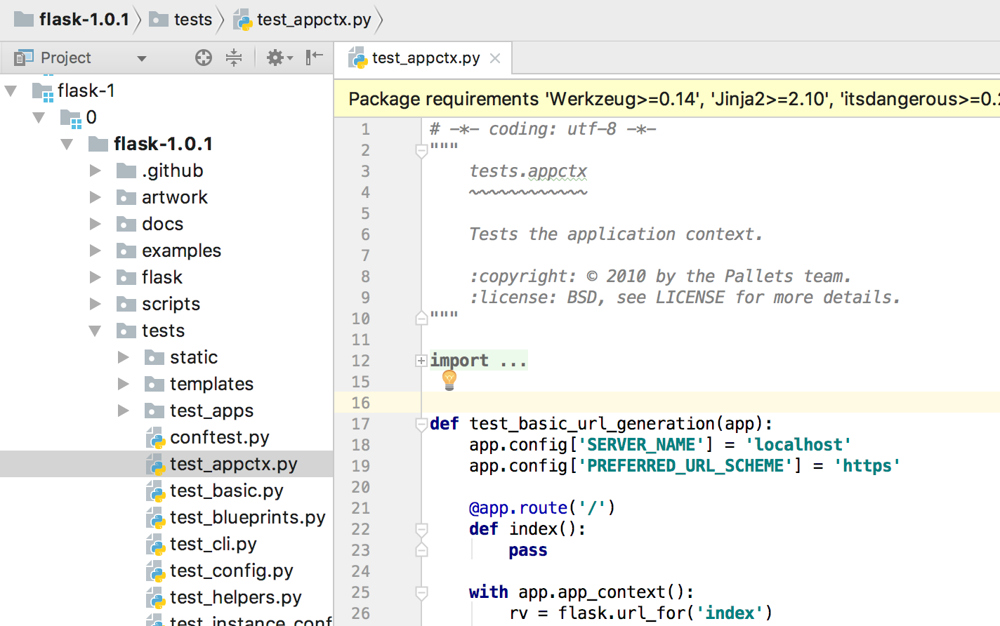
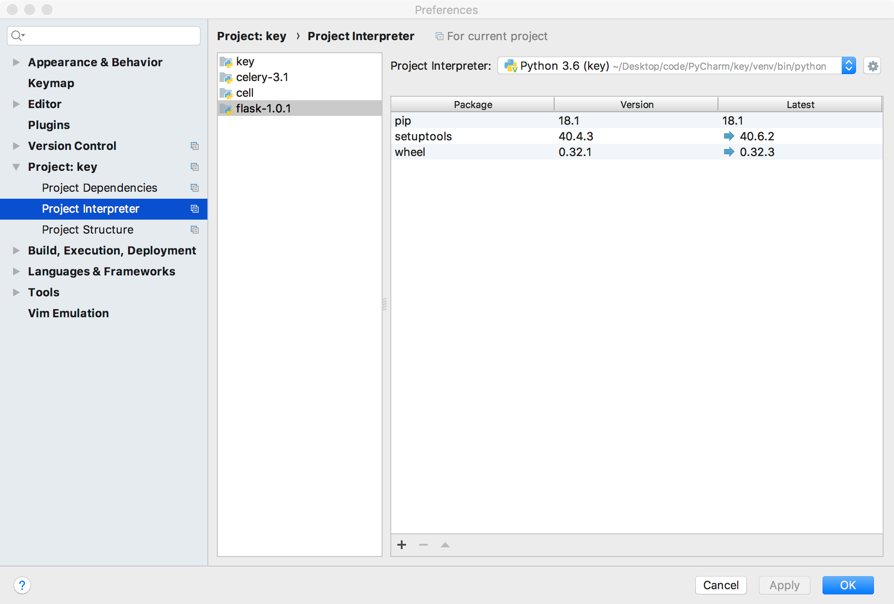
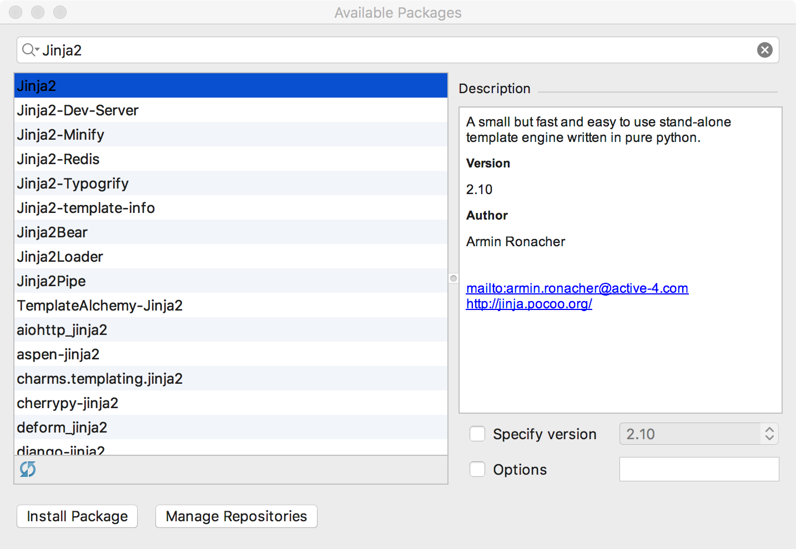
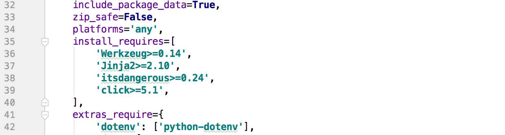
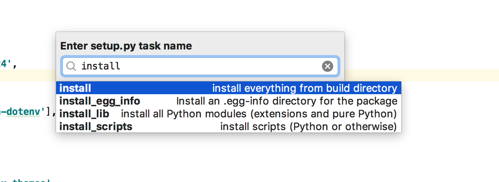
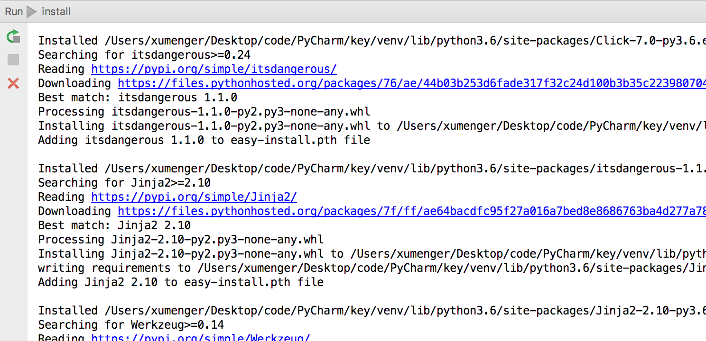
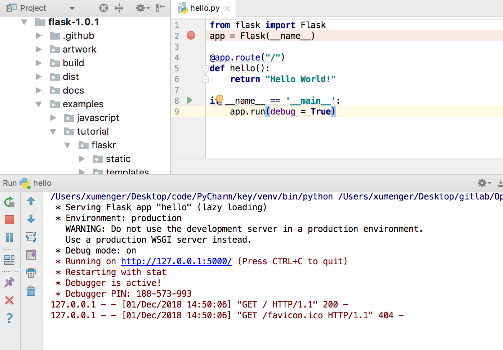
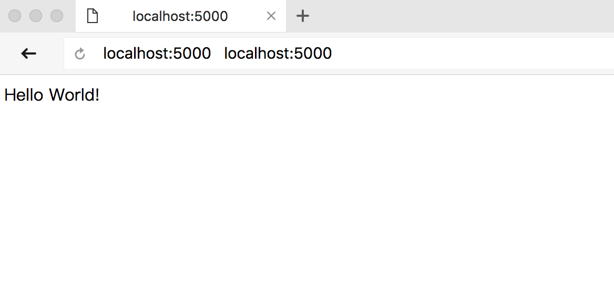

【File】->【Open】，选择Flask 1.0 所在的目录，导入项目



【PyCharm】->【Preferences...】，选择【Project Interpreter】，然后选择对应的flask-1.0.1 项目



然后点击下面的**+**号，来安装需要的依赖



具体需要哪些依赖，可以到setup.py 文件的install_requires 中看到



或者你也可以一次性自动安装需要的所有依赖，【Tools】->【Run setup.py Task...】，选择install 选项即可



然后在控制台看到这些输出，说明正在安装



等待安装完成！

编写代码如下

```python
from flask import Flask
app = Flask(__name__)

@app.route("/")
def hello():
    return "Hello World!"

if __name__ == '__main__':
    app.run(debug = True)
```

然后，右键启动程序，成功运行



试着在浏览器访问[http://127.0.0.1:5000/](http://127.0.0.1:5000/)


