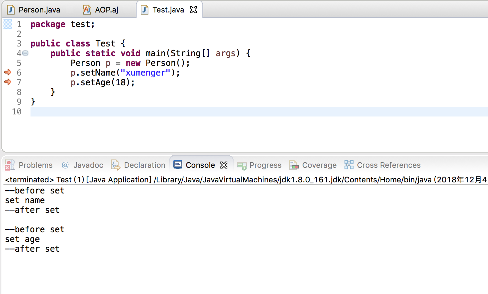

AOP 是Aspect Oriented Programming 的缩写，中文的意思是**面向切面编程**！可以在运行时动态地将代码切入到累中指定方法、指定位置上！

其实就是把**横切逻辑**从**业务逻辑**中抽取出来。哪些属于**横切逻辑**呢？比如，性能监控、日志、事务管理、权限控制等等

>多说一句，在Python 中要想在不修改原有业务代码的基础上，添加记录日志等额外功能，我们可能想到使用装饰器来实现！而在Java 中，AOP 好像是一个更主流的选择！

## 在Eclipse上搭建AspectJ环境

去[https://www.eclipse.org/ajdt/downloads/index.php](https://www.eclipse.org/ajdt/downloads/index.php)下载AJDT 插件

注意，选择匹配你的Eclipse 版本的AJDT 插件，否则会出现无法安装的问题


我当前的Eclipse 版本是4.9，但是现在[https://www.eclipse.org/ajdt/downloads/index.php](https://www.eclipse.org/ajdt/downloads/index.php)没有对应4.9 版本的，试了一下4.8，不错，没有遇到安装失败的问题

在Eclipse 安装。【Help】->【Install New Software...】


按照提示（如果版本不匹配，会出现某几个无法安装的问题），安装完成！！

## 开发一个AspectJ项目

首先去创建一个AspectJ 项目，【File】->【New】->【Other】->【AspectJ Project】


新建一个Java 类，实现代码如下

```java
package test;

public class Person {

    private String name;
    private int age;
    
    public String getName() {
        return this.name;
    }
    
    public void setName(String name) {
        System.out.println("set name");
        this.name = name;
    }
    
    public int getAge() {
        return this.age;
    }
    
    public void setAge(int age) {
        System.out.println("set age");
        this.age = age;
    }
}
```

再创建一个Aspect，【New】->【Other】->【AspectJ】


编写AOP.aj 代码如下

```java
package test;

public aspect AOP {
    
    pointcut setXXX():
        call(public void Person.set*(*));
    
    before(): setXXX() {
        System.out.println("--before set");
    }
    
    after(): setXXX() {
        System.out.println("--after set");
        System.out.println("");
    }
}
```

然后编写测试代码如下

```java
package test;

public class Test {
    public static void main(String[] args) {
        Person p = new Person();
        p.setName("xumenger");
        p.setAge(18);
    }
}
```

运行效果是这样的



## AspectJ语法

AspectJ 是一个面向切面的框架，它扩展了Java 语言，定义了AOP 语法，所以它有一个专门的编译器用来生成遵守Java 字节码规范的class 文件

AspectJ 是一种编译期的用注解形式实现的AOP

>需要特别说明，Spring 中一个很重要的点就是AOP，Spring AOP 是AOP 实现方案的一种。不同于AspectJ，它支持在运行期基于动态代理的方式将aspect 织入目标代码中来实现AOP，但Spring AOP 的切入点支持有限，而且对于static 方法和final 方法都无法支持

>另外，Spring AOP 只支持对于Ioc 容器管理的Bean，其他的普通的Java 类无法支持AOP

>Spring 2.0 以后新增了对AspectJ 切点表达式的支持，在Spring 体系中可以使用AspectJ 语法来实现AOP

废话不多说，还是来看看AspectJ 的语法！

再看看上面的例子，要怎么去理解aj 文件中代码的意思呢？

```java
package test;

public aspect AOP {
    
    pointcut setXXX():
        call(public void Person.set*(*));
    
    before(): setXXX() {
        System.out.println("--before set");
    }
    
    after(): setXXX() {
        System.out.println("--after set");
        System.out.println("");
    }
}
```

理解AspectJ 代码的关键在于理解切入点表达式！！

切入点指示符用来指示切入点表达式目的，AspectJ 切入点指示符有

* execution：用于匹配方法执行的连接点
* within：用于匹配指定类型内的方法执行
* this：用于匹配当前AOP 代理对象类型的执行方法；注意是AOP 代理对象的类型匹配，这样就可能包括引入接口也类型匹配
* target：用于匹配当前目标对象类型的执行方法；注意是目标对象的类型匹配，，这样就不包括引入接口也类型匹配
* args：用于匹配当前执行的方法传入的参数为指定类型的执行方法

AspectJ 切入点支持的切入点指示符还有：call、get、set、preinitialization、staticinitialization、initialization、handler、adviceexecution、withincode、cflow、cflowbelow、if……

AspectJ 类型匹配的通配符

* \*：匹配任何数量字符
* ..：匹配任何数量字符的重复，比如在类型模式中匹配任何数量子包，而在方法参数模式中匹配任何数量参数
* +：匹配指定类型的子类型；仅能作为后缀放在类型模式后边

>[Spring AspectJ切入点语法详解](http://www.cnblogs.com/caoyc/p/5629507.html)

## 参考资料

* [漫谈AOP开发之初探AOP及AspectJ的用法](http://www.cnblogs.com/lihuidu/p/5802662.html)
* [AspectJ的一个简单例子](http://yangjunfeng.iteye.com/blog/398028)
* [在eclipse中使用Aspectj](https://blog.csdn.net/u010513756/article/details/51804190)
* [轻松理解AOP思想(面向切面编程)](https://www.cnblogs.com/Wolfmanlq/p/6036019.html)
* [如何简单的实现 AOP](https://blog.csdn.net/kiss_xiaojie/article/details/80380548)
* [AspectJ 学习笔记](https://blog.csdn.net/csdn_terence/article/details/55804421)
* [Spring之AspectJ](https://www.cnblogs.com/wwwwyc/p/6375494.html)
* [关于AspectJ，你需要知道的一切](http://ju.outofmemory.cn/entry/329098)
* [AspectJ的切入点表达式---execution表达式详解](https://blog.csdn.net/corbin_zhang/article/details/80576809)
* [Spring AspectJ切入点语法详解](http://www.cnblogs.com/caoyc/p/5629507.html)