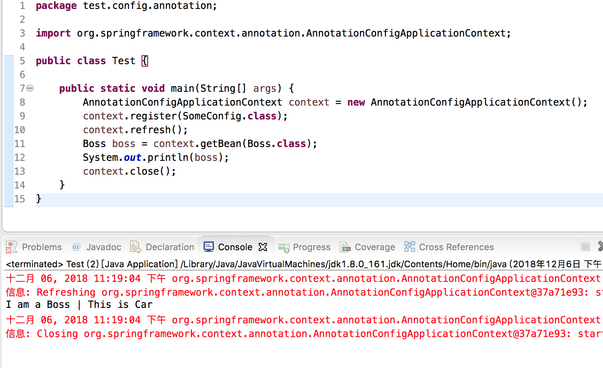

最近在研究Spring、SpringBoot，今天看到了两篇很好的文章，准备根据这两篇文章动手实践一下

>[《SpringBoot系列: 理解 Spring 的依赖注入(一)》](https://www.cnblogs.com/harrychinese/p/spring_ioc.html)

>[《SpringBoot系列: 理解 Spring 的依赖注入(二)》](https://www.cnblogs.com/harrychinese/p/spring_ioc2.html)

## Spring的依赖注入

对于Spring 程序，Spring 框架为我们提供了一个IoC 容器，该容器负责创建对象和维护对象之间的依赖关系

ApplicationContext 即是Spring 的IoC 容器，该容器负责创建Bean，并将功能类Bean 注入到你需要的Bean 中，那么，Spring 是如何知道我们有哪些Bean 类，以及这些类的依赖关系是什么？有三种配置方式告知Spring 程序，分别是XML 配置方式、注解配置方式、Java 配置方式

ApplicationContext 是Spring 程序的核心，不管是Spring 程序，还是Spring MVC 程序，还是Spring Boot 程序，其main() 函数主要的代码就是初始化ApplicationContext 容器，Spring 框架为我们提供了多种容器实现，可以针对不同的应用场景选择

* AnnotationConfigApplicationContext: 该容器读取基于Java 的配置类，适用于Java 配置方式
* AnnotationConfigWebApplicationContext: 专门为Web 应用准备的，适用于注解方式
* XmlWebApplicationContext: 该容器读取一个或多个XML 配置文件，使用于XML 配置方式
* ClassPathXmlApplicationContext, 该容器从classpath 路径下读取XML 配置文件,使用于XML 配置方式

比如示例代码

```java
ApplicationContext context = new ClassPathXmlApplicationContext("resouces/applicationContext.xml");

// 或者
ApplicationContext context = new AnnotationConfigApplicationContext(ManConfig.class);
```

## 三种Bean配置方式

**XML 配置方式**：老的程序中经常见到，比如将Spring Bean 声明放到applicationContext.xml 中

**注解配置方式**：在类定义时通过@Service、@Controller、@Repository、@Component 声明为Spring Bean

* @Service：用于业务服务层
* @Controller：用于展现层
* @Repository：用于DAO 层
* @Component：通用组件，它是上面3 个注解的父注解，无明确的角色，对普通的组件最好用@Component

**Java 配置方式**：该方法是通过@Configuration + @Bean 实现的。该方式引入一个Config 类，在类中通过方法函数声明Bean 类，而Pojo 类定义不加@Componenet 之类的注解，Config 类需要加上@Configuration 注解，Config 类中的Bean 方法需要加上@Bean 注解

@Configuration 等同于XML 配置中的`<beans></beans>` 标签，需说明的是@Configuration 其实也是@Component 的一个子注解

@Bean 等同于XML 配置中的`<bean></bean>` 标签。@Bean 用来注解一个函数，该函数应该是一个Bean 对象，Bean 对象的名称是方法名

>最佳实践：注解配置的方式和Java 配置方式没有孰优孰劣，理论上是可以相互替换的，但可以总结一个最佳实践，全局性的配置用Java 配置（比如数据库的相关配置，MVC 相关配置），业务Bean 配置使用注解配置，尽量少用XML 配置方式

## 搭建测试环境

在Eclipse 上创建一个Maven 项目


修改pom.xml 内容，引入spring-context 依赖，内容为

```xml
<project xmlns="http://maven.apache.org/POM/4.0.0" xmlns:xsi="http://www.w3.org/2001/XMLSchema-instance" xsi:schemaLocation="http://maven.apache.org/POM/4.0.0 http://maven.apache.org/xsd/maven-4.0.0.xsd">
  <modelVersion>4.0.0</modelVersion>
  <groupId>TestSpring</groupId>
  <artifactId>TestSpring</artifactId>
  <version>0.0.1-SNAPSHOT</version>
  <name>TestSpring</name>
  
  <dependencies>
    <dependency>
        <groupId>org.springframework</groupId>
        <artifactId>spring-context</artifactId>
        <version>4.3.10.RELEASE</version>
    </dependency>
  </dependencies>
</project>
```

等待依赖下载


## 基于注解配置实例

基于注解的配置，主要在各个Pojo Class 定义时使用@Component 来声明该类是一个Spring 的Bean，比如Car、Boss 类都使用@Component 注解，依赖注入可以使用@Autowired 或@Resource 注解

比如在Boss 类中，使用了@Autowired 自动注入了一个Car 对象

```java
package test.config.annotation;

import org.springframework.stereotype.Component;

@Component
public class Car {
    @Override
    public String toString() {
        return "This is Car";
    }
}
```

```java
package test.config.annotation;

import org.springframework.beans.factory.annotation.Autowired;
import org.springframework.stereotype.Component;

@Component
public class Boss {
    @Autowired
    private Car car;
    
    @Override
    public String toString() {
        return "I am a Boss | " + car;
    }
}
```

```java
package test.config.annotation;

import org.springframework.context.annotation.ComponentScan;
import org.springframework.context.annotation.Configuration;

/*
 * 这里创建SomeConfig 类目的只有一个，不要准备XML 配置文件
 * 在main() 函数中将使用这个Config 类初始化容器
 * 加上ComponentScan，告知IoC 容器需要扫描指定package 来获取bean 的定义
 */
@Configuration
@ComponentScan("test.config.annotation")
public class SomeConfig {
    
}
```

```java
package test.config.annotation;

import org.springframework.context.annotation.AnnotationConfigApplicationContext;

public class Test {
    
    public static void main(String[] args) {
        AnnotationConfigApplicationContext context = new AnnotationConfigApplicationContext();
        context.register(SomeConfig.class);
        context.refresh();
        Boss boss = context.getBean(Boss.class);
        System.out.println(boss);
        context.close();
    }
}
```

运行效果如下



## 基于Java 的配置

基于注解的配置，主要在各个Pojo Class 定义时使用@Component 来声明该类是一个Spring 的Bean，但如果使用基于Java 的配置，Pojo Class 上不需要加上任何IoC 相关的注解，而是需要在Config 类中使用@Bean 来注解那些需要Spring 容器管理的对象，@Bean 注解往往加在一个函数体上，该函数需要返回一个对象

```java
package test.config.annotation;

import org.springframework.stereotype.Component;

@Component
public class Car {
    @Override
    public String toString() {
        return "This is Car";
    }
}
```

```java
package test.config.annotation;

import org.springframework.beans.factory.annotation.Autowired;
import org.springframework.stereotype.Component;

@Component
public class Boss {
    @Autowired
    private Car car;
    
    @Override
    public String toString() {
        return "I am a Boss | " + car;
    }
}
```

```java
package test.config.annotation;

import org.springframework.context.annotation.ComponentScan;
import org.springframework.context.annotation.Configuration;

/*
 * 这里创建SomeConfig 类目的只有一个，不要准备XML 配置文件
 * 在main() 函数中将使用这个Config 类初始化容器
 * 加上ComponentScan，告知IoC 容器需要扫描指定package 来获取bean 的定义
 */
@Configuration
@ComponentScan("test.config.annotation")
public class SomeConfig {
    
}
```

```java
package test.config.annotation;

import org.springframework.context.annotation.AnnotationConfigApplicationContext;

public class Test {
    
    public static void main(String[] args) {
        AnnotationConfigApplicationContext context = new AnnotationConfigApplicationContext();
        context.register(SomeConfig.class);
        context.refresh();
        Boss boss = context.getBean(Boss.class);
        System.out.println(boss);
        context.close();
    }
}
```

运行效果如下


## 多个Java配置类的处理方式

有时候，我们会在多个Config 类中定义不同的Bean，如何告诉Spring IoC 加载这些Config 类呢？有两个方法分别是：

* 将Config 类分为主从Config两个类别，在主要Config 导入从属Config，在初始化Spring 容器的时候只要注册主要Config 类即可
* 不区分主从Config 类，在初始化Spring 容器的时候将这些Config 类都注册进去

>推荐使用主从Config 方式

**区分主从**

```java
@Configuration
@Import(SubConfig.class)
public class MainConfig {
    @Bean
    Boss boss() {
        return new Boss();
    }
}
```

```java
@Configuration
public class SubConfig {
    @Bean
    public Car car() {
        return new Car();
    }
}
```

```java
public class Test {

    public static void main(String[] args) {
        AnnotationConfigApplicationContext context = new AnnotationConfigApplicationContext();
        context.register(MainConfig.class);
        context.refresh();
        Boss boss = context.getBean(Boss.class);
        System.out.println(boss);
        context.close();
    }
}
```

**不区分主从**

```java
@Configuration
public class SomeConfig1 {
    @Bean
    Boss boss() {
        return new Boss();
    }
}
```

```java
@Configuration
public class SomeConfig2 {
    @Bean
    Car car() {
        return new Car();
    }
}
```

```java
public class Test {

    public static void main(String[] args) {
        AnnotationConfigApplicationContext context = new AnnotationConfigApplicationContext();
        context.register(SomeConfig1.class);
        context.register(SomeConfig2.class);
        context.refresh();
        Boss boss = context.getBean(Boss.class);
        System.out.println(boss);
        context.close();
    }
}
```

## Java配置和注解配置组合使用

>最佳实践：注解配置的方式和Java 配置方式没有孰优孰劣，理论上是可以相互替换的，但可以总结一个最佳实践，全局性的配置用Java 配置（比如数据库的相关配置，MVC 相关配置），业务Bean 配置使用注解配置，尽量少用XML 配置方式

下面的例子中，Boss Bean 采用Java 配置方式，Car Bean 采用注解配置方式

```java
/*
 * 该Java 没有加任何IoC 注解
 */
public class Boss {
    @Autowired
    private Car car;

    @Override
    public String toString() {
        return "I am a Boss | " + car;
    }
}
```

```java
/*
 * Car 加上了基于注解的配置
 */
@Component
public class Car {
    @Override
    public String toString() {
        return "This is Car";
    }
}
```

```java
/*
 * 该配置类中仅定义了Boss Bean，没有定义Car Bean，但实际上Boss 对象仍能被成功注入Car
 * 因为我们组合使用了基于注解的配置方法，Config 类加上@ComponentScan 后, IoC 容器能扫描到 Car 类 (因为其被注解为 Component)
 */
@Configuration
@ComponentScan("test.config.mix")
public class SomeConfig {
    @Bean
    Boss boss() {
        return new Boss();
    }
}
```

```java
public class Test {

    public static void main(String[] args) {
        AnnotationConfigApplicationContext context = new AnnotationConfigApplicationContext();
        context.register(SomeConfig.class);
        context.refresh();
        Boss boss = context.getBean(Boss.class);
        System.out.println(boss);
        context.close();
    }
}
```

## SpringBoot的配置

上面的例子都是基于Spring 框架，在程序启动时需要我们将Config 类主动注册到容器上，而对于Spring Boot 程序，因为加了@EnableAutoConfiguration, 所以可以省去注册 Config 类的过程

修改pom.xml 文件如下（等待下载Spring Boot 依赖）

```xml
<project xmlns="http://maven.apache.org/POM/4.0.0" xmlns:xsi="http://www.w3.org/2001/XMLSchema-instance" xsi:schemaLocation="http://maven.apache.org/POM/4.0.0 http://maven.apache.org/xsd/maven-4.0.0.xsd">
  <modelVersion>4.0.0</modelVersion>
  <groupId>TestSpring</groupId>
  <artifactId>TestSpring</artifactId>
  <version>0.0.1-SNAPSHOT</version>
  <name>TestSpring</name>
  
  <dependencies>
    <dependency>
      <groupId>org.springframework</groupId>
      <artifactId>spring-context</artifactId>
      <version>4.3.10.RELEASE</version>
    </dependency>
    
    <dependency>
       <groupId>org.springframework.boot</groupId>
       <artifactId>spring-boot-starter</artifactId>
       <version>1.5.6.RELEASE</version>
    </dependency>
  </dependencies>
</project>
```

然后编写测试案例

```java
package test.config.springboot;

import org.springframework.stereotype.Component;

/*
 * 该Java 类加上了基于注解的配置说明
 */
@Component
public class Car {
    @Override
    public String toString() {
        return "This is Car";
    }
}
```

```java
package test.config.springboot;

import org.springframework.beans.factory.annotation.Autowired;

/*
 * 该Java 类没有加任何IoC 注解
 */
public class Boss {
    @Autowired
    private Car car;

    @Override
    public String toString() {
        return "I am a Boss | " + car;
    }
}
```

```java
package test.config.springboot;

import org.springframework.context.annotation.Bean;
import org.springframework.context.annotation.ComponentScan;
import org.springframework.context.annotation.Configuration;

/*
 * 该配置类中仅定义了Boss Bean，并加上@ComponentScan
 * IoC 容器能扫描到Car 类，因为其被注解为@Component
 */
@Configuration
@ComponentScan("test.config.springboot")
public class SomeConfig {
    @Bean
    Boss boss() {
        return new Boss();
    }
}
```

```java
package test.config.springboot;

import org.springframework.beans.factory.annotation.Autowired;
import org.springframework.boot.CommandLineRunner;
import org.springframework.boot.SpringApplication;
import org.springframework.boot.autoconfigure.SpringBootApplication;
import org.springframework.context.ApplicationContext;

/*
 * 基于SpringBoot 的命令行程序
 * 无需注册Config 类
 */
@SpringBootApplication  //same as @Configuration @EnableAutoConfiguration @ComponentScan
public class Test implements CommandLineRunner {
    @Autowired
    private ApplicationContext context;

    // Put your logic here.
    @Override
    public void run(String... args) throws Exception {
        Boss boss = context.getBean(Boss.class);
        System.out.println(boss);
    }
    
    public static void main(String[] args) throws Exception {
        SpringApplication app = new SpringApplication(Test.class);
        app.run(args);
    }
}
```

运行效果如下


## Bean作用域

Bean 常用的作用域有下面5 类

* @Scope("singleton")：表示在Spring 容器中只创建一个Bean 实例，一般情况下在应用程序启动的时候，就已经完成Bean 实例化了。在程序运行过程中，每次调用这个Bean 将使用同一个实例。这也是Spring 默认的Scope
* @Scope("prototype")：标注的Bean，每次获取这个Bean 都创建一个新的实例
* @Scope("request")：仅适用于Web 项目，给每个HTTP Request 新建一个Bean 实例
* @Scope("session")：仅适用于Web 项目，给每个HTTP Session 新建一个Bean 实例
* @Scope("global-session")：仅适用于Portal Web 项目，给每个Global HTTP Session 新建一个Bean 实例

singleton Bean 默认都是在容器创建后即初始化，基本上等同于启动一个JVM 后即创建Bean 实例，如果应用很关注启动时间，可以在声明Bean 的时候再加一个@Lazy 注解，Bean 实例化将延迟到第一次获取 bean 对象时。一般情况下，强烈建议所有的Singleton Bean 不要启用延迟加载，这样就能在程序启动的时候发现问题

Struts2 每次请求过来都会实例化一个对象来响应，所以没有线程安全问题，而Spring MVC 是基于视图函数做拦截的，每次Web 请求过来后，Spring 都是使用controller 的指定方法去响应,  而不是新实例化一个controller

Spring 这样做的好处是：避免频繁对象实例化和GC，效率会比Struts2要高；但也不是没有缺点的，会有线程不安全的潜在危险。潜在的风险点是，如果我们的Controller、Service、Repository 类中包含实例变量，就很可能会引起线程不安全

避免线程不安全的方法有三个

* Controller、Service、Repository类中不要加实例变量，有的Bean 都是无状态的，这样就杜绝了线程不安全的隐患，这是推荐做法
* 如果Bean 类必须有成员变量，一定要将成员变量加到ThreadLocal 中
* 默认情况下Spring IoC 管理的Bean，其生命周期是singleton，我们可以修改Controller、Service、Repository 的生命周期为request

Spring 默认的scope 是singleton，因为不需要频繁的对象创建和内存回收，性能最好，但需要注意线程安全问题

prototype 类型的Bean，每次注入的都是一个全新对象，显然没有线程安全问题

request 和session 对象，除非我们在同一个request 或session 中显式地使用了多线程，需要注意一下线程安全问题，在绝大多数情形下，这两个scope 类型的Bean 是线程安全的

## @Conditional条件注入

>@Primary 的缺点：通过类型方法将接口和某个具体实现绑定死了；好处：我们可以随时切换Primary 类，达到切换具体实现

>@Qualifier 的缺点：通过名称方式将接口和具体实现的名称绑定死了；好处：我们可以随时调整名称，达到切换具体实现

但总体来讲@Primary 和@Qualifier 都有点hard code 味道，有什么更好的方案呢？答案就是@Conditional，使用起来稍微复杂些，Spring Boot 中大量使用了@Conditional 注解，比如多profile 环境

首先，我们需要实现Spring 的Condition 接口，然后在Config 类中使用@Conditional + @Bean 组合声明Bean 类型，加上@Conditional 之后, 将在Bean 实例化时按实际的条件evaluate 来确定使用哪个子类

```java
public class LinuxCondition implements Condition {
    public boolean matches(ConditionContext context, AnnotatedTypeMetadata metadata) {
        boolean result=context.getEnvironment().getProperty("os.name").contains("Linux");
        return result ;
    }
}
```

```java
public class WindowsCondition implements Condition {
    public boolean matches(ConditionContext context, AnnotatedTypeMetadata metadata) {
        boolean result=context.getEnvironment().getProperty("os.name").contains("Windows");
        return result ;
    }
}
```

```java
@Configuration
@ComponentScan("javaTestMaven.demo2")
public class SomeConfig {
    @Bean
    @Conditional(LinuxCondition.class)
    public ICar getBenzVWCar() {
        return new VWCar();
    }

    @Bean
    @Conditional(WindowsCondition.class)
    public ICar getBenzCar() {
        return new BenzCar();
    }
}
```

```java
public class Test {

     public static void main(String[] args) {
        AnnotationConfigApplicationContext context = new AnnotationConfigApplicationContext();
        context.register(SomeConfig.class);
        context.refresh();
        ICar car = context.getBean(ICar.class);
        System.out.println(car);
        context.close();
    }
}
```
