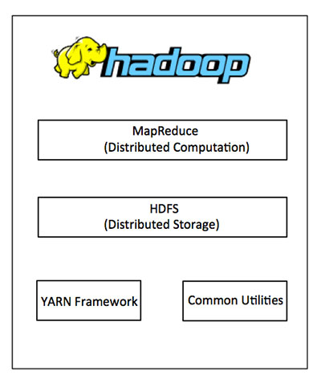

## Hadoop

MapReduce 算法将任务分成小份，并将它们分配到多台计算机，并且从这些机器收集结果并综合，形成了结果数据集。Hadoop 使用MapReduce 算法运行，其中数据在使用其他并行处理的应用程序，总之，Hadoop 用于开发可以执行完整的统计分析大数据的应用程序

Hadoop 是用Java 编写，允许分布式在集群，使用简单的编程模型的计算机大型数据集处理的Apache 的开源框架。Hadoop 框架应用工程提供跨计算机集群的分布式存储和计算的环境。Hadoop 是专为从单一服务器到上千台机器的扩展，每个机器都可以提供本地计算和存储

在Hadoop 的核心主要分为两个层次，即：

* 加工/计算层（MapReduce）
* 存储层（Hadoop 分布式文件系统）

MapReduce 是一种并行编程模型，用于编写普通硬件的设计，谷歌对大量数据的高效处理（多TB 数据集）的分布式应用在大型集群（数千个节点）以及可靠的容错方式。MapReduce 程序可在Hadoop 框架上运行

Hadoop 分布式文件系统（HDFS）是基于谷歌文件系统（GFS），并提供了一个设计在普通硬件上运行的分布式文件系统。它与现有的分布式文件系统有很多相似之处。它高度容错并设计成部署在低成本的硬件，提供了高吞吐量的应用数据访问，并且适用于具有大数据集的应用程序

除了上面两个核心组件，Hadoop 框架还包括以下两个模块：

* Hadoop Common：这是Java 库和其他Hadoop 组件所需的实用工具
* Hadoop YARN：这是作业调度和集群资源管理的框架

设计Hadoop 的初衷是处理这项任务：搜寻和搜索数十亿个网页，将这些信息收集到数据库中。正是由于渴望搜寻和搜索互联网，才有了Hadoop 的HDFS 及分布式处理引擎MapReduce

如果数据集变得极其庞大或极其复杂

## Spark

与Hadoop 的离线计算不同，Spark 基于内存计算要比Hadoop更快、更高效。Spark 是用Scala 写的，这同样是一门简洁高效的语言。当然，开发Spark 也是支持Python 和Java 的

Spark 是一个针对超大数据集合的低延迟的集群分布式计算系统，比MapReducer 快40倍左右。Spark 是Hadoop 的升级版本，Hadoop 作为第一代产品使用HDFS，第二代假如了Cache 来保存中间结果，并能适时主动推Map/Reduce 任务，第三代就是Spark 倡导的流Streaming

Spark 兼容Hadoop API，能够读写Hadoop 的HDFS HBASE 顺序文件等

## 搭建大数据环境

## 一个简单的例子

## 参考资料

* [Hadoop教程](https://www.yiibai.com/hadoop/)
* [Spark - 大数据Big Data处理框架](https://www.jdon.com/bigdata/spark.html)
* [用通俗易懂的大白话讲解Map/Reduce原理](https://blog.csdn.net/oppo62258801/article/details/72884633)
* [别再比较Hadoop和Spark了，那不是设计人员的初衷](http://www.huochai.mobi/p/d/3967708/?share_tid=8b394250f453&fmid=10786192)
