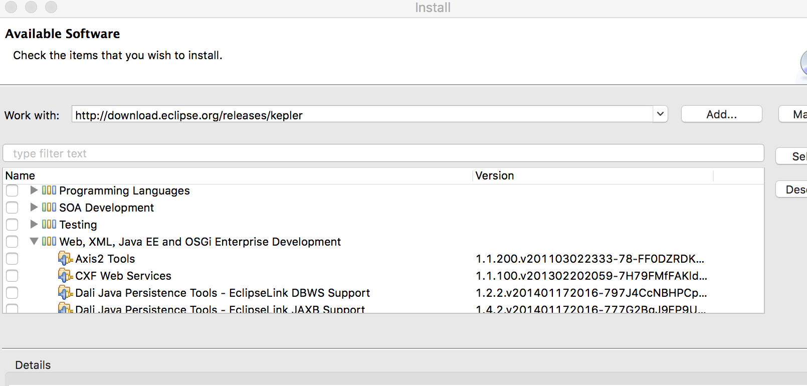
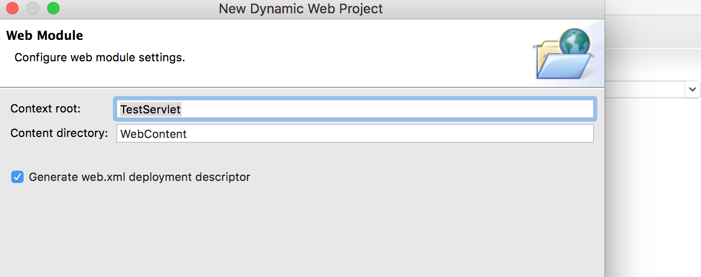

处理请求和返回响应的过程就是由Servlet 程序来完成的！

## 搭建开发环境

首先需要在Eclipse 中安装tomcat，因为Servlet 需要运行在tomcat 环境下运行！我选择安装tomcat 8.5，到达官网的下载地址[https://tomcat.apache.org/download-80.cgi](https://tomcat.apache.org/download-80.cgi)进行下载，选择tar.gz 格式下载，解压后，拷贝到/Library 目录下

下面可以启动tomcat


试着在浏览器中输入[http://localhost:8080](http://localhost:8080)，发现可以访问成功！


启动的命令是sh.startup.sh，对应关闭服务器的命令是sh shutdown.sh

接下来就是把tomcat 集成到Eclipse 中，【Eclipse】->【Perferences】->【Server】->【Runtime Environments】，不过因为我的Eclipse 没有Server 选项，所以需要首先去解决这个问题！

【Help】->【Install New Software】，输入[http://download.eclipse.org/releases/kepler](http://download.eclipse.org/releases/kepler)，回车后可能因为网络速度问题需要稍微多等一会，正常你会看到这样的界面，勾选【Web,XML, Java EE and OSGi Enterprise Development】->【Eclipse Java EE Developer Tools】、【Eclipse Java Web Developer Tools】、【Eclipse Web Developer Tools】、【Eclipse XML Editors and Tools】、【JST Server Adapters Extensions】和【JST Server Adapters】，然后一路Next 即可



等待安装完成（这个比较耗时）。安装完成后重启Eclipse，OK，现在Perferences 中有Server 选项了，接下来继续配置tomcat，【Eclipse】->【Perferences】->【Server】->【Runtime Environments】


这里需要修改/Library/apache-tomcat-8.5.37 的权限，chmod -R 755 /Library/apache-tomcat-8.5.37，然后再选择对应的路径，否则会报错无法继续，权限修改好之后就OK 了


OK，至此，Eclipse tomcat 环境配置完成

## 开发Servlet实例

开发Servlet 有三种可以选择的方法

* 实现Servlet 接口
    * init() 初始化Servlet，该函数只会被调用一次，用户首次访问该Servlet 时调用
    * destroy() 销毁Servlet 实例，关闭tomcat 时调用
    * service() 处理业务逻辑，业务逻辑代码写在这里，用户访问Servlet 时，调用该函数
* 继承GenericServlet
* 继承HttpServlet，需要重写doGet() 和doPost() 方法

上面已经把开发环境搭建完成了，下面就编写一个例子来看看效果！【File】->【New】->【Dynamic Web Project】，输入项目名，其他的保持默认即可


Next->Next，勾选Generate web.xml deployment descriptor，该选项会在目录下生成一个默认的xml文件



在TestServlet 项目Java Resource 的src 下建立命名为web 的package，然后创建名为SimpleServlet 的Servlet，继承自HttpServlet，实现代码如下

```java
package web;

import java.io.IOException;
import javax.servlet.ServletException;
import javax.servlet.annotation.WebServlet;
import javax.servlet.http.HttpServlet;
import javax.servlet.http.HttpServletRequest;
import javax.servlet.http.HttpServletResponse;

/**
 * Servlet implementation class SimpleServlet
 */
@WebServlet("/SimpleServlet")
public class SimpleServlet extends HttpServlet {
    private static final long serialVersionUID = 1L;
       
    /**
     * @see HttpServlet#HttpServlet()
     */
    public SimpleServlet() {
        super();
        // TODO Auto-generated constructor stub
    }

    /**
     * @see HttpServlet#doGet(HttpServletRequest request, HttpServletResponse response)
     */
    protected void doGet(HttpServletRequest request, HttpServletResponse response) throws ServletException, IOException {
        // TODO Auto-generated method stub
        response.getWriter().append("Served at: ").append(request.getContextPath());
    }

    /**
     * @see HttpServlet#doPost(HttpServletRequest request, HttpServletResponse response)
     */
    protected void doPost(HttpServletRequest request, HttpServletResponse response) throws ServletException, IOException {
        // TODO Auto-generated method stub
        doGet(request, response);
    }        
}
```

修改web.xml 的配置，添加自己的`<servlet>`和`<servlet-mapping>`，`<servlet>`和`<servlet-mapping>`成对出现，定义访问的路径

```xml
<?xml version="1.0" encoding="UTF-8"?>
<web-app xmlns:xsi="http://www.w3.org/2001/XMLSchema-instance" xmlns="http://xmlns.jcp.org/xml/ns/javaee" xsi:schemaLocation="http://xmlns.jcp.org/xml/ns/javaee http://xmlns.jcp.org/xml/ns/javaee/web-app_3_1.xsd" id="WebApp_ID" version="3.1">
  <display-name>TestServlet</display-name>
  <welcome-file-list>
    <welcome-file>index.html</welcome-file>
    <welcome-file>index.htm</welcome-file>
    <welcome-file>index.jsp</welcome-file>
    <welcome-file>default.html</welcome-file>
    <welcome-file>default.htm</welcome-file>
    <welcome-file>default.jsp</welcome-file>
  </welcome-file-list>
  
  <servlet>
    <servlet-name>simpleServlet</servlet-name>
    <servlet-class>web.SimpleServlet</servlet-class>
  </servlet>
  <servlet-mapping>
    <servlet-name>simpleServlet</servlet-name>
    <url-pattern>/test</url-pattern>
  </servlet-mapping>
</web-app>
```

然后在SimpleServlet 项目上右键->【Run as】->【Run on Server】，即可启动服务


然后在浏览器中访问[http://localhost:8080/TestServlet/test](http://localhost:8080/TestServlet/test)，可以看到Servlet 的运行效果


## tomcat

tomcat 是Web 应用服务器，是一个Servlet/JSP 容器，tomcat 作为Servlet 容器，负责处理客户请求，把请求传送给Servlet，并将Servlet 的响应返回给用户

* tomcat 6.0 支持Servlet 2.5
* tomcat 7.0 支持Servlet 3.0
* tomcat 8.0 支持Servlet 3.1


## 参考资料

* [《Servlet——开发Servlet三种方法详解》](https://blog.csdn.net/w_linux/article/details/79503432)
* [《如何在mac系统运行servlet helloworld项目》](https://www.jianshu.com/p/d23182c477b8)
* [《mac eclipse配置 tomcat》](https://www.cnblogs.com/yk617558302/p/6029163.html)
* [《eclipse配置Tomcat时 windows->preferences 找不到server选项》](https://blog.csdn.net/keebai/article/details/52752870)
* [《Eclipse中serverRuntime Environment中没有Tomcat选项》](https://blog.csdn.net/mmayanshuo/article/details/79461384)
* [Ubuntu: eclipse tomcat unknown version of tomcat was specified](https://blog.csdn.net/wangdachui95345/article/details/52209530)
* [如何解决eclipse没有Dynamic Web Project问题](https://blog.csdn.net/li_k_y/article/details/82712334)
