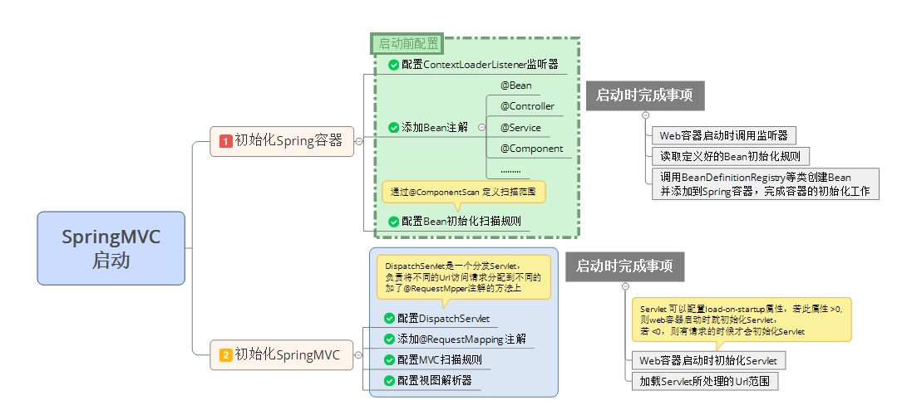
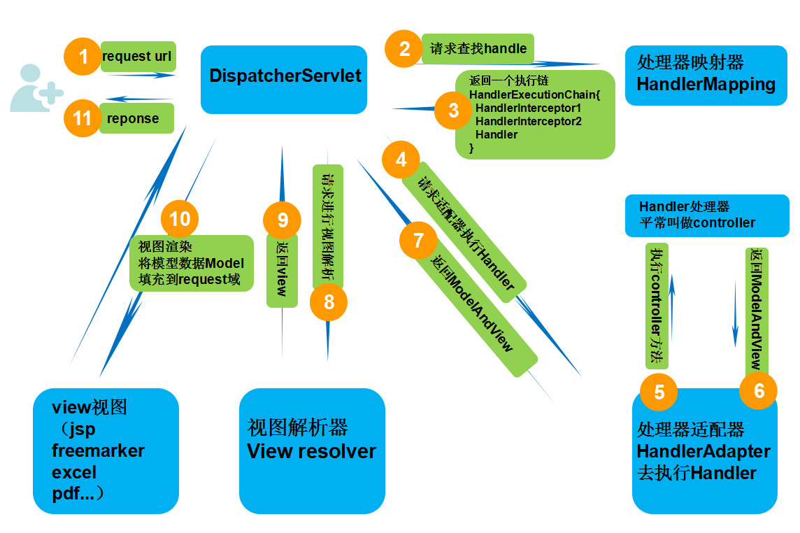

Spring MVC 是Spring 框架的重要模块，借助于Spring 的容器技术，可以非常方便的搭建Web 项目

## 搭建Spring MVC开发环境

首先创建一个Maven 项目

## Spring MVC初始化的流程

Spring MVC 项目启动时要完成Spring 容器的初始化和Spring MVC 配置的初始化

## Spring MVC处理HTTP请求的流程

>参考自[https://www.cnblogs.com/leskang/p/6101368.html](https://www.cnblogs.com/leskang/p/6101368.html)

1. 客户端发起请求到前端控制器DispatcherServlet
2. 前端控制器请求HandlerMapping找Handler（可根据xml或注解查找）
3. 处理器映射器HandlerMapping向前端控制器返回Handler
    * HandlerMapping会把请求映射为HandlerExecutionChain对象
    * 包含一个Handler处理器（页面控制器）对象，多个HandlerInterceptor拦截器对象
    * 通过这种策略模式，很容易添加新的映射策略
4. 前端控制器调用处理器适配器去执行Handler
5. 处理器适配器HandlerAdapter将会根据适配的结果去执行Handler
6. Handler执行完成给适配器完成ModelAndView
7. 处理器适配器向前端控制器返回ModelAndView
    * ModelAndView是Spring MVC框架的一个底层对象，包括Model和View
8. 前端控制器请求视图解析器进行视图解析
    * 通过这种策略很容易更换其他视图技术，只需要更改视图解析器即可
9. 视图解析器向前端控制器返回View
10. 前端控制器进行视图渲染（视图渲染将模型数据填充到request域）
11. 前端控制器向用户响应结果

## 参考资料

* [springMVC请求流程详解](https://www.cnblogs.com/leskang/p/6101368.html)
* [Spring MVC 环境搭建（一）](https://www.cnblogs.com/shinejaie/p/5244258.html)
* [Spring MVC篇一、搭建Spring MVC框架](https://www.cnblogs.com/Captain-Run/p/46c2e33aabb5270136c4bdbc9b52b1f6.html)
* [零配置简单搭建SpringMVC 项目](https://www.cnblogs.com/beiyan/p/5942741.html)
