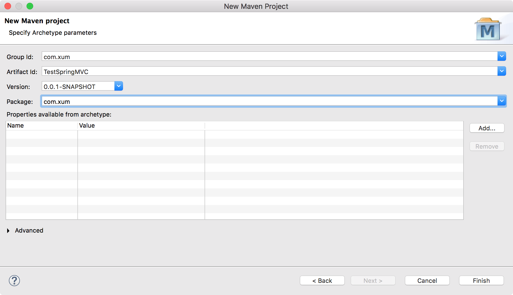
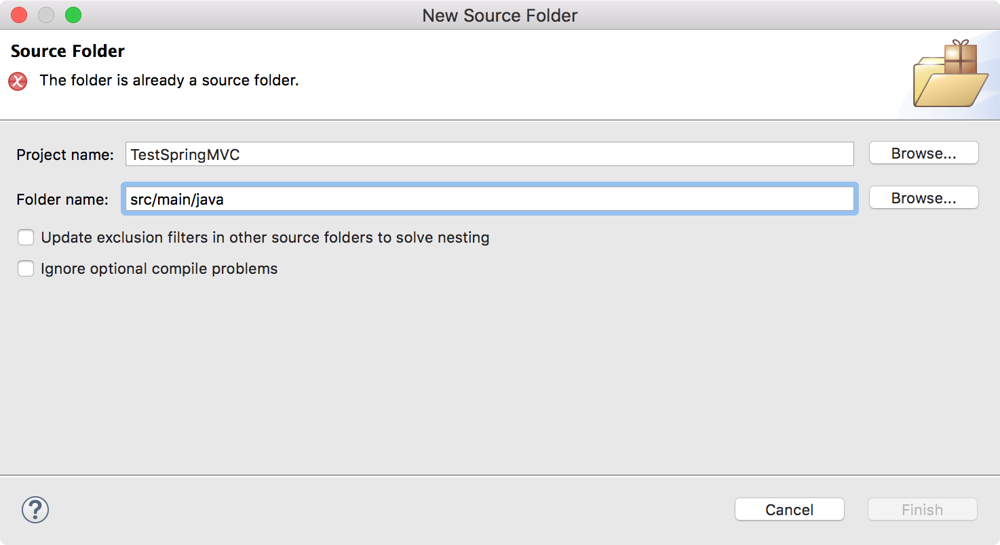
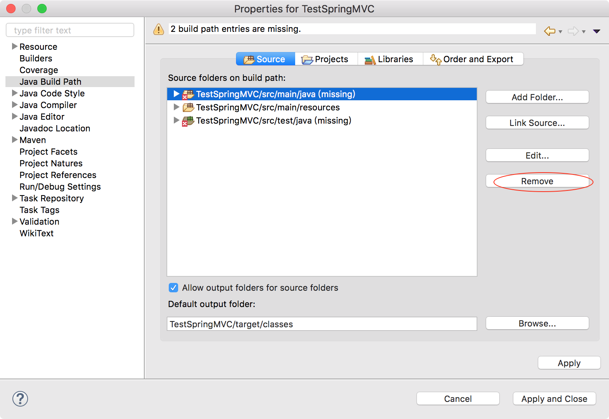

Spring MVC 是Spring 框架的重要模块，借助于Spring 的容器技术，可以非常方便的搭建Web 项目。使用Spring 可插入的MVC 架构，从而在使用Spring 进行Web 开发时，可以选择使用Spring 的Spring MVC 框架或集成其他的MVC 框架，比如Struts1、Struts2 等

## 搭建Spring MVC开发环境

Spring MVC 是一个和Struts2 一样的基于MVC 设计模式的Web 框架，并且继承了MVC 的优点，是基于请求驱动的轻量级Web 框架，Spring MVC 可以认为是Spring 其中的一个Web 扩展，小巧灵活，但功能强大，可以直接传入Servlet API 使用起来开发会比较方便，并且通过配置注解的方式，很轻松的对Web 资源进行管理，提高了开发的速度和应用程序的可维护性

使用Spring MVC 可以设计出干净的Web 层。目前非常流行的就是SSM 的这种整合，就是Spring + Spring MVC + MyBatis 的结合，这样更适合复杂的企业级Web 应用

【File】->【New】，创建一个Maven 项目


Next，选择maven-archetype-webapp


Next，输入Group Id、Artifact Id



finish 后，Maven 项目创建完成！

下面需要调整目录结构为标准的目录结构！新建Source Folder，但是可能会报错



为什么呢？明明没有这个文件夹啊！解决方法是【项目右键】->【Properties】->【Java Build Path】->【Source】->选择标记为有missing 的源文件夹->【Remove】->【Apply】



接下来再来新建源文件夹就不会报错了（如此添加src/main/java、src/test/java、src/test/resources）


接下来把项目转换为Dynamic Web。【项目右键】->【Properties】->【Project Facets】，勾选Dynamic Web Module、Java、JavaScript。Dynamic Web Module 的版本设置为3.1


>此时项目中会多出来一个WebContent 文件夹，需要在这里把它删除了！


现在把项目成功转换为maven 管理的web 项目，接下来修改构建路径和部署集。先来修改构建路径，【项目右键】->【Properties】->【Java Build Path】->【Sources】，添加这些文件夹


接下来修改部署集，添加这些项目


修改pom.xml 添加依赖

```xml
<project xmlns="http://maven.apache.org/POM/4.0.0" xmlns:xsi="http://www.w3.org/2001/XMLSchema-instance"
  xsi:schemaLocation="http://maven.apache.org/POM/4.0.0 http://maven.apache.org/maven-v4_0_0.xsd">
  <modelVersion>4.0.0</modelVersion>
  <groupId>com.xum</groupId>
  <artifactId>TestSpringMVC</artifactId>
  <packaging>war</packaging>
  <version>0.0.1-SNAPSHOT</version>
  <name>TestSpringMVC Maven Webapp</name>
  <url>http://maven.apache.org</url>
  
  <properties>
    <spring.version>4.1.1.RELEASE</spring.version>
  </properties>
 
  <dependencies>
    <dependency>
      <groupId>junit</groupId>
      <artifactId>junit</artifactId>
      <version>3.8.1</version>
      <scope>test</scope>
    </dependency>
    
    <dependency>
        <groupId>org.springframework</groupId>
        <artifactId>spring-core</artifactId>
        <version>${spring.version}</version>
    </dependency>
    <dependency>
        <groupId>org.springframework</groupId>
        <artifactId>spring-web</artifactId>
        <version>${spring.version}</version>
    </dependency>
    <dependency>
        <groupId>org.springframework</groupId>
        <artifactId>spring-webmvc</artifactId>
        <version>${spring.version}</version>
    </dependency>
    
    <dependency>
      <groupId>javax.servlet</groupId>
      <artifactId>javax.servlet-api</artifactId>
      <version>3.1.0</version>
    </dependency>  
  </dependencies>
  <build>
    <finalName>TestSpringMVC</finalName>
  </build>
</project>
```

修改web.xml 的内容如下

```xml
<?xml version="1.0" encoding="UTF-8"?>
<web-app 
    version="2.4"
    xmlns="http://java.sun.com/xml/ns/j2ee"
    xmlns:xsi="http://www.w3.org/2001/XMLSchema-instance"
    xsi:schemaLocation="http://java.sun.com/xml/ns/j2ee http://java.sun.com/xml/ns/j2ee/web-app_2_4.xsd">

  <display-name>Archetype Created Web Application</display-name>

  <!-- 设置spring容器配置文件的位置 -->
    <context-param>
        <param-name>contextConfigLocation</param-name>
        <param-value>classpath:/spring-config/spring.xml</param-value>
    </context-param>

    <!-- 配置ContextLoaderListener表示该工程要以spring的方式启动。
    如果没有设置上下文配置的路径启动时会默认在/WEB-INF目录下查找applicationContext.xml作为spring容器的配置文件，
    但是可以自己设置spring容器配置文件的位置
    在spring容器的配置文件中可以初始化一些bean，如DataSource -->
    <listener>
        <listener-class>org.springframework.web.context.ContextLoaderListener</listener-class>
    </listener>

    <!-- 字符集 过滤器  -->  
    <filter>  
        <filter-name>CharacterEncodingFilter</filter-name>  
        <filter-class>org.springframework.web.filter.CharacterEncodingFilter</filter-class>  
        <init-param>  
            <param-name>encoding</param-name>  
            <param-value>UTF-8</param-value>  
        </init-param>  
        <init-param>  
            <param-name>forceEncoding</param-name>  
            <param-value>true</param-value>  
        </init-param>  
    </filter>  
    <filter-mapping>  
        <filter-name>CharacterEncodingFilter</filter-name>  
        <url-pattern>/*</url-pattern>  
    </filter-mapping>  

    <!-- 配置DispatcherServlet表示，该工程将采用springmvc的方式。
    如果没有初始化springmvc配置文件的位置，启动时也会默认在/WEB-INF目录下查找XXX-servlet.xml作为配置文件，
    XXX就是DispatcherServlet的名字。但是也可以自己定义springmvc配置文件的位置 -->
    <servlet>
        <servlet-name>xumenger</servlet-name>
        <servlet-class>org.springframework.web.servlet.DispatcherServlet</servlet-class>
        <init-param>
            <param-name>contextConfigLocation</param-name>
            <param-value>classpath:/springmvc-config/springmvc.xml</param-value>
        </init-param>
    </servlet>
    <servlet-mapping>
        <servlet-name>xumenger</servlet-name>
        <url-pattern>/</url-pattern>
    </servlet-mapping>

    <welcome-file-list>
        <welcome-file>index.jsp</welcome-file>
    </welcome-file-list>

</web-app>
```

resources 下新增spring-config/spring.xml

```xml
<?xml version="1.0" encoding="UTF-8"?>
<beans xmlns="http://www.springframework.org/schema/beans"
       xmlns:xsi="http://www.w3.org/2001/XMLSchema-instance" 
       xmlns:context="http://www.springframework.org/schema/context"
       xsi:schemaLocation="http://www.springframework.org/schema/beans http://www.springframework.org/schema/beans/spring-beans.xsd  
              http://www.springframework.org/schema/context http://www.springframework.org/schema/context/spring-context-3.0.xsd"> 

    <context:annotation-config />    

    <context:component-scan base-package="com.xum">
        <context:exclude-filter type="annotation" expression="org.springframework.stereotype.Controller"/>
    </context:component-scan>

</beans>
```

resources 下新增springmvc-config/springmvc.xml

```xml
<?xml version="1.0" encoding="UTF-8"?>
<beans xmlns="http://www.springframework.org/schema/beans"
       xmlns:xsi="http://www.w3.org/2001/XMLSchema-instance" 
       xmlns:mvc="http://www.springframework.org/schema/mvc" 
       xmlns:context="http://www.springframework.org/schema/context"
       xmlns:p="http://www.springframework.org/schema/p"
       xmlns:util="http://www.springframework.org/schema/util"
       xsi:schemaLocation="http://www.springframework.org/schema/beans http://www.springframework.org/schema/beans/spring-beans.xsd  
              http://www.springframework.org/schema/context http://www.springframework.org/schema/context/spring-context-3.0.xsd  
              http://www.springframework.org/schema/mvc http://www.springframework.org/schema/mvc/spring-mvc.xsd              
              http://www.springframework.org/schema/util http://www.springframework.org/schema/util/spring-util.xsd">

    <!-- 激活@Controller模式 -->
    <mvc:annotation-driven/>

    <!-- 对包中（包括子包）的所有类进行自动扫描，以完成bean创建及依赖注入的功能 -->
    <context:component-scan base-package="com.xum.controller">
        <context:include-filter type="annotation" expression="org.springframework.stereotype.Controller"/>
    </context:component-scan>

    <bean class="org.springframework.web.servlet.view.InternalResourceViewResolver">
        <property name="prefix" value="/WEB-INF/jsp/"></property>
        <property name="suffix" value=".jsp"></property>
    </bean>

</beans>
```

编写HelloController.java，内容如下

```java
package com.xum.controller;

import org.springframework.stereotype.Controller;
import org.springframework.web.bind.annotation.RequestMapping;

@Controller
@RequestMapping("/test")
public class HelloController {
	
	@RequestMapping(value="")
    public String index() {
        return "test/index";
    }
	
}
```

src/main/webapp/WEB-INF 下创建jsp 文件夹，再创建test 文件夹，下面新增index.jsp

```jsp
<%@ page language="java" contentType="text/html; charset=UTF-8" pageEncoding="UTF-8"%>
<!DOCTYPE html>
<html>
<head>
    <meta http-equiv="Content-Type" content="text/html; charset=UTF-8">
    <title>a simple springmvc peoject</title>
</head>
<body>
    hello,my first simple springmvc project!
</body>
</html>
```

然后，【项目右键】->【Run as】->【Run on Server】

[http://localhost:8080/TestSpringMVC/](http://localhost:8080/TestSpringMVC/)访问效果是这样的


[http://localhost:8080/TestSpringMVC/test/](http://localhost:8080/TestSpringMVC/test/)访问效果是这样的（这个URL 是走SpringMVC 的Controller 的）


最终项目目录结构是这样的！


## Spring MVC初始化的流程

Spring MVC 项目启动时要完成Spring 容器的初始化和Spring MVC 配置的初始化


>参考自[https://www.cnblogs.com/beiyan/p/5942741.html](https://www.cnblogs.com/beiyan/p/5942741.html)

## Spring MVC处理HTTP请求的流程


>参考自[https://www.cnblogs.com/leskang/p/6101368.html](https://www.cnblogs.com/leskang/p/6101368.html)

1. 客户端发起请求到前端控制器DispatcherServlet
2. 前端控制器请求HandlerMapping找Handler（可根据xml或注解查找）
3. 处理器映射器HandlerMapping向前端控制器返回Handler
    * HandlerMapping会把请求映射为HandlerExecutionChain对象
    * 包含一个Handler处理器（页面控制器）对象、多个HandlerInterceptor拦截器对象
    * 通过这种策略模式，很容易添加新的映射策略
4. 前端控制器调用处理器适配器去执行Handler
5. 处理器适配器HandlerAdapter将会根据适配的结果去执行Handler
6. Handler执行完成给适配器完成ModelAndView
7. 处理器适配器向前端控制器返回ModelAndView
    * ModelAndView是Spring MVC框架的一个底层对象，包括Model和View
8. 前端控制器请求视图解析器进行视图解析
    * 通过这种策略很容易更换其他视图技术，只需要更改视图解析器即可
9. 视图解析器向前端控制器返回View
10. 前端控制器进行视图渲染（视图渲染将模型数据填充到request域）
11. 前端控制器向用户返回响应结果

代码层面处理HTTP 请求的流程大概是这样的！


>[https://www.cnblogs.com/Ming8006/p/6346712.html?utm_source=itdadao&utm_medium=referral](https://www.cnblogs.com/Ming8006/p/6346712.html?utm_source=itdadao&utm_medium=referral)

## 参考资料

* [springMVC请求流程详解](https://www.cnblogs.com/leskang/p/6101368.html)
* [Spring MVC 环境搭建（一）](https://www.cnblogs.com/shinejaie/p/5244258.html)
* [Spring MVC篇一、搭建Spring MVC框架](https://www.cnblogs.com/Captain-Run/p/46c2e33aabb5270136c4bdbc9b52b1f6.html)
* [零配置简单搭建SpringMVC 项目](https://www.cnblogs.com/beiyan/p/5942741.html)
* [使用SpringMVC搭建第一个项目](https://www.cnblogs.com/demodashi/p/8481560.html)
* [通过eclipse配置Spring MVC项目](https://www.cnblogs.com/freeweb/p/5100309.html)
* [Eclipse开发SpringMVC简单小程序](https://blog.csdn.net/qq_26584263/article/details/72896058)
* [SpringMVC HelloWorld实例开发及部署](https://www.cnblogs.com/Ming8006/p/6346712.html?utm_source=itdadao&utm_medium=referral)
* [搭建Spring MVC 4开发环境八步走](http://www.itboth.com/d/6naYfe/apache-java-mvc-tomcat-spring)
* [Web开发：关于Tomcat出现The origin server did not find a current representation for the target resourc...的问题](https://blog.csdn.net/dbc_121/article/details/79204340)
* [使用eclipse创建一个简单的maven管理的springmvc的项目](https://www.eertime.com/archives/126.html)
