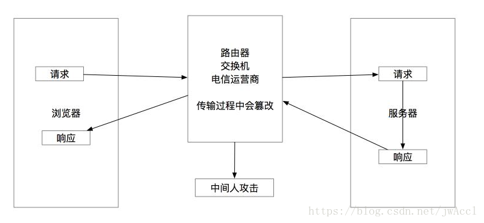

## HTTP请求流程

HTTP 请求的流程很简单，客户端向服务端发明文请求，服务端处理后应答明文内容

>图片来自[https://blog.csdn.net/jwaccl/article/details/80953610](https://blog.csdn.net/jwaccl/article/details/80953610)

## HTTPS请求流程

HTTPS 的流程是：

1. 客户端使用https 的URL 访问Web 服务器，要求与Web 服务器建立SSL 连接
2. Web 服务器收到客户端请求后，会将网站的证书信息（包含公钥）传送一份到客户端
3. 客户端与Web 服务器开始协商SSL 连接的安全等级，也就是信息加密的等级
4. 客户端根据双方同意的安全等级，建立会话秘钥，然后利用网站的公钥将会话秘钥加密，并传送给网站
5. Web 服务器利用自己的私钥解密出会话秘钥
6. Web 服务器利用会话秘钥加密与客户端之间的通信

>图片来自[https://www.cnblogs.com/wqhwe/p/5407468.html](https://www.cnblogs.com/wqhwe/p/5407468.html)

## 参考资料

* [HTTP与HTTPS的区别](https://www.cnblogs.com/wqhwe/p/5407468.html)
* [HTTP与HTTPS对访问速度（性能）的影响](https://www.cnblogs.com/mylanguage/p/5635524.html)
* [一次完整的HTTP请求所经历的7个步骤](https://www.cnblogs.com/linjiqin/p/3560152.html)
* [HTTPS 原理解析](https://www.cnblogs.com/zery/p/5164795.html)