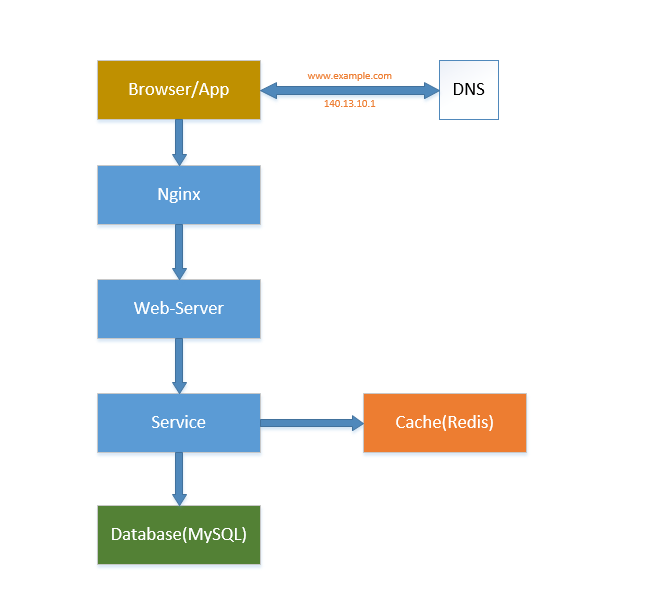
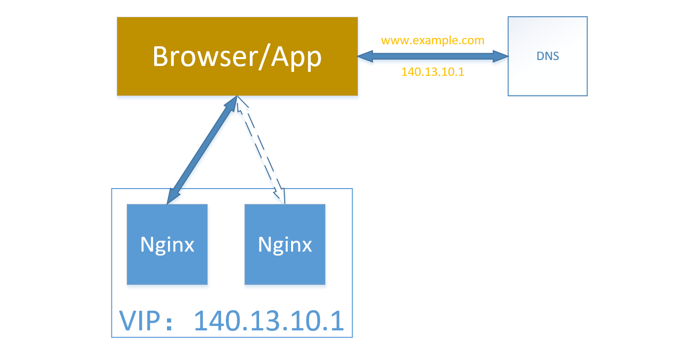
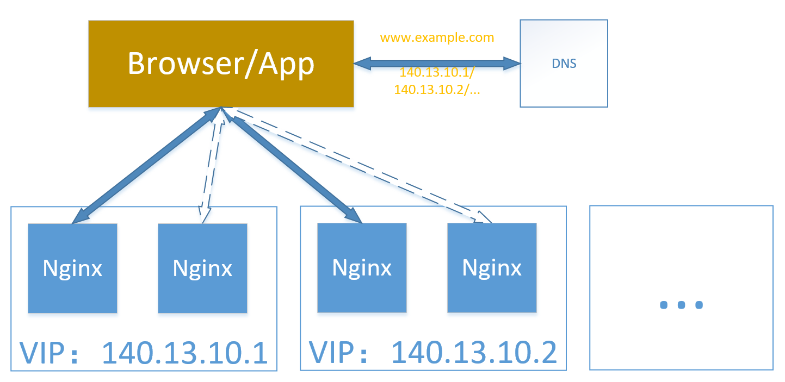

目前分布式系统架构的实践中，除了最基础的数据一致性要保证，大家都在讨论高可用和高并发

当前互联网企业中典型的分层架构是这样的



可能还会有架设F5、LVS 等设备的架构，这里不讨论！下面对于反向代理层（Nginx）的高可用和高并发策略进行讲解。其它层也都可以借鉴其背后的思想

## 高可用

实现高可用的核心准则是**冗余**！比如在反向代理层，架设两个nginx，当master-nginx 挂了，立马用shadow-nginx 顶上来

OK，上面这么一说看似很清晰，能够在master-nginx 出现故障时，切换到让请求流量走到另一台shadow-nginx 上，这样流量就可以继续往下走了

但是，细想一下，这两台服务器的IP 不一样，难道要让浏览器、app 自己动手去改IP？

所以有了冗余之后，还不够，每次出现故障需要人工介入恢复势必会增加系统的不可服务实践。所以，又往往是通过**自动故障转移**来实现系统的高可用

那么上面的场景怎么实现自动故障转移呢？

有两台nginx，一台对线上提供服务，另一台冗余以保证高可用，常见的实践是keepalived 存活探测，相同virtual IP 提供服务

当master-nginx 挂了的时候，keepalived 能够探测到，会自动的进行故障转移，将流量自动迁移到shadow-nginx，由于使用的是相同的virtual IP，这个切换过程对调用方是透明的



>实现自动故障转移的核心是virtual IP！下面会讲到其技术细节

## 高并发

上面介绍了高可用的方案了，但对外还是只有一个IP，同时只会有一个nginx 对外服务！假如这个nginx 服务器支持10 万并发，但随着用户量的增加，慢慢并发数很快就会超过10万，达到20万、30万、100万、500万，这时候怎么办？

>你可以通过架设LVS、F5 来实现，但这里我们不讨论这种方案，如果只用nginx 怎么实现？

其实很简单，反向代理层的横向扩展，就是利用**DNS 轮询**来实现！

以最开始的图为例，为www.example.com 配置多个IP，比如10 个，每次客户端像DNS 查询IP 时，随机返回10 个IP 中的一个，这样系统反向代理层的并发量可以提升十倍，如果系统并发量继续提升，那么添加更多的IP

每个IP 地址上的nginx 还是使用上面master-nginx + shadow-nginx + keeplived + virtual IP 的方式来保证每个IP 节点的高可用！

综上，最终的反向代理层高可用、高并发的方案是这样的



## 虚拟IP

virtual IP 的实现方案有多种，这里介绍几种主流的实现方式

### 通过ARP协议实现VIP

IP 地址只是一个逻辑地址，在以太网中MAC 地址才是真正用来进行数据传输的物理地址，每台主机中都有一个ARP 高速缓存，存储**同一个网络内**的IP 地址与MAC 地址的对应关系，以太网中的主机发送数据时会先从这个缓存中查询目标IP 对应的MAC 地址，会向这个MAC 地址发送数据。操作系统会自动维护这个缓存。这就是整个实现的关键

比如下面是机器A 上的 ARP 缓存

```
(192.168.1.219) at 00:21:5A:DB:68:E8 [ether] on bond0
(192.168.1.217) at 00:21:5A:DB:68:E8 [ether] on bond0
(192.168.1.218) at 00:21:5A:DB:7F:C2 [ether] on bond0
```

192.168.1.217、192.168.1.218 是两台真实的电脑

192.168.1.217 为对外提供数据库服务的主机

192.168.1.218 为热备的机器

192.168.1.219 为虚IP

>注意上面，219(VIP)、217 的MAC 地址是相同的

假如217 宕机了，218 检测到217 心跳挂了，于是启动切换。218 会进行ARP 广播，让VIP 对应的MAC 地址变成自己的MAC 地址。于是，机器A 上的ARP 缓存就变成这样了

```
(192.168.1.219) at 00:21:5A:DB:7F:C2 [ether] on bond0
(192.168.1.217) at 00:21:5A:DB:68:E8 [ether] on bond0
(192.168.1.218) at 00:21:5A:DB:7F:C2 [ether] on bond0
```

>注意现在219(VIP)、218 的MAC 地址是相同的了

不需要人手工修改机器A 的配置，即可实现自动切换的效果！

这是一种简单的VIP 实现，通过MAC 的更改来实现切换。但也有一些局限性，因为实现于MAC 层，所以**无法跨网段**。也无法屏蔽掉后面的服务器的IP 地址

想想上面的场景，nginx 的IP 是要暴露到外网的，所以这种方案的VIP 可以吗？

### 


## 参考资料

* [虚拟IP原理](https://www.cnblogs.com/shijingxiang/articles/4521498.html)
* [Virtual IP Address的实现](https://blog.csdn.net/JackLiu16/article/details/79512927)
* [nginx - 性能优化，突破十万并发](http://www.cnblogs.com/ldms/p/3525383.html)
