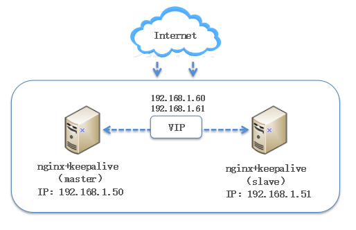

[上一篇](http://www.xumenger.com/nginx-hc-ha-20190219/)介绍了使用 [DNS轮询 + master-nginx + shadow-nginx + keeplived + virtual IP] 技术来实现反向代理层的高可用与高并发

本文就着重介绍一下virtual IP 技术！virtual IP 的实现方案有多种，这里介绍几种主流的实现方式

## 通过ARP协议实现VIP

IP 地址只是一个逻辑地址，在以太网中MAC 地址才是真正用来进行数据传输的物理地址，每台主机中都有一个ARP 高速缓存，存储**同一个网络内**的IP 地址与MAC 地址的对应关系，以太网中的主机发送数据时会先从这个缓存中查询目标IP 对应的MAC 地址，会向这个MAC 地址发送数据。操作系统会自动维护这个缓存。这就是整个实现的关键

比如下面是机器A 上的 ARP 缓存

```
(192.168.1.219) at 00:21:5A:DB:68:E8 [ether] on bond0
(192.168.1.217) at 00:21:5A:DB:68:E8 [ether] on bond0
(192.168.1.218) at 00:21:5A:DB:7F:C2 [ether] on bond0
```

192.168.1.217、192.168.1.218 是两台真实的电脑；192.168.1.217 为对外提供服务的主机；192.168.1.218 为热备的机器；192.168.1.219 为虚IP

>注意此时219(VIP)、217 的MAC 地址是相同的

假如217 宕机了，218 检测到217 心跳挂了，于是启动切换。218 会进行ARP 广播，让VIP 对应的MAC 地址变成自己的MAC 地址。于是，机器A 上的ARP 缓存就变成这样了

```
(192.168.1.219) at 00:21:5A:DB:7F:C2 [ether] on bond0
(192.168.1.217) at 00:21:5A:DB:68:E8 [ether] on bond0
(192.168.1.218) at 00:21:5A:DB:7F:C2 [ether] on bond0
```

>注意现在219(VIP)、218 的MAC 地址是相同的了

不需要人手工修改机器A 的配置，即可实现自动切换的效果！

这是一种简单的VIP 实现，通过MAC 的更改来实现切换。但也有一些局限性，因为实现于MAC 层，所以**无法跨网段**。也无法屏蔽掉后面的服务器的IP 地址

想想[上一篇](http://www.xumenger.com/nginx-hc-ha-20190219/)介绍的场景，nginx 的IP 是要暴露到外网的，所以这种方案的VIP 可以吗？

不过这种方案在内网做MySQL、Redis 的冗余还是可行的！

### 为什么就需要Mac地址又需要IP地址？

假如局域网中有计算机A、计算机B，以及一个唯一与外网连通的路由器，局域网外面是远在他方的百度。当计算机A 想要连接百度时，计算机A 就先发出一个连接百度的请求谁的IP 地址是220.181.57.217，但因为百度在外网，并不在局域网内，所以局域网内部没有人能够回应它的请求！

那正确的做法是怎么样的呢？

正确的做法就是用两种地址，首先使用MAC 地址访问路由器，然后用路由器作为中转站去访问百度的IP 地址！

现实中数据包通过网络中的各种设备（路由器、服务器、交换机、网关等），经过数次的转发，从一端传达到另一端


## 基于VRRP协议实现VIP

VRRP(Virtual Router Redundancy Protocol，虚拟路由器冗余协议)，VRRP 是为了解决静态路由的高可用。虚拟路由器由多个路由器组成，每个路由器都有各自的IP 和共同的VRIP(0-255)，其中每个VRRP 路由器通过竞选成为Master，占有VIP，对外提供路由服务，其他成为Backup，Master 以IP 组播形式发送VRRP 协议包，与Backup 保持心跳连接，若Master 不可用（或Backup 接收不到VRRP 协议包），则Backup通过竞选产生新的Master，并继续对外提供路由服务，从而实现高可用

Keepalived 是Linux 下面实现VRRP 备份路由的高可靠性运行件。基于Keepalived 设计的服务模式能够真正做到主服务器和备份服务器故障时IP 瞬间无缝交接。二者结合，可以构架出比较稳定的软件LB 方案！



## 参考资料

* [虚拟IP原理](https://www.cnblogs.com/shijingxiang/articles/4521498.html)
* [Virtual IP Address的实现](https://blog.csdn.net/JackLiu16/article/details/79512927)
* [nginx - 性能优化，突破十万并发](http://www.cnblogs.com/ldms/p/3525383.html)
* [Nginx+keepalived 双机热备（主从模式）](https://www.cnblogs.com/kevingrace/p/6138185.html)
* [VRRP－虚拟路由冗余协议](https://www.cnblogs.com/xukong898/p/9081359.html)
* [虚拟IP继NGINX之后，keepalived的心跳之路](https://blog.csdn.net/qq_31642819/article/details/82218778)
* [高可用架构图一图三用（keepalived+haproxy,keepalived+lvs,heartbeat+haproxy）](https://blog.csdn.net/wjw521wjw521/article/details/81118988)
