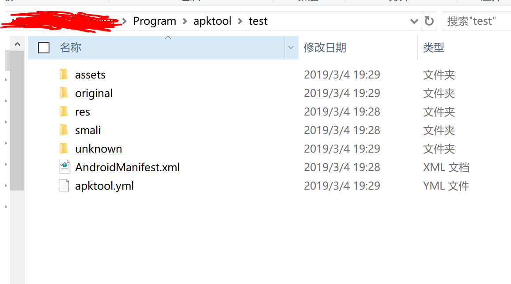
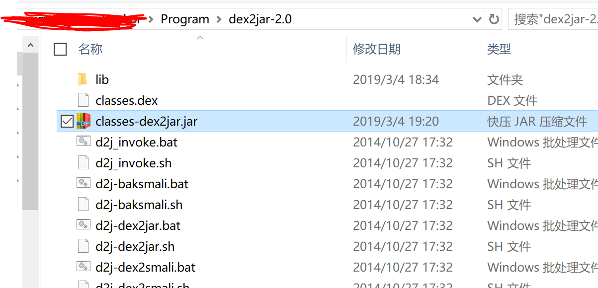
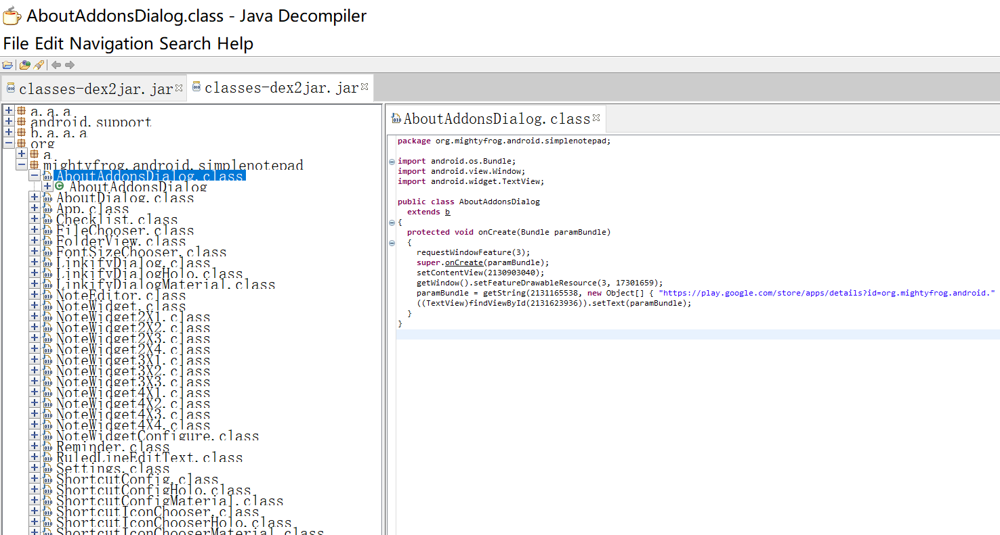

apktool——可以反编译软件的布局文件、图片等资源

dex2jar——将apk反编译成java源码（classes.dex转化成jar文件）

jd-gui——查看APK中classes.dex转化成出的jar文件，即源码文件

## apktool

从[https://bitbucket.org/iBotPeaches/apktool/downloads/](https://bitbucket.org/iBotPeaches/apktool/downloads/)下载apktool.jar，更名为apktool.jar

新建文件apktool.bat

```bat

@echo off
if "%PATH_BASE%" == "" set PATH_BASE=%PATH%
set PATH=%CD%;%PATH_BASE%;
chcp 65001 2>nul >nul
java -jar -Duser.language=en -Dfile.encoding=UTF8 "%~dp0\apktool.jar" %*
```

apktool.jar 和apktool.bat 放到同一个目录下，进入该目录下，可以反编译apk文件

```
C:\Users\xumenger\Hacker\Program\apktool>apktool.bat d -f test.apk
I: Using Apktool 2.4.0 on test.apk
I: Loading resource table...
I: Decoding AndroidManifest.xml with resources...
S: WARNING: Could not write to (C:\Users\xumenger\AppData\Local\apktool\framework), using C:\Users\xumenger\AppData\Local\Temp\ instead...
S: Please be aware this is a volatile directory and frameworks could go missing, please utilize --frame-path if the default storage directory is unavailable
I: Loading resource table from file: C:\Users\xumenger\AppData\Local\Temp\1.apk
I: Regular manifest package...
I: Decoding file-resources...
I: Decoding values */* XMLs...
I: Baksmaling classes.dex...
I: Copying assets and libs...
I: Copying unknown files...
I: Copying original files...
```

可以看到生成的和apk 同名的文件夹



## dex2jar

下载地址：[https://sourceforge.net/projects/dex2jar/](https://sourceforge.net/projects/dex2jar/)，下载后，解压到某个目录即可，可以看到有很多的bat、sh 文件，我们要用的是d2j-dex2jar.bat

直接使用快压对apk 文件进行解压，根目录下有一个classes.dex 文件。将需要反编译的dex 文件（这里是classes.dex）复制到 dex2jar 解压目录下

打开命令行进入d2j-dex2jar.bat 文件所在目录，输入命令

```
C:\Users\xumenger\Hacker\Program\dex2jar-2.0>d2j-dex2jar.bat classes.dex
dex2jar classes.dex -> .\classes-dex2jar.jar
```

生成了一个classes-dex2jar.jar 文件



## jd-dui

下载地址是[http://jd.benow.ca/](http://jd.benow.ca/)

打开jd-dui，直接将jar 文件拖到程序中即可完成反汇编


