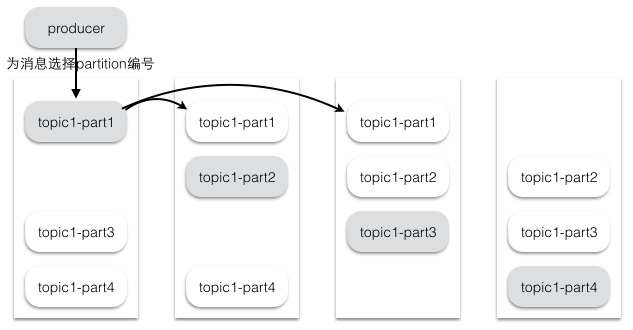

>本文内容来自[浅谈分布式消息技术 Kafka](http://www.linkedkeeper.com/detail/blog.action?bid=1016)

>Kafka 的这部分内容确实困扰我挺久的！

---

Kafka 的高可用保证来源于其副本（replication）策略

在Kafka 0.8 版本之前没有分区（Partition）的副本（Replication）机制，一旦Broker 宕机，那么该Broker 上面所有的Partition 都无法提供服务，而Partition 又没有备份数据，数据的可用性就大大降低了。所以0.8 后提供了Replication 机制来保证Broker 的failover

引入Replication 之后，同一个Partition 可能会有多个Replica，那就需要在这些Replication 中选一个Leader，Producer 和Consumer 只与这个Leader 交互，其他Replica 作为Followers 从Leader 中复制数据

## 副本放置策略

为了更好的做负载均衡，Kafka 尽量将所有的Partition 均匀分配到整个集群上

Kafka 分配Replica 的算法如下：

* 将所有存活的N 个Brokers 和待分配的Partition 排序
* 将第i 个Partition 分配到第(i mod n)个Broker 上
	* 这个Partition 的第一个Replica 存在于这个分配的Broker 上
	* 并且会作为partition的优先副本
* 将第i 个Partition 的第j 个Replica 分配到第((i + j) mod n)个Broker 上

假设集群一共有4个brokers，一个topic 有4个partition，每个partition 有3个副本。下图是每个broker 上的副本分配情况

## 同步策略

Producer 在发布消息到某个Partition 时，先通过ZooKeeper 找到该Partition 的Leader，然后无论该Topic 的Replication Factor 为多少，Producer 只将该消息发送到该Partition 的Leader。Leader 会将该消息写入其本地Log。每个Follower 都从Leader pull 数据。这种方式上，Follower 存储的数据顺序与Leader 保持一致。Follower 在收到该消息并写入其Log 后，向Leader 发送ACK。一旦Leader 收到了ISR 中的所有Replica 的ACK，该消息就被认为已经commit 了，Leader将增加HW 并且向Producer 发送ACK

为了提高性能，每个Follower 在接收到数据后就立马向Leader 发送ACK，而非等到数据写入Log 中。因此，对于已经commit 的消息，Kafka只 能保证它被存于多个Replica 的内存中，而不能保证它们被持久化到磁盘中，也就不能完全保证异常发生后该条消息一定能被Consumer 消费

Consumer 读消息也是从Leader 读取，只有被commit 过的消息才会暴露给Consumer

对于Kafka 而言，定义一个Broker 是否“活着”包含两个条件：

* 一是它必须维护与ZooKeeper 的session（这个通过ZooKeeper 的Heartbeat 机制来实现）
* 二是Follower 必须能够及时将Leader 的消息复制过来，不能“落后太多”

Leader 会跟踪与其保持同步的Replica 列表，该列表称为ISR（即in-sync Replica）。如果一个Follower 宕机，或者落后太多，Leader 将把它从ISR 中移除。这里所描述的“落后太多”指Follower 复制的消息落后于Leader 后的条数超过预定值或者Follower 超过一定时间未向Leader 发送fetch 请求

Kafka 只解决fail/recover，一条消息只有被ISR 里的所有Follower 都从Leader 复制过去才会被认为已提交。这样就避免了部分数据被写进了Leader，还没来得及被任何Follower 复制就宕机了，而造成数据丢失（Consumer 无法消费这些数据）。而对于Producer 而言，它可以选择是否等待消息commit。这种机制确保了只要ISR 有一个或以上的Follower，一条被commit 的消息就不会丢失

## Leader选举

Leader 选举本质上是一个分布式锁，有两种方式实现基于ZooKeeper 的分布式锁：

* 节点名称唯一性：多个客户端创建一个节点，只有成功创建节点的客户端才能获得锁
* 临时顺序节点：所有客户端在某个目录下创建自己的临时顺序节点，只有序号最小的才获得锁

Majority Vote 的选举策略和ZooKeeper 中的Zab 选举是类似的，实际上ZooKeeper 内部本身就实现了少数服从多数的选举策略。Kafka 中对于Partition 的Leader 副本的选举采用了第一种方法：为Partition 分配副本，指定一个ZNode 临时节点，第一个成功创建节点的副本就是Leader 节点，其他副本会在这个ZNode 节点上注册Watcher 监听器，一旦Leader 宕机，对应的临时节点就会被自动删除，这时注册在该节点上的所有Follower 都会收到监听器事件，它们都会尝试创建该节点，只有创建成功的那个Follower 才会成为Leader（ZooKeeper 保证对于一个节点只有一个客户端能创建成功），其他Follower 继续重新注册监听事件

## 更多资料

* [浅谈分布式消息技术 Kafka](http://www.linkedkeeper.com/detail/blog.action?bid=1016)
* [Kafka 解析之失效副本](http://www.iocoder.cn/Kafka/failure-of-copy/)
* [Kafka数据可靠性深度解读](https://blog.csdn.net/u013256816/article/details/71091774)
* [为什么Kafka那么快](https://blog.csdn.net/z69183787/article/details/80323581)
* [浅谈分布式服务协调技术 Zookeeper](http://www.linkedkeeper.com/detail/blog.action?bid=1014)
* [从分布式一致性谈到CAP理论、BASE理论](https://www.cnblogs.com/szlbm/p/5588543.html)
* [浅谈分布式事务](http://www.linkedkeeper.com/detail/blog.action?bid=1013)
