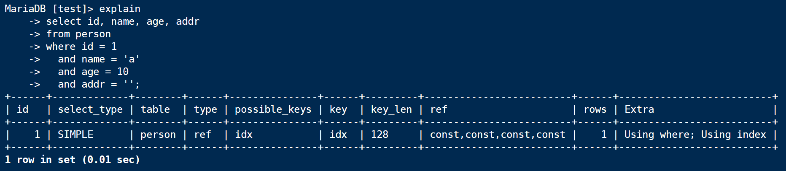
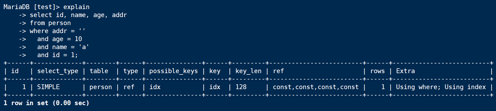
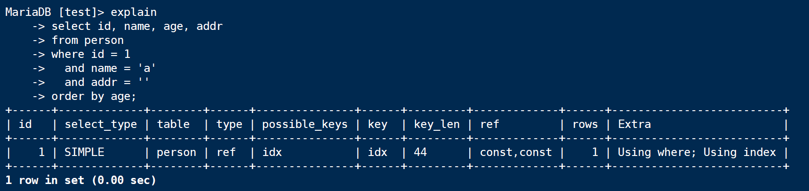
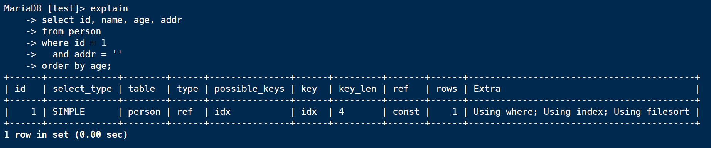

首先启动服务端，并连接到服务端

```shell
service mysql start
mysql -u root -p
```

创建一个用于测试的数据表，并创建一个复合索引

```sql
create table person
(
  id int(4) not null,
  name char(10) not null,
  age int(4) not null,
  addr char(20) not null
);

alter table person add index idx(id, name, age, addr);
```

查看一下数据库的编码集是这样的

```
show variables like '%character_set%';
+--------------------------+----------------------------+
| Variable_name            | Value                      |
+--------------------------+----------------------------+
| character_set_client     | utf8mb4                    |
| character_set_connection | utf8mb4                    |
| character_set_database   | utf8mb4                    |
| character_set_filesystem | binary                     |
| character_set_results    | utf8mb4                    |
| character_set_server     | utf8mb4                    |
| character_set_system     | utf8                       |
| character_sets_dir       | /usr/share/mysql/charsets/ |
+--------------------------+----------------------------+
```

utf8mb4 编码方式，每个字符占4 个字节；utf8 编码方式，每个字符占3 个字节

下面看一下几种SQL 的执行计划。特别说明，本文基于mysqld 10.1.29-MariaDB-6，并不是主流的mysql 5，所以可能其他版本的mysql 会看到不同的执行计划

## where条件顺序与索引顺序一致

```sql
explain 
select id, name, age, addr
from person
where id = 1
  and name = 'a'
  and age = 10
  and addr = '';
```

执行计划是这样的



where条件顺序与索引顺序一致，这是最理想的情况！看到Extra 中是Using where; Using index

另外看一下key\_len，因为四个列都用到了，而utf8mb4 编码的char 一个字符占4 个字节，所以总共是4 + 10 \* 4 + 4 + 20 \* 4 = 128

如果使用mysql 5.5，那么Extra 里面应该只有Using index，因为SQL 中涉及到的所有列都是索引中的列，为什么这里既有Using index，又有Using where？不知道[MySQL执行计划extra中的using index 和 using where using index 的区别](http://www.cnblogs.com/wy123/p/7366486.html)中讲的对不对！

## 变一下where条件顺序

复合索引的顺序是id、name、age、addr，试一下顺序完全反过来呢

```sql
explain 
select id, name, age, addr
from person
where addr = ''
  and age = 10
  and name = 'a'
  and id = 1;
```

执行计划是这样的



可以看到，where 后面的顺序变了，但是执行计划还是一样的，其实是因为SQL 优化器导致的

还是建议使用第一种方式：where 后面条件的顺序保持和复合索引的顺序一致！

## 复合索引出现跨列

```sql
explain 
select id, name, age, addr
from person
where id = 1
  and name = 'a'
  and addr = ''
order by age;
```

执行计划是这样的



现在复合索引中因为第三个列age 没用，所以虽然第四列addr 在where 中，不过因为跨列不会用到，只用到id、name 列，所以key\_len 为 4 + 10 \* 4 = 44

而且上面两个执行计划的ref 列都是const,const,const,const，而这里是const,const

## 第二个列name在where中也不存在

```sql
explain 
select id, name, age, addr
from person
where id = 1
  and addr = ''
order by age;
```

执行计划是这样的



因为出现跨列，所以只用到复合索引中的id，key\_len = 4 也可以证明这一点；另外Extra 中多了一个Using filesort，多了一次额外的排序

为什么上一个例子中出现跨列但没有Using filesort？因为上一个例子中where 和order by 拼起来并没有出现跨列，但这里where 和order by 拼起来后还是少了第二列name 列，所以就出现了Using filesort

