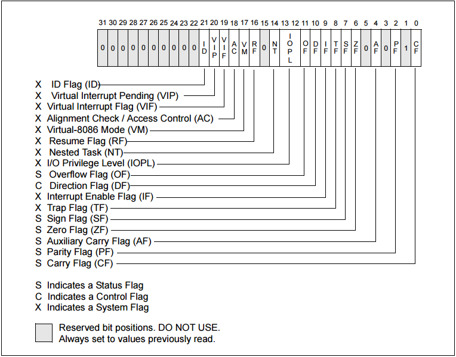

RFLAGS 用于指示处理器的状态并控制它的操作。下图展示了CPU 的标志寄存器。在64 位中RFLAGS 包含EFLAG 寄存器，这在64 位中也是不变的



## 运算结果标志位

**ZF（ZeroFlag）**

零位标志位。记录相关指令执行后的结果是否为0，如果是0，那么ZF=1，否则ZF=0

**PF（ParityFlag）**

奇偶标志位。记录相关指令执行后，其结果的所有二进制位中1 的个数是偶数还是奇数，如果是偶数，PF=1，反之PF=2

**SF（SignFlag）**

符号标志位。记录相关指令执行后，其结果是否为负，如果结果为负，SF=1，非负则SF=0

**CF（CarrayFlag）**

进位标志位。一般进行无符号运算时，它记录运算结果的最高位向更高位的进位值，或者从更高位的借位值，如果运算结果的最高位产生了一个进位或借位，那么其值为1，否则为0

**OF（OverflowFlag）**

溢出标志位。在进行有符号数运算的时候，如果结果超出了机器所能表示的范围称为溢出，OF 的值置为1，否则为0。注意，这里所说的溢出，**只是对有符号运算而言**

## 状态控制标志位

**TF（TrapFlag）**，追踪标志位。当追踪标志被置为1 时，CPU 进入单步执行方式，即每执行一条指令产生一个单步中断请求，这种方式主要用于程序的调试

**IF（Interrupt-enable Flag）**，中断允许标志位。用来决定CPU 是否响应CPU 外部的可屏蔽中断发出的中断请求，但不管该标志为何值，CPU 都必须响应CPU 外部的不可屏蔽中断发出的中断请求，以及CPU 内部产生的中断请求

* 当IF=1 时，CPU 可以响应CPU 外部的可屏蔽中断发出的中断请求
* 当IF=0 时，CPU 不响应CPU 外部的可屏蔽中断发出的中断请求
* CPU 的指令系统中也有专门的指令来改变标志位IF 的值

## 看一个例子

分析一下下面的汇编代码每一步执行后标志寄存器的值

```asm
sub al, al
mov al, 10h
add al, 90h
mov al, 80h
add al, 80h
mov al, 0fch
add al, 05h
mov al, 7dh
add al, 0bh
```

>**sub al, al**

此时al 的值为0，没有借位（CF=0）

没有溢出（OF=0）

不是负数（SF=0）

值为0（ZF=1）

二进制中1的个数为0（偶数，PF=1）

>**mov al, 10h**

mov、push、pop 等指令不会对标志寄存器有影响

>**add al, 90h**

al值为10h，10h + 90h = 00010000b + 10010000b = 10100000b = a0h，没有进位（CF=0）

10h是十进制16，90h是十进制-112，a0h为十进制-96，没有溢出（OF=0）

是负数（SF=1）

值不为0（ZF=0）

二进制中1的个数2个（偶数，PF=1）

...

## 跳转指令

**jmp**。无条件跳转指令

**jz**。ZF=1 时跳转

**jnz**。ZF=0 时跳转

**je**。ZF=1 时跳转

**jne**。ZF=0 时跳转

>更多的请参见[跳转指令](https://www.cnblogs.com/xingkongyihao/p/7900240.html)
