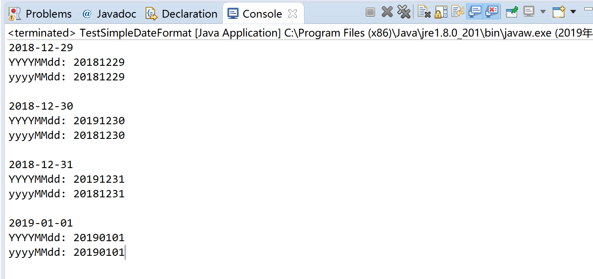
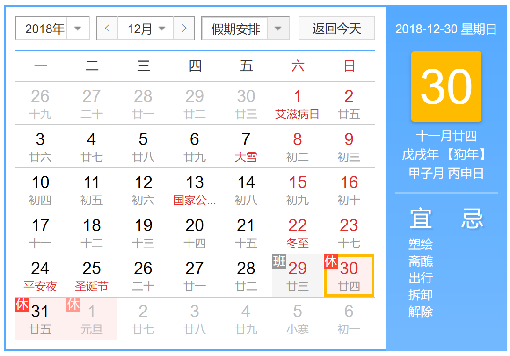

>使用SimpleDateFormat() 获取格式化日期时，YYYYMMdd 和yyyyMMdd 是一样的吗？

## 先去看一下现象

编写测试代码如下

```java
import java.text.DateFormat;
import java.text.ParseException;
import java.text.SimpleDateFormat;
import java.util.Calendar;
import java.util.Date;

public class TestSimpleDateFormat {
    public static void main(String[] args) {
    	TestSimpleDateFormat("2018-12-29");
    	TestSimpleDateFormat("2018-12-30");
    	TestSimpleDateFormat("2018-12-31");
    	TestSimpleDateFormat("2019-01-01");
    }
    
    private static void TestSimpleDateFormat(String someday) {
        try {
    		DateFormat df = new SimpleDateFormat("yyyy-MM-dd");
    		Calendar cal = Calendar.getInstance();
    		
    		System.out.println(someday);
    		Date date = df.parse(someday);
    		cal.setTime(date);
    		
    		Long timestamp = cal.getTimeInMillis();
    		
    		System.out.println("YYYYMMdd: " + getYYYYMMdd(timestamp));
    		System.out.println("yyyyMMdd: " + getyyyyMMdd(timestamp));
    		System.out.println("");
    	} catch (ParseException e) {
    		e.printStackTrace();
    	}
    }
    
    private static String getYYYYMMdd(Long timestamp) {
    	Date date = new Date(timestamp);
    	String str = new SimpleDateFormat("YYYYMMdd").format(date);
    	return str;
    }
    
    private static String getyyyyMMdd(Long timestamp) {
    	Date date = new Date(timestamp);
    	String str = new SimpleDateFormat("yyyyMMdd").format(date);
    	return str;
    }
}
```

程序运行输入如下



很显然，使用YYYYMMdd 格式化20181230、20181231 得到的结果不是预期的结果

## 再说一下原因

在调用SimpleDateFormat() 时，参数中小写的y 表示自然年份（year），而大写的Y 表示Week Year，二者不同

在每年开头几天和最后几天，可能出现自然年和Week Year 不一致的情况

YYYYMMdd 取的并非自然年，而是“Week Year + 月 + 日”，2018/12/30 - 2019/01/05 跨年（系统中一个完整周是从周日到周六），所以2018/12/30、2018/12/31 的Week Year 是2019 而不是2018！


