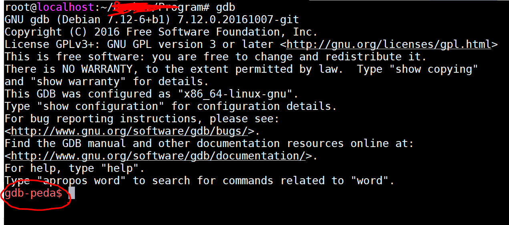
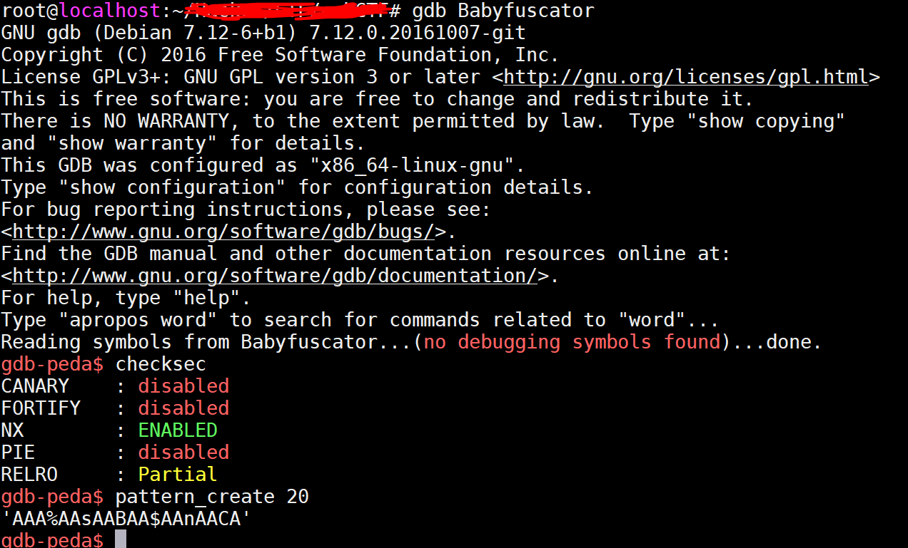

输入下面的命令

```
cd ~/Program
git clone https://github.com/longld/peda.git
echo "source ~/Program/peda/peda.py" >> ~/.gdbinit
```

然后打开gdb 之后会看到这样的效果



现在用gdb 去调试一个可执行程序，然后可以检查它的安全防护，另外可以使用gdb-peda 随机生成特定长度的字符串，在验证栈溢出时有用


