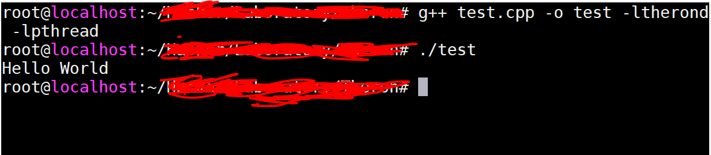

>想要更深入的了解Theron，推荐[Theron框架——C++并发编程库](https://blog.csdn.net/FX677588/column/info/16409)、[Theron, a lightweight C++ concurrency library, 源码分析](https://www.cnblogs.com/wpcockroach/archive/2012/12/03/2800491.html)、[C++ 并发编程的一种思维Theron 库简述](https://www.infoq.cn/article/cpp_concurrent_programming_introduce_theron)和[Theron官网](http://www.theron-library.com/)

[http://www.ashtonmason.net/wp-content/uploads/](http://www.ashtonmason.net/wp-content/uploads/)是官网中各个版本的下载地址，比如我下载的版本是Theron-6.00.02

执行下面的命令可以在Linux 上安装

```shell
unzip Theron-6.00.02.zip
cd Theron-6.00.02
make clean
make library

// 下面这两步将头文件和静态库拷贝到特定目录
// makefile中无install命令，需要自己拷贝
// 否则后面编译的时候会报错
cp -r Include/Theron/* /usr/include/Theron/
cp Lib/libtherond.a /usr/lib/
```

老规矩，Hello World 搞起！

```c++
#include <stdio.h>
#include <string>

#include <Theron/Theron.h>

class Printer : public Theron::Actor
{
public:
    Printer(Theron::Framework &framework) : Theron::Actor(framework) {
        // 注册消息处理函数
        RegisterHandler(this, &Printer::Print);
    }

private:
    void Print(const std::string &message, const Theron::Address from) {
        printf("%s\n", message.c_str());
        // 返回一个虚假(dummy)消息来实现同步
        Send(0, from);
    }
};


int main()
{
    // 构造一个framework对象，并实例化一个Printer的Actor由它管理
    Theron::Framework framework;
    Printer printer(framework);

    // 构造一个Receiver对象来接收Actor的反馈消息
    Theron::Receiver receiver;

    // 发送一个消息给Printer，并传递receiver作为from的地址
    if(!framework.Send(std::string("Hello World"), receiver.GetAddress(), printer.GetAddress())) {
        printf("ERROR: Failed to send message\n");
    }

    // 使用虚假消息来实现同步，确保所有线程完成任务
    receiver.Wait();
}
```

g++ test.cpp -o test -ltherond -lpthread 

用上面的命令完成编译，注意指定静态链接库，然后运行编译得到的可执行程序即可看到效果


