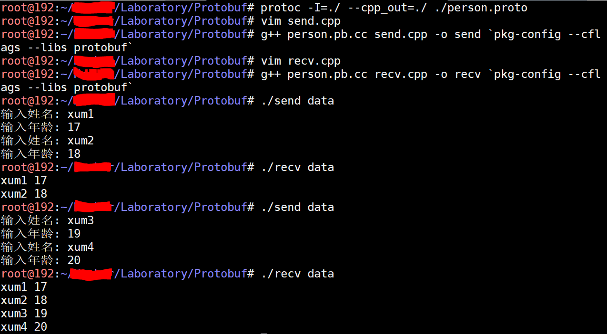

Protocol Buffers 是一种轻便高效的结构化数据存储格式，可以用于结构化数据串行化，或者说序列化。它很适合做数据存储或RPC 数据交换格式。可用于通讯协议、数据存储等领域的语言无关、平台无关、可扩展的序列化结构数据格式。目前提供了 C++、Java、Python 等编程语言

首先去[https://github.com/protocolbuffers/protobuf/releases](https://github.com/protocolbuffers/protobuf/releases)下载

编译、安装Protobuf

```sh
tar -xzf protobuf-all-3.7.1.tar.gz
cd protobuf-3.7.1/
./configure --prefix=$INSTALL_DIR 
make 
make check 
make install

apt-get install pkg-config
```

编辑`~/.profile`，写入以下内容，然后`source ~/.profile`

```
export PKG_CONFIG_PATH=/lib/pkgconfig
export LD_LIBRARY_PATH=$LD_LIBRARY_PATH:/lib
```

## 编写Protobuf程序

然后我们使用Protobuf 写一个简单的例子person.proto

```protobuf
//指定protobuf语法版本
syntax = "proto2";

package test;

message Person {
    // required 必须设置（不能为null）
    required string name = 1;

    required int32 age = 2;

    // optional 可以为空
    optional string address = 3;

    enum PhoneType {
        MOBILE = 0;
        WORK = 1;
    }

    message PhoneInfo {
        required string number = 1;
        optional PhoneType type = 2 [default = MOBILE];
    }

    //repeated 重复的 （集合）
    repeated PhoneType phones = 4;
}

message ClassRoom {
    repeated Person person = 1;
    optional string desc = 2;
}
```

在person.proto 所在的目录编译程序，`protoc -I=./ --cpp_out=./ ./person.proto` 编译得到c++ 程序，编译完成后，当前目录生成person.pb.cc、person.pb.h，同样的，也可以编译为Java、Python、C# 等代码

## 编写C++程序

Protobuf 主要用于在网络项目中设计网络协议，本文用磁盘文件IO 模拟网络协议数据的打包解包，且下面的程序中不考虑异常处理的逻辑只是展示用法

“发送”程序，按照Protobuf 往文件写数据

```c++
#include <iostream>
#include <fstream>
#include <string>
#include "person.pb.h"

using namespace std;

void InputPerson(test::Person *person)
{
    cout << "输入姓名: ";
    string name;
    cin >> name;
    person->set_name(name);

    cout << "输入年龄: ";
    int age;
    cin >> age;
    person->set_age(age);
}

int main(int argc, char **argv)
{
    if(argc != 2) {
        cerr << "Usage Error" << endl;
        return -1;
    }

    test::ClassRoom room;
    fstream input(argv[1], ios::in | ios::binary);
    room.ParseFromIstream(&input);

    InputPerson(room.add_person());
    InputPerson(room.add_person());

    fstream output(argv[1], ios::out | ios::trunc | ios::binary);
    room.SerializeToOstream(&output);

    return 0;
}
```

g++ person.pb.cc send.cpp -o send \`pkg-config --cflags --libs protobuf\` 编译程序

“接收”程序，按照Protobuf 从文件中读数据，解析数据

```c++
#include <iostream>
#include <fstream>
#include <string>
#include "person.pb.h"

using namespace std;

void ListPerson(const test::ClassRoom &room)
{
    for(int i=0; i<room.person_size(); i++) {
        const test::Person &person = room.person(i);
        cout << person.name() << " " << person.age() << endl;
    }
}

int main(int argc, char **argv)
{
    if(argc != 2) {
        cerr << "Usage Error" << endl;
        return -1;
    }

    test::ClassRoom room;

    fstream input(argv[1], ios::in | ios::binary);
    room.ParseFromIstream(&input);
    input.close();

    ListPerson(room);

    return 0;
}
```

执行下面的命令进行编译

g++ person.pb.cc recv.cpp -o recv \`pkg-config --cflags --libs protobuf\`

运行效果如下



>更多内容可以参考[Google Protocol Buffer 的使用和原理](https://www.ibm.com/developerworks/cn/linux/l-cn-gpb/index.html)
