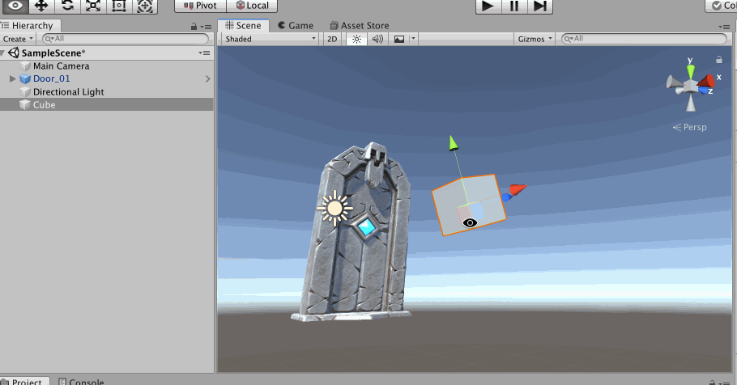

## 导入资源

资源包括人物模型、材质、动画、图片、音乐特效等等

Unity 3D 为用户提供了丰富的下载资源，其官方网址为[https://www.assetstore.unity3d.com/](ttps://www.assetstore.unity3d.com/)，也可以在Unity 3D 中执行【Window】-->【Asset Store】菜单命令直接访问 Unity 资源商店（Asset Store）

Unity 资源商店中提供了多种游戏媒体资源供下载和购买，例如人物模型、动画、粒子特效、纹理、游戏创作工具、音乐特效、功能脚本和其他类拓展插件等

也可以导入本地.unitypackage 格式的资源，将.unitypackage 文件直接拖入到Unity3D 的Project 中，然后Unity3D 解析这个文件（如果文件较大，那么解析需要一段时间），显示这个文件中包含的所有资源

点击【All】-->【Import】即可导入所有资源，导入的过程也是一个比较耗时的过程！等待一段时间后，在Project 下可以看到导入的资源

## 3D物体

Unity3D 中自带了一些基本的3D 物体，通过【GameObject】-->【3D Object】菜单路径可以看到这些物体，包括方块（Cube）、球体（Sphere）、胶囊体（Capsule）、圆柱体（Cylinder）、地面（Plane）、面片（Quad，其大小是 1 \* 1 的）、地形（Terrain）、树（Tree）、风区（Wind Zone，有了风区可以创建一些随风摇摆的效果）、3D 文字

上面截图中，我就是将Unity3D 支持的3D 物体随便列出来，视角也没有做很好的调整

实际的游戏开发中，要想做出炫酷的效果，显然这些Unity3D 自带的3D 物体是不够的，需要建模师通过3D Max、Maya 等建模工具创建出更为复杂的物体，然后开发人员将其导入到Unity 3D 再进行开发

>一个模型是通过形状（Mesh）、材质（Materials）、贴图等来构成的

比如上面我们导入了资源中有各种**预制体（Prefabs）**，像石头、阶梯等，可以直接拖到**场景（Scene）**中

## 工具栏

Unity3D 的菜单栏就不多做介绍了，自己多去点击看一下其功能，这里介绍一下Unity3D 的常用工具栏，如下图（分别从1 开始标号）

接下来逐个介绍工具栏中各个工具的作用，让操作Unity3D 变得更加方便快捷

1 号工具（Q），点击后，进入场景界面，左击鼠标可以拖动整个场景上下左右移动

2 号工具（W），点击后，进入场景界面，可以用于拖动某个3D 物体在X、Y、Z 轴的移动

3 号工具（E），点击后，进入场景界面，可以用于控制某个3D 物体在X、Y、Z 轴的旋转

4 号工具（R），点击后，进入场景界面，可以用于控制某个3D 物体在X、Y、Z 轴的放大

5 号工具（T），也是用于调整物体的大小的，3D 游戏中基本不用，常用于在2D 游戏中调整2D UI、物体的大小

7 号工具，用于切换显示物体的中心点（Center）和原点（Pivot），Unity3D 自带的标准的几何体的原点和中心点都是一致的，可以导入一下其他的模型资源，可以看到其并不在一个点上

8 号工具，切换坐标，Global 是全局坐标（整个场景的坐标），Local 是局部坐标（物体自己的坐标）

9 号工具，运行游戏

10 号工具，暂停游戏

11 号工具，逐帧运行

## Scene窗口视野控制

**视野的平移**，可以直接按鼠标滑轮，然后移动鼠标就可以实现视野的平移。如果你是使用的Mac 进行开发，并且没有鼠标，那么在触摸屏上两个指头同时按下，在触碰上移动也可以实现视野的平移

**聚焦到物体**，如果我想聚焦到场景中的某个物体上怎么办，可以双击其对应在Hierarchy 视图中的对象，更快捷的方式则是在Scene 视图中选中它，然后按【F】键

**观察物体**，如果想围绕某个物体上下左右前后观察这个物体，要怎么操作，也很简单，点击这个物体，按住【alt】键，然后在按住鼠标左键上下左右移动即可

**放大缩小物体**，如果想对某个聚焦物体进行放大缩小怎么办，点击这个物体，按住【alt】键，然后滑动鼠标滑轮即可，如果是用Mac，则是两个手指放到触摸屏上下拖动

**整个场景的旋转**，不选中任何物体，按住【alt】键，然后在按住鼠标左键上下左右移动即可

**整个场景的放大缩小**，不选中任何物体，按住【alt】键，然后滑动鼠标滑轮即可

Scene 视图右上角的Global 坐标系可以切换正焦模式和透视模式，如果选中物体后，可以通过该坐标系的X、Y、Z 轴快速切换视角

