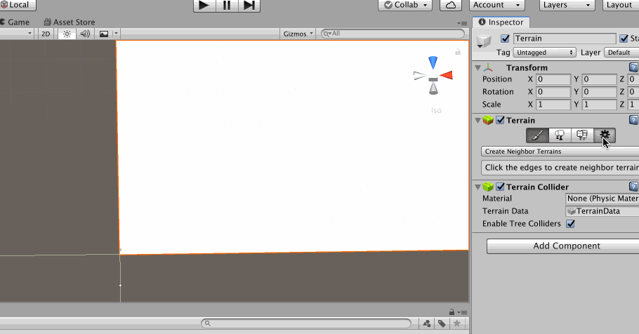
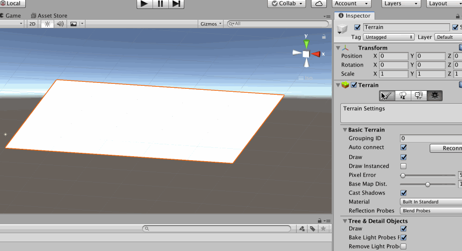
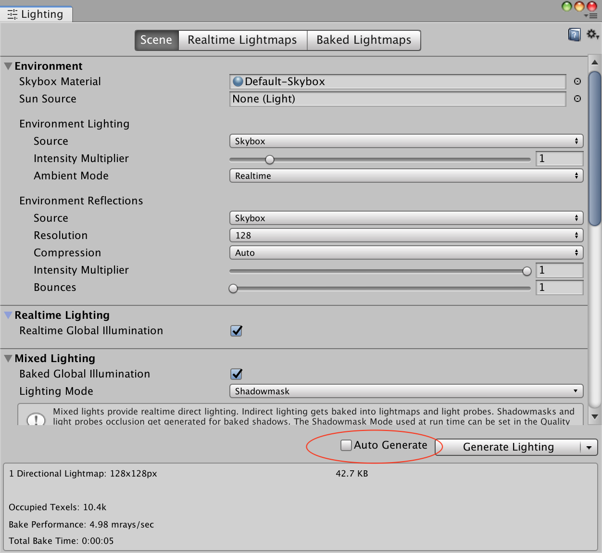
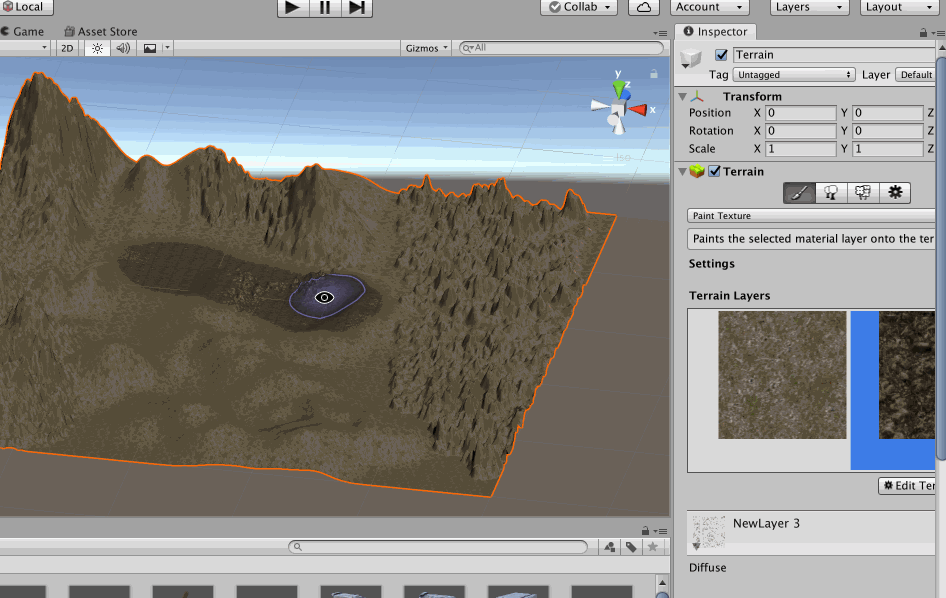
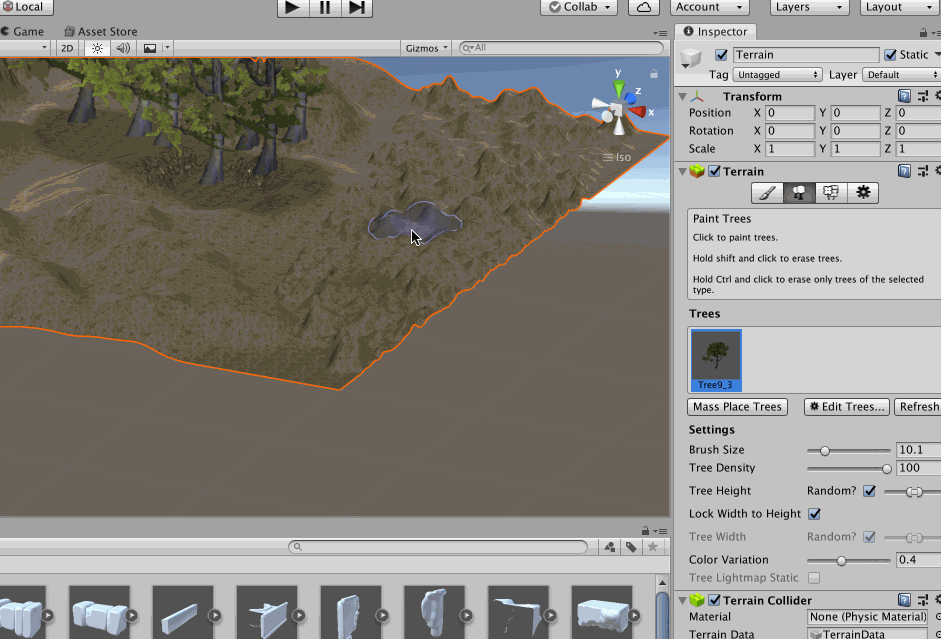

上一文提到，Unity3D 默认支持的3D Object 中有一个地形（Terrain）对象，所以在Unity 3D 中设计地形的时候，首先在Hierarchy 中Create 一个Terrain 对象

创建好一个Terrain 之后，可以在Inspector 视图中设置地形的属性，设置其长、宽、高（高用于控制太高地形时，地形的最大高度）

然后就可以对地形进行编辑了，同样在Inspector 视图中提供了很多的地形编辑工具，比如Raise or Lower Terrain 等

>上面的gif 中展示的都是太高地形，如果想降低地形，那么要按住【Shift】。另外还有Smooth Height，用于将地形变得更平滑，更符合真实的地形，等

默认每次绘制地形的时候，Unity3D 会自动处理渲染、生成光照贴图，很耗费性能，可以通过【Window】-->【Rendring】-->【Lighting Settings】，将【Auto Generate】取消

还有Paint Texture，用于绘制贴图，当然首先需要先添加贴图，第一个贴图会覆盖整个地形，第二个贴图可以用来粉刷部分地形

>在一个成熟的游戏团队中，游戏的地形也都是有专门的设计人员来进行设计的，因为地形的美观等要求是很高的

添加了贴图之后，还可以在地形中添加树（这里暂不考虑美观问题，纯粹展示Unity3D 的用法，另外按住【Shift】可以减少树）

>如果你的项目中缺少树的资源，可以直接去Assert Store 购买，然后导入到项目中之后就可以直接使用了，其他的预制体资源也是一样

也可以在地形上粉刷草（同样的，美观问题就不考虑了）

