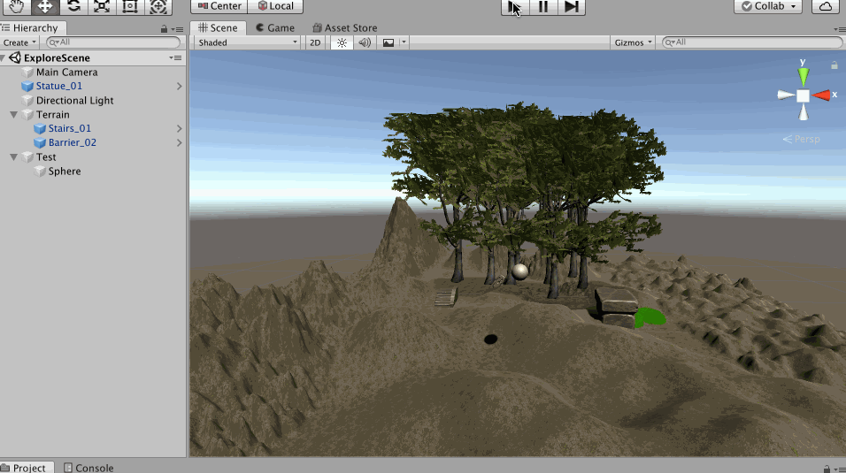
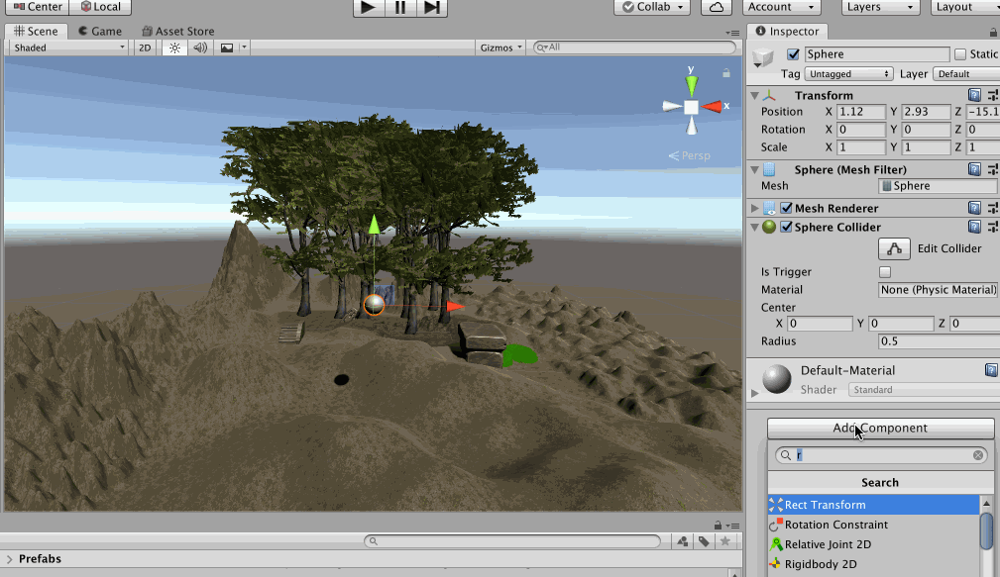
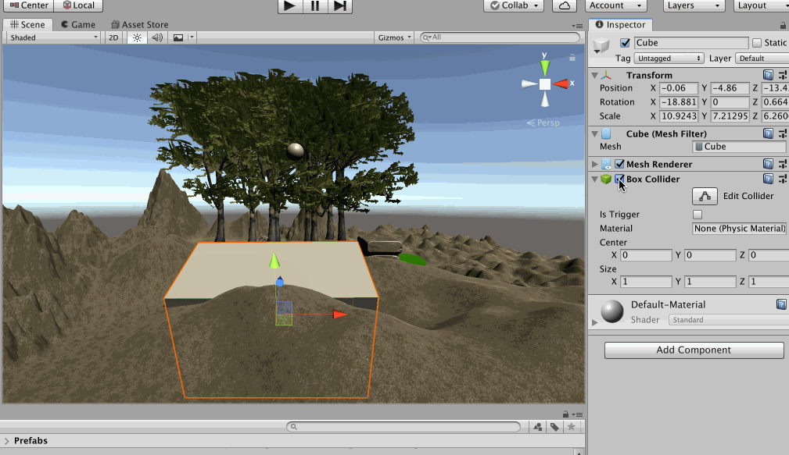
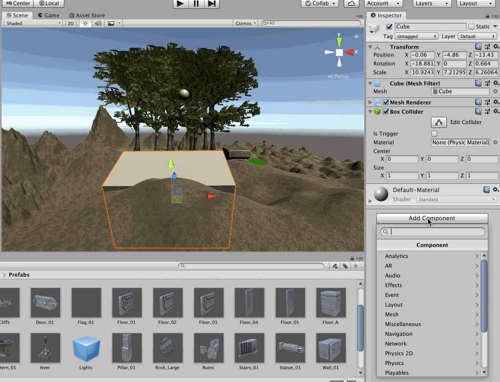
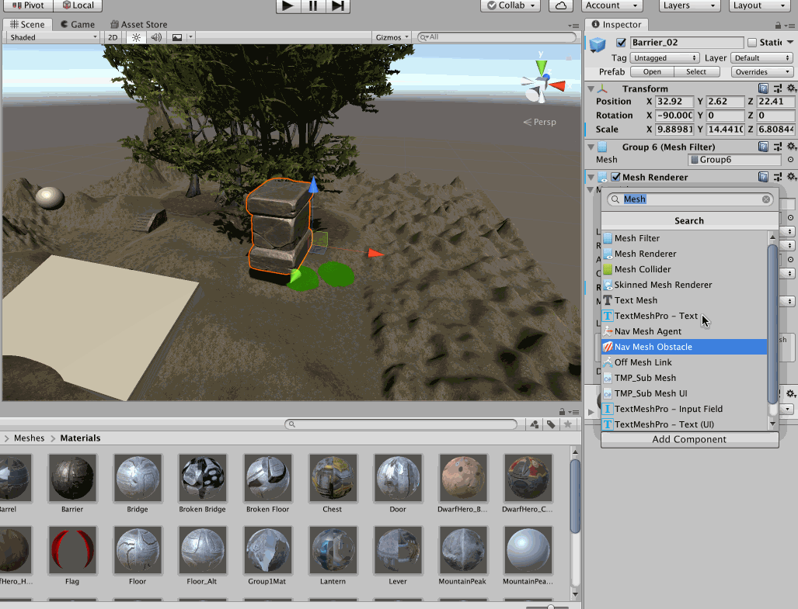

>刚体是物理学中的概念，指的是在运动中和受力作用后，形状和大小不变，而且内部各点的相对位置不变的物体。绝对刚体实际上是不存在的，只是一种理想模型，因为任何物体在受力作用后，都或多或少地变形，如果变形的程度相对于物体本身几何尺寸来说极为微小，在研究物体运动时变形就可以忽略不计

本文继续在上一篇创建的场景的基础上进行实践！在这个场景的控制加一个Sphere，然后将游戏运行起来后，发现这个球就呆在空中，明显与现实不符

怎么办？为这个球添加一个**刚体（Rigidbody）**就好了，再将游戏运行起来，效果变成这样了，很不错

## 碰撞器

上面使用的地形是有碰撞器的，所以当小球落到地面之后，其是符合我们对物理世界的感受的，那假如我随便添加一个没有碰撞器（将其Box Collider 取消勾选）的物体呢？

球直接穿过这个物体了！所以如果想让两个物体有碰撞的效果，那么必须给物体添加碰撞器，也就是勾选Box Collider

添加碰撞器后，其运行效果就变成这样了

Collider 有好多种，包括下面展示的这些，其中Box Collider（盒子碰撞器） 是最节约性能的，如果能用Box Collider 就最好用它，其他的球体碰撞器、胶囊体碰撞器相对就比较耗费性能了，**Mesh Collider** 是最耗费性能的

为什么**Mesh Collider** 是最耗费性能的？可以看到这个使用了Mesh Collider 的模型，其网格太多了！其线越多、顶点越多，在进行碰撞检测的时候，越需要进行更多的运算，更耗费性能，当然好处就是更精准，所以还是根据实际场景取舍吧

## 