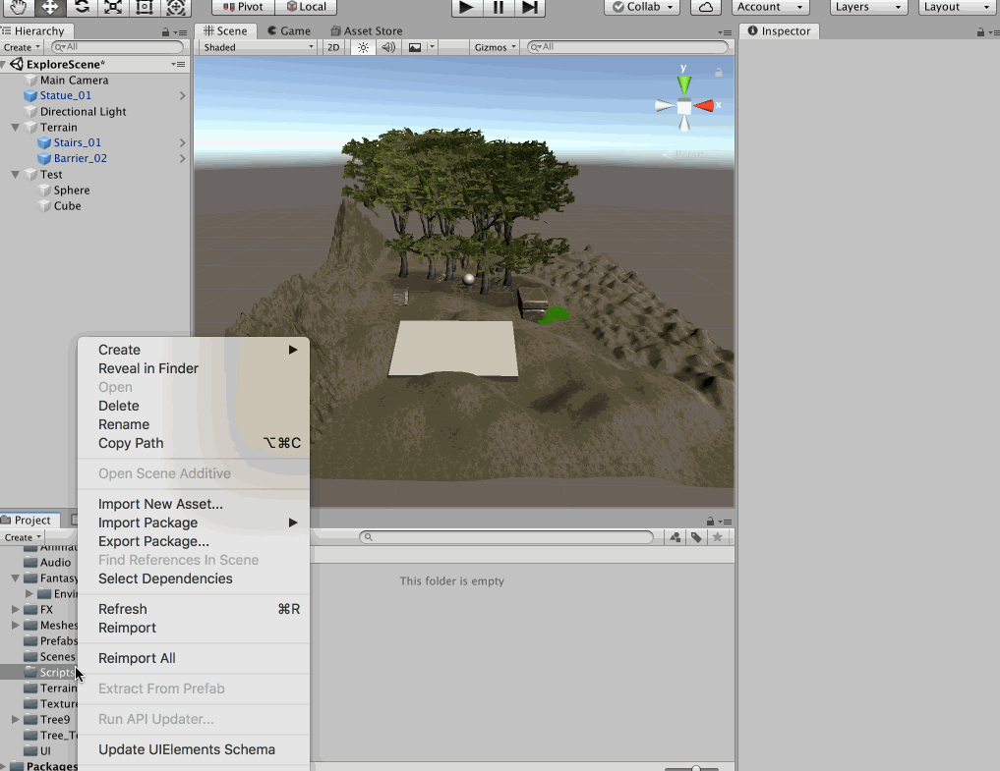
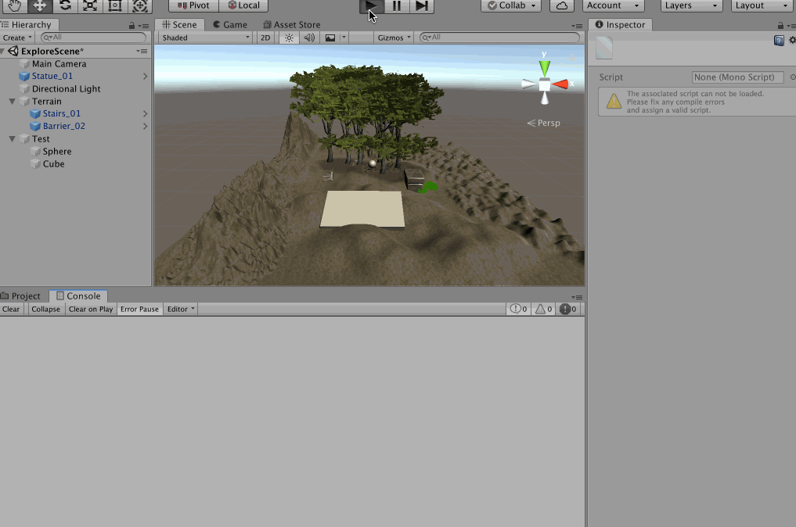
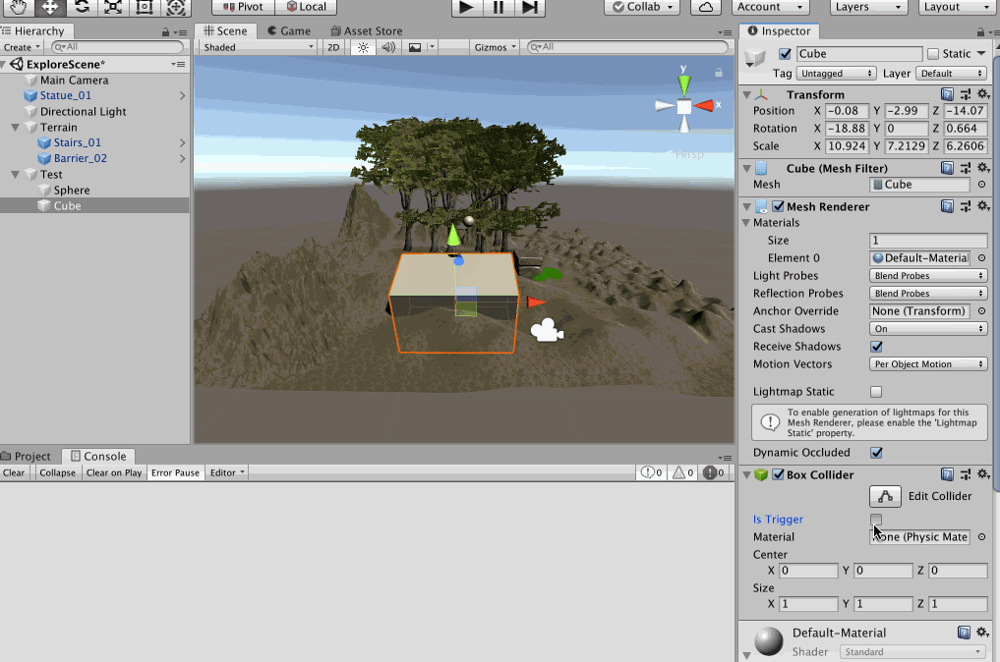
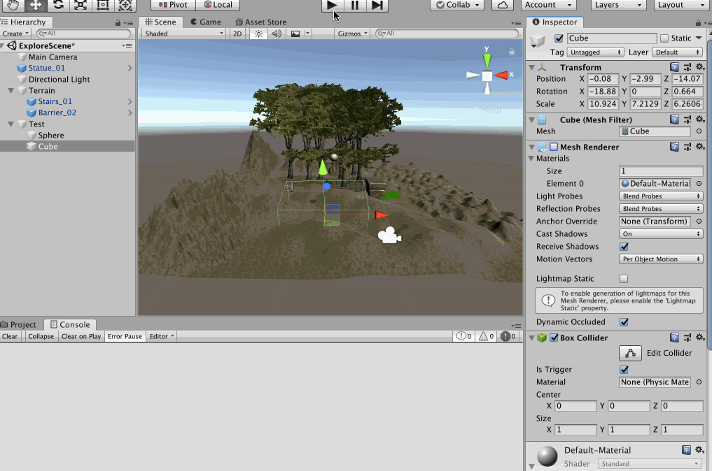
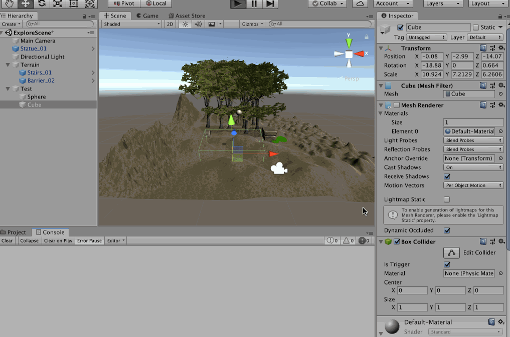
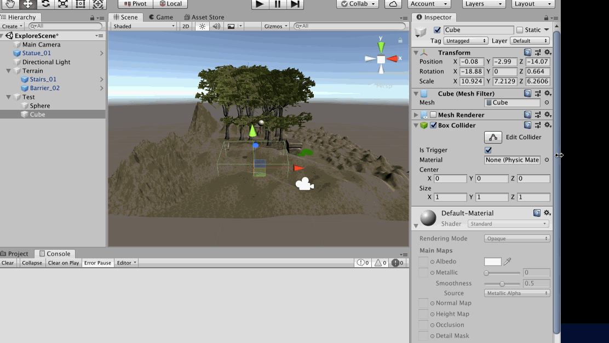

>刚体是物理学中的概念，指的是在运动中和受力作用后，形状和大小不变，而且内部各点的相对位置不变的物体。绝对刚体实际上是不存在的，只是一种理想模型，因为任何物体在受力作用后，都或多或少地变形，如果变形的程度相对于物体本身几何尺寸来说极为微小，在研究物体运动时变形就可以忽略不计

本文继续在上一篇创建的场景的基础上进行实践！在这个场景的控制加一个Sphere，然后将游戏运行起来后，发现这个球就呆在空中，明显与现实不符


怎么办？为这个球添加一个**刚体（Rigidbody）**就好了，再将游戏运行起来，效果变成这样了，很不错


## 碰撞器

上面使用的地形是有碰撞器的，所以当小球落到地面之后，其是符合我们对物理世界的感受的，那假如我随便添加一个没有碰撞器（将其Box Collider 取消勾选）的物体呢？


球直接穿过这个物体了！所以如果想让两个物体有碰撞的效果，那么必须给物体添加碰撞器，也就是勾选Box Collider

添加碰撞器后，其运行效果就变成这样了


Collider 有好多种，包括下面展示的这些，其中Box Collider（盒子碰撞器） 是最节约性能的，如果能用Box Collider 就最好用它，其他的球体碰撞器、胶囊体碰撞器相对就比较耗费性能了，**Mesh Collider** 是最耗费性能的


为什么**Mesh Collider** 是最耗费性能的？可以看到这个使用了Mesh Collider 的模型，其网格太多了！其线越多、顶点越多，在进行碰撞检测的时候，越需要进行更多的运算，更耗费性能，当然好处就是更精准，所以还是根据实际场景取舍吧


## 碰撞检测

想想我们玩过的游戏，CS、极品飞车、实况足球、雷霆战机，检测人与人、人与墙、车与山、人与足球、导弹与飞机……的碰撞明显是必须的，Unity3D 为开发者提供了刚体、碰撞器之后，那么编写脚本检测碰撞，并在碰撞之后进行对应的反应那都是在游戏开发中必须的逻辑

比如上面的例子中为Sphere 创建一个C# 脚本，在这里编写碰撞检测逻辑



编写代码如下

```c#
using System.Collections;
using System.Collections.Generic;
using UnityEngine;

public class Sphere : MonoBehaviour
{
    // Start is called before the first frame update
    void Start()
    {
        
    }

    // Update is called once per frame
    void Update()
    {
        
    }

    // Unity3D 提供的碰撞时回调的方法，每次碰撞时调用一次
    private void OnCollisionEnter(Collision collision)
    {
        print("Enter 被碰撞的对象是 " + collision.collider.name);
    }

    // 碰撞进行过程中会回调的方法
    // 碰撞过程中，每一帧都会调用一次
    private void OnCollisionStay(Collision collision)
    {
        // print("Stay 被碰撞的对象是 " + collision.collider.name);
    }

    // 碰撞结束时回调的方法
    private void OnCollisionExit(Collision collision)
    {
        print("Exit 被碰撞的对象是 " + collision.collider.name);
    }
}
```

运行效果是这样的



这里只是在碰撞时输出了一些信息，而在实际的游戏开发中，对于一些关键物体，比如玩家、赛车等的碰撞，要在碰撞检测函数中编写碰撞逻辑的，这个就要针对具体的游戏来具体设计了，这里不赘言！

关于刚体、碰撞器如何组合才能导致碰撞器回调函数被调用，可以参考[Unity Manual -> Physics -> Physics Overview -> Colliders](https://docs.unity3d.com/Manual/CollidersOverview.html)

## 触发检测

还是上面的例子，将Cube 的Is Trigger 勾选上，然后其就变成了触发器，这样当物体“碰”到它的时候，不会被挡住，会穿过它，但是还是会回调碰撞方法



触发器有什么用呢？比如在游戏开发中，有一个陷阱，当玩家进入陷阱范围内时就触发攻击，对于这个例子，我们可以将Cube 的Mesh Render 属性取消勾选，这样当游戏运行起来后，Cube 就是不可见的，但是依然会发生“碰撞”，对应的碰撞回调函数会被调用



其实触发器有对应的回调函数，如下面的代码

```c#
using System.Collections;
using System.Collections.Generic;
using UnityEngine;

public class Sphere : MonoBehaviour
{
    // Start is called before the first frame update
    void Start()
    {
        
    }

    // Update is called once per frame
    void Update()
    {
        
    }

    // Unity3D 提供的碰撞时回调的方法，每次碰撞时调用一次
    private void OnCollisionEnter(Collision collision)
    {
        print("OnCollisionEnter 被碰撞的对象是 " + collision.collider.name);
    }

    // 碰撞进行过程中会回调的方法
    // 碰撞过程中，每一帧都会调用一次
    private void OnCollisionStay(Collision collision)
    {
        // print("OnCollisionStay 被碰撞的对象是 " + collision.collider.name);
    }

    // 碰撞结束时回调的方法
    private void OnCollisionExit(Collision collision)
    {
        print("OnCollisionExit 被碰撞的对象是 " + collision.collider.name);
    }

    private void OnTriggerEnter(Collider other)
    {
        print("OnTriggerEnter 触发的对象是 " + other.name);
    }

    private void OnTriggerStay(Collider other)
    {
        // print("OnTriggerStay 触发的对象是 " + other.name);
    }

    private void OnTriggerExit(Collider other)
    {
        print("OnTriggerExit 触发的对象是 " + other.name);
    }
}
```

基于上面相同的设置，其运行效果是这样的



>因为Sphere 落入到Cube 内部后，并没有滚出来，所以对应的Exit 回调没有执行，这是正常的

如果我们将Cube 的碰撞器移除，那么这时候只会有触发器的回调被调用，碰撞器的回调就不会被调用了


