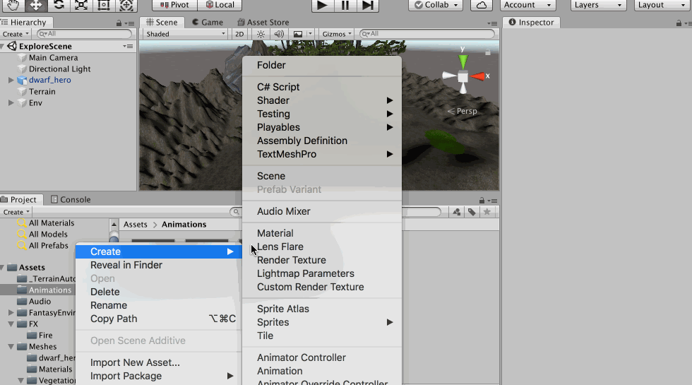
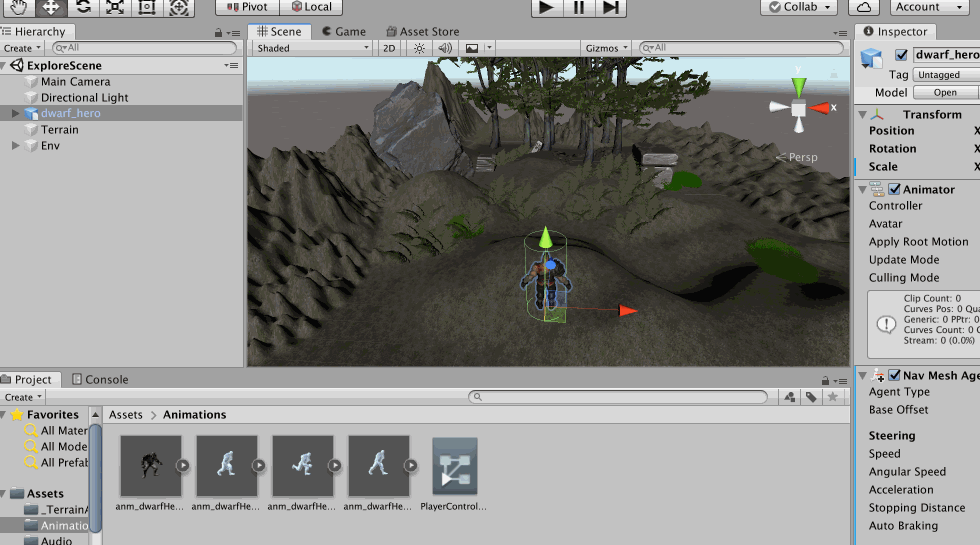
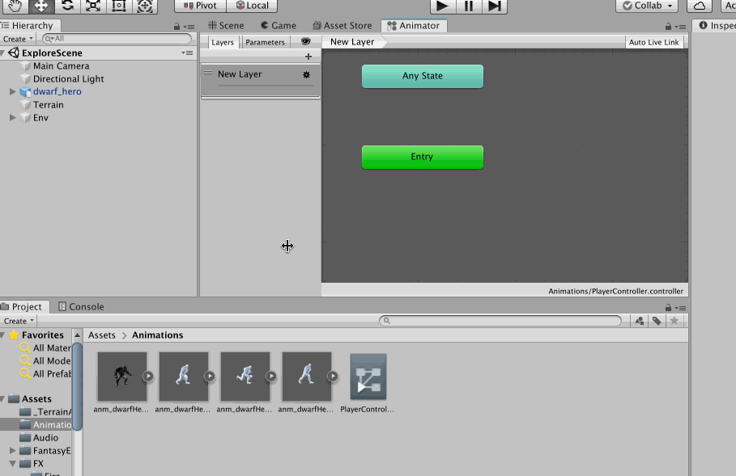
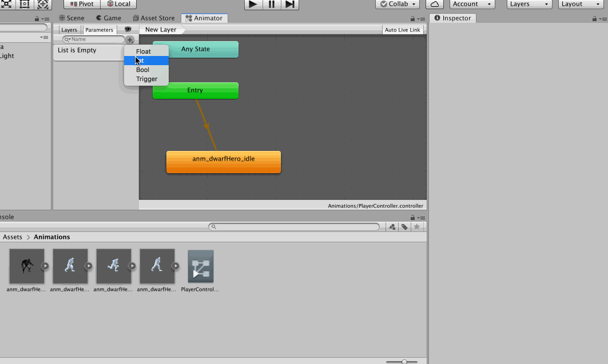

往这个简陋的场景中拖入一个角色模型


## 导航系统

导航系统，又称寻路系统，比如要控制一个角色往某个位置运动，那么可以通过导航系统帮角色选择一个最短路径，然后控制角色按照这个路径到达指定的位置

为了方便物体的管理，将地形中的环境信息放到一个Empty Object 中


然后将环境有关的，比如地形、环境等的static 都勾选上


然后进行导航网格的烘培，【Window】-->【AI】-->【Navigation】，点击Bake，烘培时间可能会稍微长一些


其中显示为蓝色的地方表示的是可行走的区域，可以把【Agent Radius】改的小一些，这样障碍物旁边就会有更多可行走区域，烘培时间可能会更长一些，稍等一下


但是其实还有一些不符合我们预期的点，比如障碍体上是可以行走的，但并不希望这样，那么可以将其Navigation Area 设置为Not Walkable，这样再去Bake 之后就会发现这里是不可行走的了


有了网格之后，就可以控制角色在网格中行走了

## 控制角色移动

为了实现角色的移动，必须为角色添加导航组件，添加了Navi Mesh Agent 之后，可以看到角色身上产生了一个圆柱体，这个是用于计算某个位置是否可以通过（通过长宽高的计算）


实现角色随着鼠标点击场景中的点进行移动，那么就必须配合C# 脚本了，为角色绑定一个C# Script，内容如下

```c#
using System.Collections;
using System.Collections.Generic;
using UnityEngine;
using UnityEngine.AI;

public class Player : MonoBehaviour
{
    // 将角色的Nav Mesh Agent直接在Inspector 界面拖拽给这个变量即可
    public NavMeshAgent agent;

    // Start is called before the first frame update
    void Start()
    {
        // 设置转向的速度，也可以直接在Inspector 界面设置
        agent.angularSpeed = 500;
    }

    // Update is called once per frame
    void Update()
    {
        // 判断鼠标左键是否按下
        if (Input.GetMouseButtonDown(0)) {
            // 使用从主摄像头到鼠标点击的点的射线来获取目标位置
            Ray ray = Camera.main.ScreenPointToRay(Input.mousePosition);
            // 定义变量保存碰撞信息
            RaycastHit hit;
            // 判断是否发生碰撞
            if (Physics.Raycast(ray, out hit)) {
                // 如果发生碰撞，通过hit 获取点击的位置，并让角色向着移动
                agent.SetDestination(hit.point);
            }
        }
    }
}
```

>通过鼠标点击地面上的点，将此点设置为角色移动的目的地，代码真的很简单！

然后角色就可以随着鼠标点击运行了


## 控制摄像机跟随

上面的实践中，可以让角色运动起来了，但是为了更好的游戏体验，希望摄像机能跟随角色运动，很简单，还是通过脚本来控制，在游戏运行时获取游戏和主角的偏移，然后在运行过程中一直保证两者的偏移不变即可实现Camera 随着主角运动（要求在场景中便为Camera 设置一个合适的视角）

为摄像机添加一个C# Script，代码内容如下

```c#
using System.Collections;
using System.Collections.Generic;
using UnityEngine;

public class MainCamera : MonoBehaviour
{
    // 目标组件，就是角色，在Inspector 中将角色拖动到这个变量上
    public Transform player;

    // 偏移
    private Vector3 offset;

    // Start is called before the first frame update
    void Start()
    {
        // 开始的时候获取相机相对于角色的偏移
        offset = transform.position - player.position;
    }

    // Update is called once per frame
    void Update()
    {
        // 每一帧都保持两者的偏移不变即可
        transform.position = offset + player.position;
    }
}
```

OK，现在的游戏体验是这样的了！


## 控制角色动画

现在资源中有四个动画，idle、jump、walk、run


在Unity3D 中通过动画状态机实现动画的播放，为角色的Animator 添加一个动画状态机



然后编辑动画状态机，选中角色物体-->【Window】-->【Animation】-->【Animator】，如果你是第一次打开，那么Layer 那里没有New Layer，需要创建一个



试着将Idle 作为初始状态拖入到Animator 中，然后可以看到角色的动画效果



OK，接下来为角色添加不同状态下的动画效果，以及不同状态变化的条件（这里通过角色的速度来控制状态变化。注：角色的Nav Mesh Agent 中有一个Speed 选项可以控制角色的最大速度）



>取消Has Exit Time，因为动画的效果可能随时发生

然后再去更新一下代码，在角色的脚本中获取动画控制器组件，完成对状态的控制

```c#
using System.Collections;
using System.Collections.Generic;
using UnityEngine;
using UnityEngine.AI;

public class Player : MonoBehaviour
{
    // 将角色的Nav Mesh Agent直接在Inspector 界面拖拽给这个变量即可
    public NavMeshAgent agent;

    // 将角色的Animator直接在Inspector 界面拖拽给这个变量即可
    public Animator anim;

    // Start is called before the first frame update
    void Start()
    {
        // 设置转向的速度，也可以直接在Inspector 界面设置
        agent.angularSpeed = 500;
    }

    // Update is called once per frame
    void Update()
    {
        // 判断鼠标左键是否按下
        if (Input.GetMouseButtonDown(0)) {
            // 使用从主摄像头到鼠标点击的点的射线来获取目标位置
            Ray ray = Camera.main.ScreenPointToRay(Input.mousePosition);
            // 定义变量保存碰撞信息
            RaycastHit hit;
            // 判断是否发生碰撞
            if (Physics.Raycast(ray, out hit)) {
                // 如果发生碰撞，通过hit 获取点击的位置，并让角色向着移动
                agent.SetDestination(hit.point);
            }
        }

        // 为状态机的参数设置值
        anim.SetFloat("speed", agent.velocity.magnitude);
    }
}
```

然后再将游戏运行起来，其效果就很棒了


