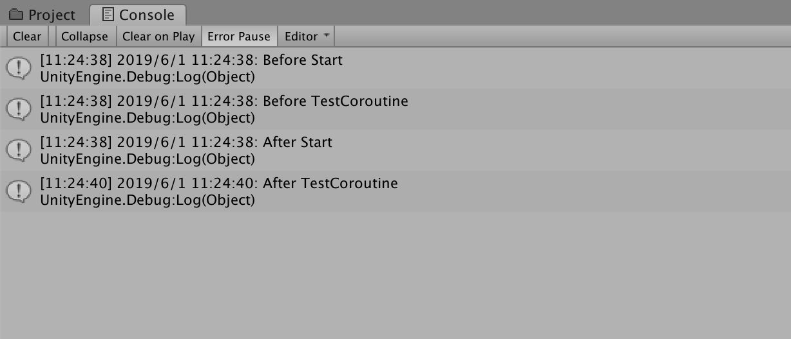
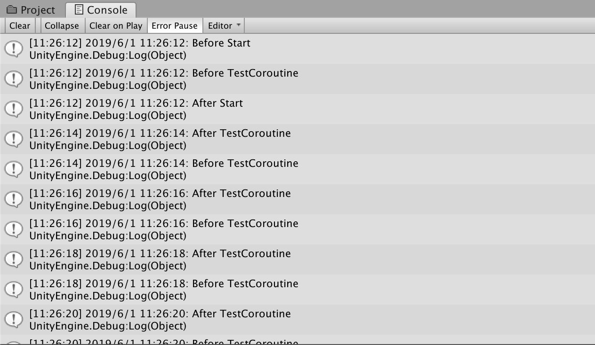

首先，祝自己儿童节快乐！


OK，回到现实吧

>协程不是线程，也不是异步执行的。协程和MonoBehaviour 的Update 函数一样也是在MainThread 中执行的。使用协程你不用考虑同步和锁的问题

下面用一个简单的例子展示C# 中协程的语法和运行现象

```c#
using System;
using System.Collections;
using System.Collections.Generic;
using UnityEngine;

public class TestCS : MonoBehaviour
{
    // Start is called before the first frame update
    void Start()
    {
        Debug.Log(DateTime.Now.ToString() + ": Before Start");
        StartCoroutine(TestCoroutine(2f));
        Debug.Log(DateTime.Now.ToString() + ": After Start");
    }

    IEnumerator TestCoroutine(float sleepTime)
    {
        Debug.Log(DateTime.Now.ToString() + ": Before TestCoroutine");
        yield return new WaitForSeconds(sleepTime);
        Debug.Log(DateTime.Now.ToString() + ": After TestCoroutine");
    }

    // Update is called once per frame
    void Update()
    {
        
    }
}
```

运行效果如下，可以看到协程只运行了一次



如果想让协程每隔指定的时间运行一次，那么就要在协程方法中加循环

```c#
using System;
using System.Collections;
using System.Collections.Generic;
using UnityEngine;

public class TestCS : MonoBehaviour
{
    // Start is called before the first frame update
    void Start()
    {
        Debug.Log(DateTime.Now.ToString() + ": Before Start");
        StartCoroutine(TestCoroutine(2f));
        Debug.Log(DateTime.Now.ToString() + ": After Start");
    }

    IEnumerator TestCoroutine(float sleepTime)
    {
        // 加一个循环
        while(true) { 
            Debug.Log(DateTime.Now.ToString() + ": Before TestCoroutine");
            yield return new WaitForSeconds(sleepTime);
            Debug.Log(DateTime.Now.ToString() + ": After TestCoroutine");
        }
    }

    // Update is called once per frame
    void Update()
    {
        
    }
}
```

现在的运行效果是这样的（每隔指定时间运行一次）



## 协程原理

协程其实就是一个IEnumerator（迭代器），IEnumerator 接口中有两个方法Current() 和MoveNext()，只有当MoveNext() 返回true 时才可以访问Current()，否则会报错

迭代器方法运行到yield return 语句时，会返回一个expression 表达式并保留当前在代码中的位置，当下次调用迭代器函数时执行从该位置重新启动

Unity3D 在每帧做的工作之一就是：调用协程（迭代器）MoveNext() 方法，如果返回true ，就从当前位置继续往下执行


## 参考资料

* [Unity协程（Coroutine）原理深入剖析](https://dsqiu.iteye.com/blog/2029701)
* [Python迭代器和生成器](http://www.xumenger.com/python-iterator-generator-20181110/)
* [协程的好处有哪些？](https://www.zhihu.com/question/20511233)